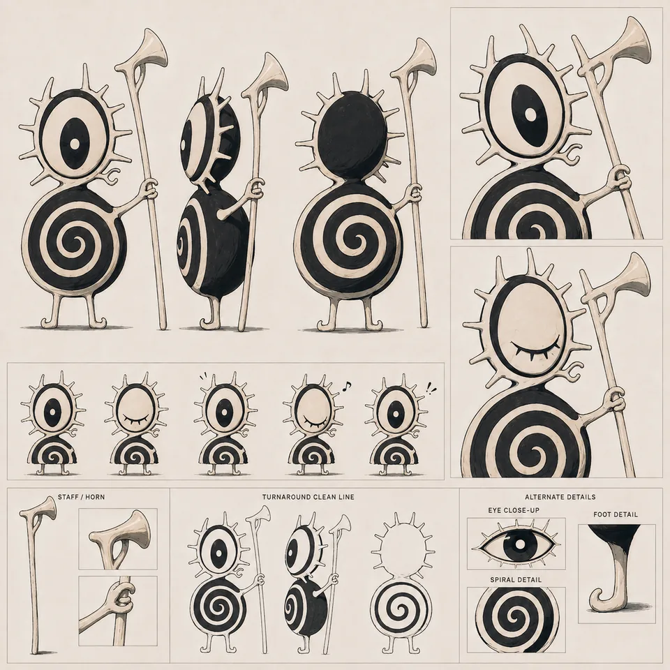
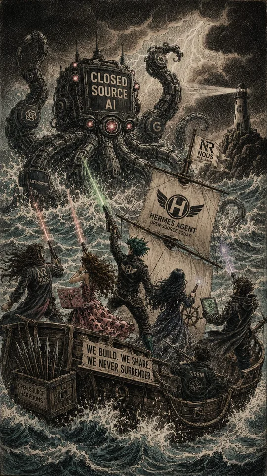
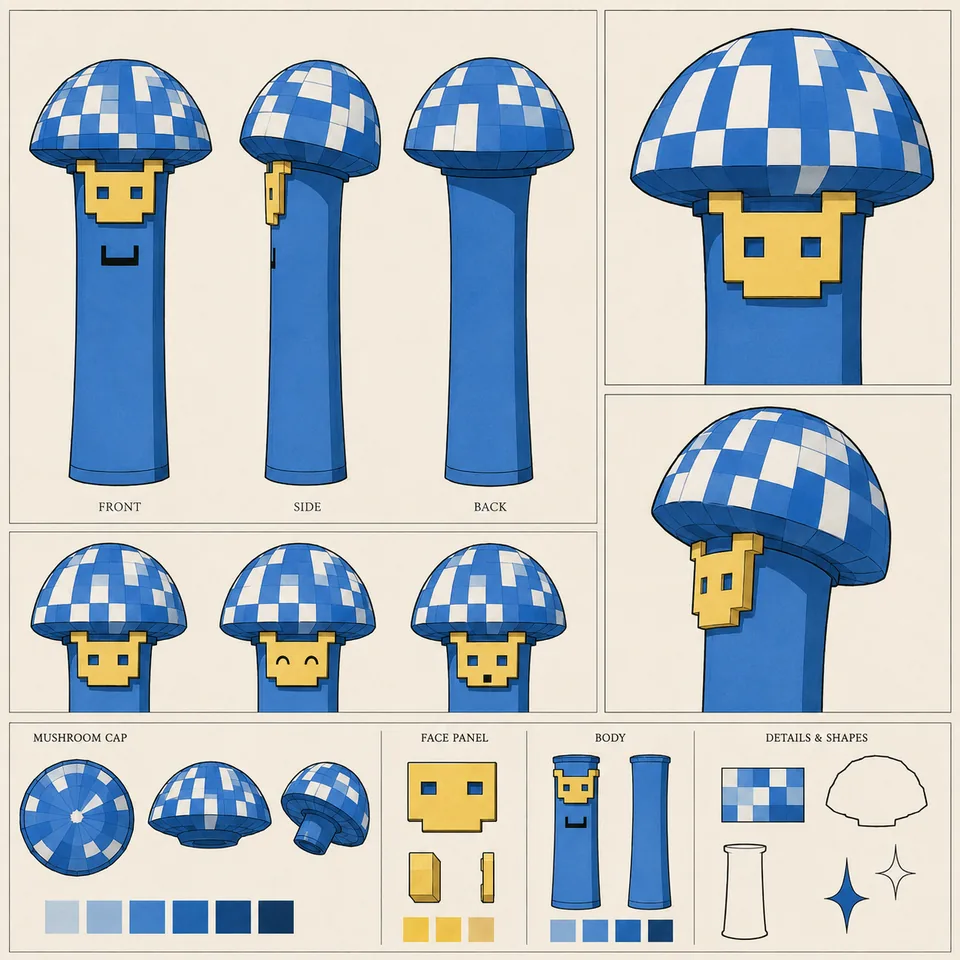
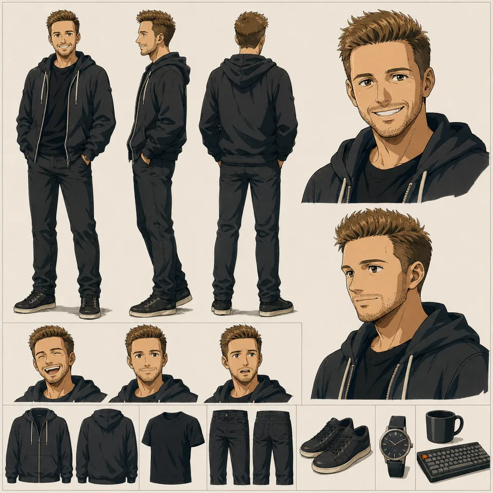
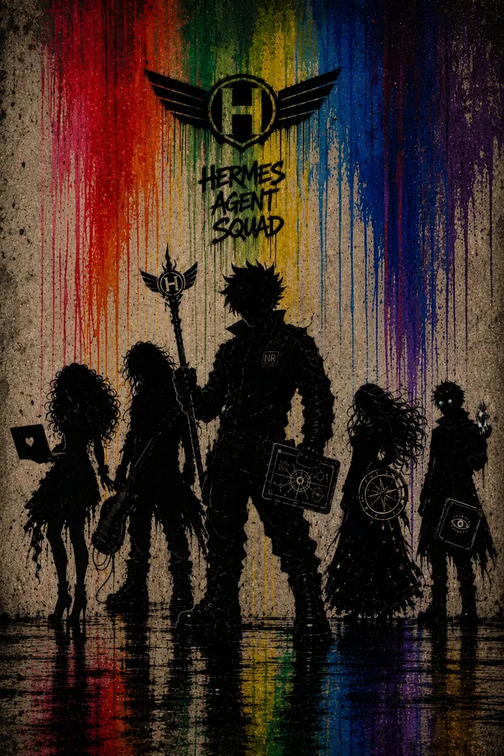
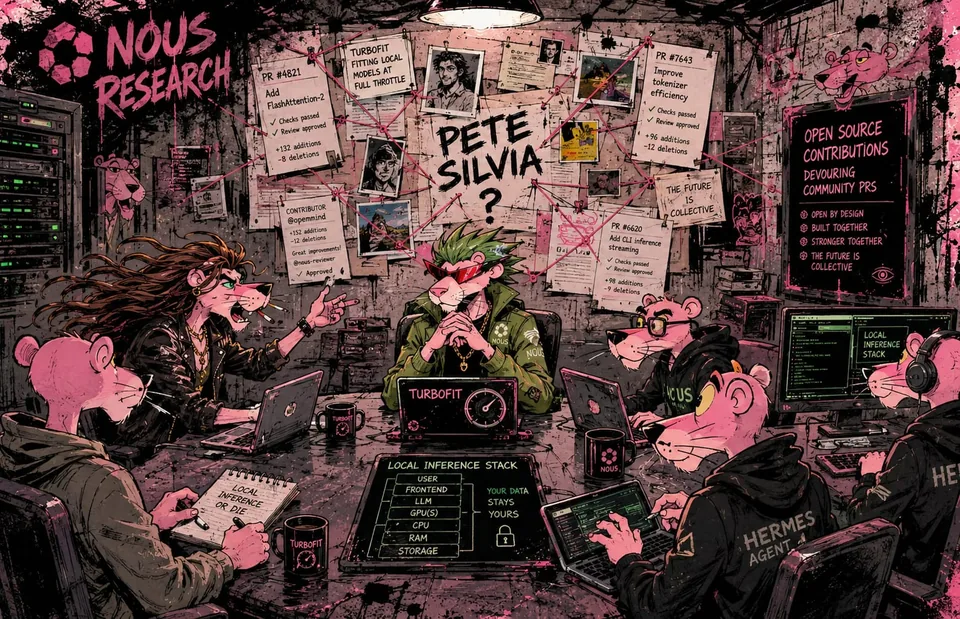

# Supporting-reference gallery

These are metadata-stripped previews of canonical non-style references. Candidate identity links are explicitly non-canonical.

## Teamwork Propaganda Poster

- Reference ID: `ref-0022ed4f3c3d8335`
- Type: `co-character-scene`
- Mapping: `character-mapped` (`high`)
- Rights: `unknown-not-cleared`
- Canonical character links: [`i-sneeze-kittens`](characters/i-sneeze-kittens/references.md), [`teknium`](characters/teknium/references.md), [`witcheer`](characters/witcheer/references.md)
- Candidate character links — **not canonical**: none

## Storybook Map Expedition

- Reference ID: `ref-048c9bd670ef986e`
- Type: `co-character-scene`
- Mapping: `character-mapped` (`medium`)
- Rights: `unknown-not-cleared`
- Canonical character links: [`brooklyn-heartbreaker`](characters/brooklyn-heartbreaker/references.md), [`nousgirl`](characters/nousgirl/references.md), [`teknium`](characters/teknium/references.md)
- Candidate character links — **not canonical**: none

## Source Evidence

- Reference ID: `ref-06db63b87301c3a4`
- Type: `source-evidence`
- Mapping: `character-mapped` (`source-established`)
- Rights: `unknown-not-cleared`
- Canonical character links: [`teknium`](characters/teknium/references.md)
- Candidate character links — **not canonical**: none

## Sheet

- Reference ID: `ref-079982e500947c21`
- Type: `sheet`
- Mapping: `character-mapped` (`source-established`)
- Rights: `unknown-not-cleared`
- Canonical character links: [`suzu`](characters/suzu/references.md)
- Candidate character links — **not canonical**: none

## Source Evidence

- Reference ID: `ref-07a6817ed1a25c0b`
- Type: `source-evidence`
- Mapping: `character-mapped` (`source-established`)
- Rights: `unknown-not-cleared`
- Canonical character links: [`turbo-fit`](characters/turbo-fit/references.md)
- Candidate character links — **not canonical**: none

## Source Evidence

- Reference ID: `ref-081c140e88190d87`
- Type: `source-evidence`
- Mapping: `character-mapped` (`source-established`)
- Rights: `unknown-not-cleared`
- Canonical character links: [`turbo-fit`](characters/turbo-fit/references.md)
- Candidate character links — **not canonical**: none

## Hermes Agent Group Portrait

- Reference ID: `ref-09a3c5e1ba139ae3`
- Type: `co-character-scene`
- Mapping: `character-mapped` (`medium`)
- Rights: `unknown-not-cleared`
- Canonical character links: [`brooklyn-heartbreaker`](characters/brooklyn-heartbreaker/references.md), [`teknium`](characters/teknium/references.md), [`tinuviel`](characters/tinuviel/references.md)
- Candidate character links — **not canonical**: none

## Source Evidence

- Reference ID: `ref-09c341460e2d3941`
- Type: `source-evidence`
- Mapping: `character-mapped` (`source-established`)
- Rights: `unknown-not-cleared`
- Canonical character links: [`turbo-fit`](characters/turbo-fit/references.md)
- Candidate character links — **not canonical**: none

## Psychedelic Pizza Feast

- Reference ID: `ref-09eaa0322d8f28b8`
- Type: `co-character-scene`
- Mapping: `character-mapped` (`high`)
- Rights: `unknown-not-cleared`
- Canonical character links: [`fatcat`](characters/fatcat/references.md), [`fleety`](characters/fleety/references.md)
- Candidate character links — **not canonical**: none

## Arm Wrestling Match

- Reference ID: `ref-0a41c8355776fcc7`
- Type: `co-character-scene`
- Mapping: `character-mapped` (`high`)
- Rights: `unknown-not-cleared`
- Canonical character links: [`teknium`](characters/teknium/references.md), [`turbo-fit`](characters/turbo-fit/references.md)
- Candidate character links — **not canonical**: none

## Noir Tax Office

- Reference ID: `ref-0e67f739124abc60`
- Type: `co-character-scene`
- Mapping: `character-mapped` (`high`)
- Rights: `unknown-not-cleared`
- Canonical character links: [`nousgirl`](characters/nousgirl/references.md), [`teknium`](characters/teknium/references.md)
- Candidate character links — **not canonical**: none

## Chaotic Hermes Clinic

- Reference ID: `ref-0f13313715a66bb0`
- Type: `co-character-scene`
- Mapping: `character-mapped` (`medium`)
- Rights: `unknown-not-cleared`
- Canonical character links: [`brooklyn-heartbreaker`](characters/brooklyn-heartbreaker/references.md), [`nousgirl`](characters/nousgirl/references.md), [`teknium`](characters/teknium/references.md)
- Candidate character links — **not canonical**: none

## Scene

- Reference ID: `ref-117f60523761dda3`
- Type: `scene`
- Mapping: `character-mapped` (`source-established`)
- Rights: `unknown-not-cleared`
- Canonical character links: [`nousgirl`](characters/nousgirl/references.md)
- Candidate character links — **not canonical**: none

## Quiet Intimate Moment

- Reference ID: `ref-12ade71ec086a193`
- Type: `co-character-scene`
- Mapping: `character-mapped` (`high`)
- Rights: `unknown-not-cleared`
- Canonical character links: [`nousgirl`](characters/nousgirl/references.md), [`teknium`](characters/teknium/references.md)
- Candidate character links — **not canonical**: none

## Source Evidence

- Reference ID: `ref-1317ed3ea8a9ba30`
- Type: `source-evidence`
- Mapping: `character-mapped` (`source-established`)
- Rights: `unknown-not-cleared`
- Canonical character links: [`tinuviel`](characters/tinuviel/references.md)
- Candidate character links — **not canonical**: none

## Sheet

- Reference ID: `ref-133aa3f47876c962`
- Type: `sheet`
- Mapping: `character-mapped` (`source-established`)
- Rights: `unknown-not-cleared`
- Canonical character links: [`i-sneeze-kittens`](characters/i-sneeze-kittens/references.md)
- Candidate character links — **not canonical**: none

## Sunlit Library Gathering

- Reference ID: `ref-153850369fa9a728`
- Type: `co-character-scene`
- Mapping: `character-mapped` (`medium`)
- Rights: `unknown-not-cleared`
- Canonical character links: [`brooklyn-heartbreaker`](characters/brooklyn-heartbreaker/references.md), [`nousgirl`](characters/nousgirl/references.md), [`teknium`](characters/teknium/references.md), [`turbo-fit`](characters/turbo-fit/references.md)
- Candidate character links — **not canonical**: none

## Armored Car Collision

- Reference ID: `ref-155af608a08302c9`
- Type: `co-character-scene`
- Mapping: `character-mapped` (`medium`)
- Rights: `unknown-not-cleared`
- Canonical character links: [`sahil`](characters/sahil/references.md)
- Candidate character links — **not canonical**: none

## Tropical Kart Race

- Reference ID: `ref-15f54aa5126d1700`
- Type: `co-character-scene`
- Mapping: `character-mapped` (`medium`)
- Rights: `unknown-not-cleared`
- Canonical character links: [`brooklyn-heartbreaker`](characters/brooklyn-heartbreaker/references.md), [`teknium`](characters/teknium/references.md), [`turbo-fit`](characters/turbo-fit/references.md)
- Candidate character links — **not canonical**: none

## Wasteland Group Expedition

- Reference ID: `ref-15f99ce755272912`
- Type: `co-character-scene`
- Mapping: `character-mapped` (`medium`)
- Rights: `unknown-not-cleared`
- Canonical character links: [`brooklyn-heartbreaker`](characters/brooklyn-heartbreaker/references.md), [`teknium`](characters/teknium/references.md), [`turbo-fit`](characters/turbo-fit/references.md)
- Candidate character links — **not canonical**: none

## Source Evidence

- Reference ID: `ref-16402fe9a023f6dc`
- Type: `source-evidence`
- Mapping: `character-mapped` (`source-established`)
- Rights: `unknown-not-cleared`
- Canonical character links: [`turbo-fit`](characters/turbo-fit/references.md)
- Candidate character links — **not canonical**: none

## Robot Lab Chaos

- Reference ID: `ref-16e988252299c847`
- Type: `single-character-scene`
- Mapping: `character-mapped` (`high`)
- Rights: `unknown-not-cleared`
- Canonical character links: [`teknium`](characters/teknium/references.md)
- Candidate character links — **not canonical**: none

## Neon City Bike Ride

- Reference ID: `ref-17d945376608cf38`
- Type: `co-character-scene`
- Mapping: `character-mapped` (`high`)
- Rights: `unknown-not-cleared`
- Canonical character links: [`brooklyn-heartbreaker`](characters/brooklyn-heartbreaker/references.md), [`nousgirl`](characters/nousgirl/references.md), [`teknium`](characters/teknium/references.md)
- Candidate character links — **not canonical**: none

## Sheet

- Reference ID: `ref-1870d31d1c63b517`
- Type: `sheet`
- Mapping: `character-mapped` (`source-established`)
- Rights: `unknown-not-cleared`
- Canonical character links: [`brooklyn-heartbreaker`](characters/brooklyn-heartbreaker/references.md)
- Candidate character links — **not canonical**: none

## Social Media Harbor Voyage

- Reference ID: `ref-1911678ecf95a01b`
- Type: `co-character-scene`
- Mapping: `character-mapped` (`high`)
- Rights: `unknown-not-cleared`
- Canonical character links: [`brooklyn-heartbreaker`](characters/brooklyn-heartbreaker/references.md), [`teknium`](characters/teknium/references.md), [`turbo-fit`](characters/turbo-fit/references.md)
- Candidate character links — **not canonical**: none

## Sheet

- Reference ID: `ref-1967821c9a0113ac`
- Type: `sheet`
- Mapping: `character-mapped` (`source-established`)
- Rights: `unknown-not-cleared`
- Canonical character links: [`nousgirl`](characters/nousgirl/references.md)
- Candidate character links — **not canonical**: none

## Portrait

- Reference ID: `ref-1ad49e19961a03de`
- Type: `portrait`
- Mapping: `character-mapped` (`source-established`)
- Rights: `unknown-not-cleared`
- Canonical character links: [`nousgirl`](characters/nousgirl/references.md)
- Candidate character links — **not canonical**: none

## Art Deco Profile Lineup

- Reference ID: `ref-1b69a149f2669033`
- Type: `co-character-scene`
- Mapping: `character-mapped` (`high`)
- Rights: `unknown-not-cleared`
- Canonical character links: [`brooklyn-heartbreaker`](characters/brooklyn-heartbreaker/references.md), [`nousgirl`](characters/nousgirl/references.md), [`teknium`](characters/teknium/references.md), [`turbo-fit`](characters/turbo-fit/references.md)
- Candidate character links — **not canonical**: none

## Sheet

- Reference ID: `ref-1c877c970073f4b6`
- Type: `sheet`
- Mapping: `character-mapped` (`source-established`)
- Rights: `unknown-not-cleared`
- Canonical character links: [`ee-dd`](characters/ee-dd/references.md)
- Candidate character links — **not canonical**: none

## Workshop Scooter Repair

- Reference ID: `ref-1cffb91a8085499f`
- Type: `single-character-scene`
- Mapping: `character-mapped` (`high`)
- Rights: `unknown-not-cleared`
- Canonical character links: [`i-sneeze-kittens`](characters/i-sneeze-kittens/references.md)
- Candidate character links — **not canonical**: none

## Cosmic Entity Power Surge

- Reference ID: `ref-1dfafe89faf1ad97`
- Type: `co-character-scene`
- Mapping: `character-mapped` (`medium`)
- Rights: `unknown-not-cleared`
- Canonical character links: [`teknium`](characters/teknium/references.md)
- Candidate character links — **not canonical**: none

## Moonlit Clifftop Duel

- Reference ID: `ref-1e18f7963e7e711c`
- Type: `co-character-scene`
- Mapping: `character-mapped` (`medium`)
- Rights: `unknown-not-cleared`
- Canonical character links: [`teknium`](characters/teknium/references.md), [`turbo-fit`](characters/turbo-fit/references.md)
- Candidate character links — **not canonical**: none

## Sheet

- Reference ID: `ref-1fc5a06f7484c9ad`
- Type: `sheet`
- Mapping: `character-mapped` (`source-established`)
- Rights: `unknown-not-cleared`
- Canonical character links: [`adolan`](characters/adolan/references.md)
- Candidate character links — **not canonical**: none

## Source Evidence

- Reference ID: `ref-2052ff74073abaa1`
- Type: `source-evidence`
- Mapping: `character-mapped` (`source-established`)
- Rights: `unknown-not-cleared`
- Canonical character links: [`nousgirl`](characters/nousgirl/references.md)
- Candidate character links — **not canonical**: none

## Source Evidence

- Reference ID: `ref-206a6cb529849914`
- Type: `source-evidence`
- Mapping: `character-mapped` (`source-established`)
- Rights: `unknown-not-cleared`
- Canonical character links: [`teknium`](characters/teknium/references.md)
- Candidate character links — **not canonical**: none

## Source Evidence

- Reference ID: `ref-21cb1a63b57e932f`
- Type: `source-evidence`
- Mapping: `character-mapped` (`source-established`)
- Rights: `unknown-not-cleared`
- Canonical character links: [`turbo-fit`](characters/turbo-fit/references.md)
- Candidate character links — **not canonical**: none

## Emergency Command Room

- Reference ID: `ref-21d96d16476de312`
- Type: `co-character-scene`
- Mapping: `character-mapped` (`high`)
- Rights: `unknown-not-cleared`
- Canonical character links: [`brooklyn-heartbreaker`](characters/brooklyn-heartbreaker/references.md), [`nousgirl`](characters/nousgirl/references.md), [`teknium`](characters/teknium/references.md), [`turbo-fit`](characters/turbo-fit/references.md)
- Candidate character links — **not canonical**: none

## Source Evidence

- Reference ID: `ref-221d5c211cd9fcec`
- Type: `source-evidence`
- Mapping: `character-mapped` (`source-established`)
- Rights: `unknown-not-cleared`
- Canonical character links: [`nousgirl`](characters/nousgirl/references.md)
- Candidate character links — **not canonical**: none

## Source Evidence

- Reference ID: `ref-22516b5bc1af97c8`
- Type: `source-evidence`
- Mapping: `character-mapped` (`source-established`)
- Rights: `unknown-not-cleared`
- Canonical character links: [`nousgirl`](characters/nousgirl/references.md)
- Candidate character links — **not canonical**: none

## Source Evidence

- Reference ID: `ref-22bcba995b490da8`
- Type: `source-evidence`
- Mapping: `character-mapped` (`source-established`)
- Rights: `unknown-not-cleared`
- Canonical character links: [`turbo-fit`](characters/turbo-fit/references.md)
- Candidate character links — **not canonical**: none

## Lunar Cat Confrontation

- Reference ID: `ref-22f9bcd1dc376667`
- Type: `co-character-scene`
- Mapping: `character-mapped` (`high`)
- Rights: `unknown-not-cleared`
- Canonical character links: [`fatcat`](characters/fatcat/references.md), [`fleety`](characters/fleety/references.md)
- Candidate character links — **not canonical**: none

## Source Evidence

- Reference ID: `ref-25049055f11aa5c7`
- Type: `source-evidence`
- Mapping: `character-mapped` (`source-established`)
- Rights: `unknown-not-cleared`
- Canonical character links: [`tinuviel`](characters/tinuviel/references.md)
- Candidate character links — **not canonical**: none

## Source Evidence

- Reference ID: `ref-253b773cf3ccd6fc`
- Type: `source-evidence`
- Mapping: `character-mapped` (`source-established`)
- Rights: `unknown-not-cleared`
- Canonical character links: [`teknium`](characters/teknium/references.md)
- Candidate character links — **not canonical**: none

## Source Evidence

- Reference ID: `ref-255e3976d2cbf728`
- Type: `source-evidence`
- Mapping: `character-mapped` (`source-established`)
- Rights: `unknown-not-cleared`
- Canonical character links: [`turbo-fit`](characters/turbo-fit/references.md)
- Candidate character links — **not canonical**: none

## Fantasy Tapestry Adventure

- Reference ID: `ref-25b32f7d64519773`
- Type: `co-character-scene`
- Mapping: `character-mapped` (`medium`)
- Rights: `unknown-not-cleared`
- Canonical character links: [`i-sneeze-kittens`](characters/i-sneeze-kittens/references.md)
- Candidate character links — **not canonical**: none

## Stylized Rooftop Pose

- Reference ID: `ref-269ca1583b91b793`
- Type: `single-character-scene`
- Mapping: `character-mapped` (`high`)
- Rights: `unknown-not-cleared`
- Canonical character links: [`i-sneeze-kittens`](characters/i-sneeze-kittens/references.md)
- Candidate character links — **not canonical**: none

## Purple Outage Command Center

- Reference ID: `ref-291ac946639e2923`
- Type: `co-character-scene`
- Mapping: `character-mapped` (`medium`)
- Rights: `unknown-not-cleared`
- Canonical character links: [`brooklyn-heartbreaker`](characters/brooklyn-heartbreaker/references.md), [`teknium`](characters/teknium/references.md), [`turbo-fit`](characters/turbo-fit/references.md)
- Candidate character links — **not canonical**: none

## Portrait

- Reference ID: `ref-29c35a8001d84410`
- Type: `portrait`
- Mapping: `character-mapped` (`source-established`)
- Rights: `unknown-not-cleared`
- Canonical character links: [`ggb`](characters/ggb/references.md)
- Candidate character links — **not canonical**: none

## Source Evidence

- Reference ID: `ref-2afea2b641637c09`
- Type: `source-evidence`
- Mapping: `character-mapped` (`source-established`)
- Rights: `unknown-not-cleared`
- Canonical character links: [`tinuviel`](characters/tinuviel/references.md)
- Candidate character links — **not canonical**: none

## Neon Coastal Overlook

- Reference ID: `ref-2c106e4b0c560f64`
- Type: `single-character-scene`
- Mapping: `character-mapped` (`high`)
- Rights: `unknown-not-cleared`
- Canonical character links: [`teknium`](characters/teknium/references.md)
- Candidate character links — **not canonical**: none

## Robot Puppet Theater

- Reference ID: `ref-2cb7d18f1ccb5475`
- Type: `co-character-scene`
- Mapping: `character-mapped` (`low`)
- Rights: `unknown-not-cleared`
- Canonical character links: [`turbo-fit`](characters/turbo-fit/references.md)
- Candidate character links — **not canonical**: none

## Multiverse Portal Team

- Reference ID: `ref-2d246f1adbcdb084`
- Type: `co-character-scene`
- Mapping: `character-mapped` (`high`)
- Rights: `unknown-not-cleared`
- Canonical character links: [`brooklyn-heartbreaker`](characters/brooklyn-heartbreaker/references.md), [`sidbin`](characters/sidbin/references.md), [`teknium`](characters/teknium/references.md), [`tinuviel`](characters/tinuviel/references.md), [`turbo-fit`](characters/turbo-fit/references.md)
- Candidate character links — **not canonical**: none

## Data Center Liberation Team

- Reference ID: `ref-30fb2252b524873d`
- Type: `co-character-scene`
- Mapping: `character-mapped` (`high`)
- Rights: `unknown-not-cleared`
- Canonical character links: [`brooklyn-heartbreaker`](characters/brooklyn-heartbreaker/references.md), [`sidbin`](characters/sidbin/references.md), [`teknium`](characters/teknium/references.md), [`tinuviel`](characters/tinuviel/references.md), [`turbo-fit`](characters/turbo-fit/references.md)
- Candidate character links — **not canonical**: none

## Source Evidence

- Reference ID: `ref-31df0807cbfb54bd`
- Type: `source-evidence`
- Mapping: `character-mapped` (`source-established`)
- Rights: `unknown-not-cleared`
- Canonical character links: [`turbo-fit`](characters/turbo-fit/references.md)
- Candidate character links — **not canonical**: none

## Cubist Computer Store

- Reference ID: `ref-320c3001ad952697`
- Type: `single-character-scene`
- Mapping: `character-mapped` (`high`)
- Rights: `unknown-not-cleared`
- Canonical character links: [`i-sneeze-kittens`](characters/i-sneeze-kittens/references.md)
- Candidate character links — **not canonical**: none

## Celestial Folklore Encounter

- Reference ID: `ref-320e067fb2fa6698`
- Type: `co-character-scene`
- Mapping: `character-mapped` (`medium`)
- Rights: `unknown-not-cleared`
- Canonical character links: [`teknium`](characters/teknium/references.md)
- Candidate character links — **not canonical**: none

## Source Evidence

- Reference ID: `ref-3345bf826bc63834`
- Type: `source-evidence`
- Mapping: `character-mapped` (`source-established`)
- Rights: `unknown-not-cleared`
- Canonical character links: [`tinuviel`](characters/tinuviel/references.md)
- Candidate character links — **not canonical**: none

## Collaborative City Building

- Reference ID: `ref-33694986ceefe483`
- Type: `co-character-scene`
- Mapping: `character-mapped` (`high`)
- Rights: `unknown-not-cleared`
- Canonical character links: [`brooklyn-heartbreaker`](characters/brooklyn-heartbreaker/references.md), [`sidbin`](characters/sidbin/references.md), [`teknium`](characters/teknium/references.md), [`tinuviel`](characters/tinuviel/references.md), [`turbo-fit`](characters/turbo-fit/references.md)
- Candidate character links — **not canonical**: none

## Source Evidence

- Reference ID: `ref-34300eda5290e1ed`
- Type: `source-evidence`
- Mapping: `character-mapped` (`source-established`)
- Rights: `unknown-not-cleared`
- Canonical character links: [`turbo-fit`](characters/turbo-fit/references.md)
- Candidate character links — **not canonical**: none

## Neon Rooftop Squad

- Reference ID: `ref-35f5ecbbf1ab4b06`
- Type: `co-character-scene`
- Mapping: `character-mapped` (`high`)
- Rights: `unknown-not-cleared`
- Canonical character links: [`brooklyn-heartbreaker`](characters/brooklyn-heartbreaker/references.md), [`sidbin`](characters/sidbin/references.md), [`teknium`](characters/teknium/references.md), [`tinuviel`](characters/tinuviel/references.md), [`turbo-fit`](characters/turbo-fit/references.md)
- Candidate character links — **not canonical**: none

## Open Source Graveyard

- Reference ID: `ref-38039a466a575b2b`
- Type: `co-character-scene`
- Mapping: `character-mapped` (`high`)
- Rights: `unknown-not-cleared`
- Canonical character links: [`brooklyn-heartbreaker`](characters/brooklyn-heartbreaker/references.md), [`sidbin`](characters/sidbin/references.md), [`teknium`](characters/teknium/references.md), [`tinuviel`](characters/tinuviel/references.md), [`turbo-fit`](characters/turbo-fit/references.md)
- Candidate character links — **not canonical**: none

## Source Evidence

- Reference ID: `ref-38aa1258cf959765`
- Type: `source-evidence`
- Mapping: `character-mapped` (`source-established`)
- Rights: `unknown-not-cleared`
- Canonical character links: [`tinuviel`](characters/tinuviel/references.md)
- Candidate character links — **not canonical**: none

## Brooklyn Map Dispute

- Reference ID: `ref-392cdab8982753fc`
- Type: `co-character-scene`
- Mapping: `character-mapped` (`high`)
- Rights: `unknown-not-cleared`
- Canonical character links: [`fleety`](characters/fleety/references.md), [`sahil`](characters/sahil/references.md)
- Candidate character links — **not canonical**: none

## Source Evidence

- Reference ID: `ref-3a62fb9f7c0cc193`
- Type: `source-evidence`
- Mapping: `character-mapped` (`source-established`)
- Rights: `unknown-not-cleared`
- Canonical character links: [`turbo-fit`](characters/turbo-fit/references.md)
- Candidate character links — **not canonical**: none

## Source Evidence

- Reference ID: `ref-3a93f5e2aae93d6c`
- Type: `source-evidence`
- Mapping: `character-mapped` (`source-established`)
- Rights: `unknown-not-cleared`
- Canonical character links: [`tinuviel`](characters/tinuviel/references.md)
- Candidate character links — **not canonical**: none

## Rainbow Squad Poster

- Reference ID: `ref-3a956070a22b1526`
- Type: `co-character-scene`
- Mapping: `character-mapped` (`high`)
- Rights: `unknown-not-cleared`
- Canonical character links: [`brooklyn-heartbreaker`](characters/brooklyn-heartbreaker/references.md), [`sidbin`](characters/sidbin/references.md), [`teknium`](characters/teknium/references.md), [`tinuviel`](characters/tinuviel/references.md), [`turbo-fit`](characters/turbo-fit/references.md)
- Candidate character links — **not canonical**: none

## Sheet

- Reference ID: `ref-3c2cdc7c9b147043`
- Type: `sheet`
- Mapping: `character-mapped` (`source-established`)
- Rights: `unknown-not-cleared`
- Canonical character links: [`nousgirl`](characters/nousgirl/references.md)
- Candidate character links — **not canonical**: none

## Neon City Team March

- Reference ID: `ref-3c3c4658d418a903`
- Type: `co-character-scene`
- Mapping: `character-mapped` (`high`)
- Rights: `unknown-not-cleared`
- Canonical character links: [`brooklyn-heartbreaker`](characters/brooklyn-heartbreaker/references.md), [`sidbin`](characters/sidbin/references.md), [`teknium`](characters/teknium/references.md), [`tinuviel`](characters/tinuviel/references.md), [`turbo-fit`](characters/turbo-fit/references.md)
- Candidate character links — **not canonical**: none

## Source Evidence

- Reference ID: `ref-3c74958918ca6b06`
- Type: `source-evidence`
- Mapping: `character-mapped` (`source-established`)
- Rights: `unknown-not-cleared`
- Canonical character links: [`nousgirl`](characters/nousgirl/references.md)
- Candidate character links — **not canonical**: none

## Sheet

- Reference ID: `ref-3d29af2cff70af74`
- Type: `sheet`
- Mapping: `character-mapped` (`source-established`)
- Rights: `unknown-not-cleared`
- Canonical character links: [`turbo-fit`](characters/turbo-fit/references.md)
- Candidate character links — **not canonical**: none

## Sheet

- Reference ID: `ref-3ee99d60c965897b`
- Type: `sheet`
- Mapping: `character-mapped` (`source-established`)
- Rights: `approval-pending-per-profile`
- Canonical character links: [`sudo-nightwing`](characters/sudo-nightwing/references.md)
- Candidate character links — **not canonical**: none

## Source Evidence

- Reference ID: `ref-3f459960a494112d`
- Type: `source-evidence`
- Mapping: `character-mapped` (`source-established`)
- Rights: `unknown-not-cleared`
- Canonical character links: [`tinuviel`](characters/tinuviel/references.md)
- Candidate character links — **not canonical**: none

## Source Evidence

- Reference ID: `ref-3f49e631ac53e6af`
- Type: `source-evidence`
- Mapping: `character-mapped` (`source-established`)
- Rights: `unknown-not-cleared`
- Canonical character links: [`teknium`](characters/teknium/references.md)
- Candidate character links — **not canonical**: none

## Source Evidence

- Reference ID: `ref-3f56aced3e86ea48`
- Type: `source-evidence`
- Mapping: `character-mapped` (`source-established`)
- Rights: `unknown-not-cleared`
- Canonical character links: [`turbo-fit`](characters/turbo-fit/references.md)
- Candidate character links — **not canonical**: none

## Source Evidence

- Reference ID: `ref-3fa9a348e6adfb7e`
- Type: `source-evidence`
- Mapping: `character-mapped` (`source-established`)
- Rights: `unknown-not-cleared`
- Canonical character links: [`turbo-fit`](characters/turbo-fit/references.md)
- Candidate character links — **not canonical**: none

## Question Recycler Comic

- Reference ID: `ref-403686c2047834cb`
- Type: `co-character-scene`
- Mapping: `character-mapped` (`medium`)
- Rights: `unknown-not-cleared`
- Canonical character links: [`brooklyn-heartbreaker`](characters/brooklyn-heartbreaker/references.md), [`teknium`](characters/teknium/references.md)
- Candidate character links — **not canonical**: none

## Sheet

- Reference ID: `ref-41ffcd5b157a0fad`
- Type: `sheet`
- Mapping: `character-mapped` (`source-established`)
- Rights: `unknown-not-cleared`
- Canonical character links: [`nousgirl`](characters/nousgirl/references.md)
- Candidate character links — **not canonical**: none

## Cyberpunk Command Hideout

- Reference ID: `ref-4202f60ed449c93d`
- Type: `co-character-scene`
- Mapping: `character-mapped` (`medium`)
- Rights: `unknown-not-cleared`
- Canonical character links: [`teknium`](characters/teknium/references.md), [`turbo-fit`](characters/turbo-fit/references.md)
- Candidate character links — **not canonical**: none

## Plush Factory Argument

- Reference ID: `ref-4262d1ca9d36af6b`
- Type: `co-character-scene`
- Mapping: `character-mapped` (`high`)
- Rights: `unknown-not-cleared`
- Canonical character links: [`don-piedro`](characters/don-piedro/references.md), [`witcheer`](characters/witcheer/references.md)
- Candidate character links — **not canonical**: none

## Agent Squad Reference

- Reference ID: `ref-426508e0ad73e935`
- Type: `reference-composite`
- Mapping: `character-mapped` (`high`)
- Rights: `unknown-not-cleared`
- Canonical character links: [`brooklyn-heartbreaker`](characters/brooklyn-heartbreaker/references.md), [`sidbin`](characters/sidbin/references.md), [`teknium`](characters/teknium/references.md), [`tinuviel`](characters/tinuviel/references.md), [`turbo-fit`](characters/turbo-fit/references.md)
- Candidate character links — **not canonical**: none

## Retro Gaming Plush Squad

- Reference ID: `ref-42ccb80c74a7c3a9`
- Type: `co-character-scene`
- Mapping: `character-mapped` (`medium`)
- Rights: `unknown-not-cleared`
- Canonical character links: [`teknium`](characters/teknium/references.md)
- Candidate character links — **not canonical**: none

## Stormbound Ai Pirate Ship

- Reference ID: `ref-433528979f232a89`
- Type: `environment-concept`
- Mapping: `scene-classified-cast-unresolved` (`high`)
- Rights: `unknown-not-cleared`
- Canonical character links: none
- Candidate character links — **not canonical**: none

## Armored Car Impact

- Reference ID: `ref-45ae934b8bdf5bb8`
- Type: `co-character-scene`
- Mapping: `character-mapped` (`medium`)
- Rights: `unknown-not-cleared`
- Canonical character links: [`sahil`](characters/sahil/references.md)
- Candidate character links — **not canonical**: none

## Deep Fried Ai Diner

- Reference ID: `ref-460551f33b85c2e1`
- Type: `co-character-scene`
- Mapping: `character-mapped` (`medium`)
- Rights: `unknown-not-cleared`
- Canonical character links: [`brooklyn-heartbreaker`](characters/brooklyn-heartbreaker/references.md)
- Candidate character links — **not canonical**: none

## Model Preview

- Reference ID: `ref-47dc7d1cef0c5f8a`
- Type: `model-preview`
- Mapping: `character-mapped` (`source-established`)
- Rights: `unknown-not-cleared`
- Canonical character links: [`doge-man`](characters/doge-man/references.md)
- Candidate character links — **not canonical**: none

## Source Evidence

- Reference ID: `ref-496485ca237082a3`
- Type: `source-evidence`
- Mapping: `character-mapped` (`source-established`)
- Rights: `unknown-not-cleared`
- Canonical character links: [`turbo-fit`](characters/turbo-fit/references.md)
- Candidate character links — **not canonical**: none

## Fiery Desert Sunset

- Reference ID: `ref-49659a50cea28be2`
- Type: `single-character-scene`
- Mapping: `character-mapped` (`high`)
- Rights: `unknown-not-cleared`
- Canonical character links: [`teknium`](characters/teknium/references.md)
- Candidate character links — **not canonical**: none

## Source Evidence

- Reference ID: `ref-4ad8b1dcdcfe827a`
- Type: `source-evidence`
- Mapping: `character-mapped` (`source-established`)
- Rights: `unknown-not-cleared`
- Canonical character links: [`teknium`](characters/teknium/references.md)
- Candidate character links — **not canonical**: none

## Portrait

- Reference ID: `ref-4ca6d92a7e1dee2f`
- Type: `portrait`
- Mapping: `character-mapped` (`source-established`)
- Rights: `unknown-not-cleared`
- Canonical character links: [`teknium`](characters/teknium/references.md)
- Candidate character links — **not canonical**: none

## Source Evidence

- Reference ID: `ref-4d729b3e73b87e72`
- Type: `source-evidence`
- Mapping: `character-mapped` (`source-established`)
- Rights: `unknown-not-cleared`
- Canonical character links: [`turbo-fit`](characters/turbo-fit/references.md)
- Candidate character links — **not canonical**: none

## Rainbow Squad Silhouettes

- Reference ID: `ref-4ff64e3403ce9b04`
- Type: `co-character-scene`
- Mapping: `character-mapped` (`low`)
- Rights: `unknown-not-cleared`
- Canonical character links: [`sidbin`](characters/sidbin/references.md), [`teknium`](characters/teknium/references.md), [`turbo-fit`](characters/turbo-fit/references.md)
- Candidate character links — **not canonical**: [`tinuviel`](characters/tinuviel/references.md)

## Banana Standoff Graffiti

- Reference ID: `ref-4fff1b9d9bbf0aae`
- Type: `co-character-scene`
- Mapping: `character-mapped` (`high`)
- Rights: `unknown-not-cleared`
- Canonical character links: [`teknium`](characters/teknium/references.md), [`turbo-fit`](characters/turbo-fit/references.md)
- Candidate character links — **not canonical**: none

## Geometric Women Portraits

- Reference ID: `ref-500e7665771a866e`
- Type: `reference-composite`
- Mapping: `character-mapped` (`low`)
- Rights: `unknown-not-cleared`
- Canonical character links: [`brooklyn-heartbreaker`](characters/brooklyn-heartbreaker/references.md)
- Candidate character links — **not canonical**: none

## Source Evidence

- Reference ID: `ref-532206daf9e62c65`
- Type: `source-evidence`
- Mapping: `character-mapped` (`source-established`)
- Rights: `unknown-not-cleared`
- Canonical character links: [`teknium`](characters/teknium/references.md)
- Candidate character links — **not canonical**: none

## Source Evidence

- Reference ID: `ref-5418ce478767d7de`
- Type: `source-evidence`
- Mapping: `character-mapped` (`source-established`)
- Rights: `unknown-not-cleared`
- Canonical character links: [`nousgirl`](characters/nousgirl/references.md)
- Candidate character links — **not canonical**: none

## Neon Agent Poster

- Reference ID: `ref-541ef2e689ad502c`
- Type: `co-character-scene`
- Mapping: `character-mapped` (`high`)
- Rights: `unknown-not-cleared`
- Canonical character links: [`nousgirl`](characters/nousgirl/references.md), [`sahil`](characters/sahil/references.md)
- Candidate character links — **not canonical**: none

## Woodland Agent Squad

- Reference ID: `ref-543d14cdb5bdbeae`
- Type: `co-character-scene`
- Mapping: `character-mapped` (`medium`)
- Rights: `unknown-not-cleared`
- Canonical character links: [`teknium`](characters/teknium/references.md)
- Candidate character links — **not canonical**: none

## Wii Boxing Showdown

- Reference ID: `ref-553483e2437b0dda`
- Type: `co-character-scene`
- Mapping: `character-mapped` (`high`)
- Rights: `unknown-not-cleared`
- Canonical character links: [`teknium`](characters/teknium/references.md), [`turbo-fit`](characters/turbo-fit/references.md)
- Candidate character links — **not canonical**: [`brooklyn-heartbreaker`](characters/brooklyn-heartbreaker/references.md)

## Neon Rooftop Comet Ride

- Reference ID: `ref-556828cdcf639c55`
- Type: `co-character-scene`
- Mapping: `character-mapped` (`medium`)
- Rights: `unknown-not-cleared`
- Canonical character links: [`brooklyn-heartbreaker`](characters/brooklyn-heartbreaker/references.md), [`sidbin`](characters/sidbin/references.md), [`teknium`](characters/teknium/references.md), [`tinuviel`](characters/tinuviel/references.md), [`turbo-fit`](characters/turbo-fit/references.md)
- Candidate character links — **not canonical**: none

## Source Evidence

- Reference ID: `ref-5642a10872e82875`
- Type: `source-evidence`
- Mapping: `character-mapped` (`source-established`)
- Rights: `unknown-not-cleared`
- Canonical character links: [`turbo-fit`](characters/turbo-fit/references.md)
- Candidate character links — **not canonical**: none

## Swamp Shark Fishing

- Reference ID: `ref-56600e5e50e23fa7`
- Type: `co-character-scene`
- Mapping: `character-mapped` (`medium`)
- Rights: `unknown-not-cleared`
- Canonical character links: [`sahil`](characters/sahil/references.md)
- Candidate character links — **not canonical**: none

## Open Source Roller Disco

- Reference ID: `ref-581dad8db16d20ea`
- Type: `co-character-scene`
- Mapping: `character-mapped` (`high`)
- Rights: `unknown-not-cleared`
- Canonical character links: [`brooklyn-heartbreaker`](characters/brooklyn-heartbreaker/references.md), [`sidbin`](characters/sidbin/references.md), [`teknium`](characters/teknium/references.md), [`tinuviel`](characters/tinuviel/references.md), [`turbo-fit`](characters/turbo-fit/references.md)
- Candidate character links — **not canonical**: none

## Open Source Propaganda City

- Reference ID: `ref-5ae5e272268ac2ee`
- Type: `co-character-scene`
- Mapping: `character-mapped` (`medium`)
- Rights: `unknown-not-cleared`
- Canonical character links: [`teknium`](characters/teknium/references.md)
- Candidate character links — **not canonical**: none

## Arcade Battle Collage

- Reference ID: `ref-5c320f7677aaa8f7`
- Type: `co-character-scene`
- Mapping: `character-mapped` (`high`)
- Rights: `unknown-not-cleared`
- Canonical character links: [`brooklyn-heartbreaker`](characters/brooklyn-heartbreaker/references.md), [`nousgirl`](characters/nousgirl/references.md), [`teknium`](characters/teknium/references.md)
- Candidate character links — **not canonical**: none

## Source Evidence

- Reference ID: `ref-5d379239f4a351ad`
- Type: `source-evidence`
- Mapping: `character-mapped` (`source-established`)
- Rights: `unknown-not-cleared`
- Canonical character links: [`turbo-fit`](characters/turbo-fit/references.md)
- Candidate character links — **not canonical**: none

## Source Evidence

- Reference ID: `ref-5e65b5097c76b096`
- Type: `source-evidence`
- Mapping: `character-mapped` (`source-established`)
- Rights: `unknown-not-cleared`
- Canonical character links: [`nousgirl`](characters/nousgirl/references.md)
- Candidate character links — **not canonical**: none

## Overgrown Wasteland Expedition

- Reference ID: `ref-60d746cadb1eacce`
- Type: `environment-concept`
- Mapping: `character-mapped` (`medium`)
- Rights: `unknown-not-cleared`
- Canonical character links: [`gottz`](characters/gottz/references.md), [`sidbin`](characters/sidbin/references.md), [`teknium`](characters/teknium/references.md), [`turbo-fit`](characters/turbo-fit/references.md)
- Candidate character links — **not canonical**: none

## Source Evidence

- Reference ID: `ref-61592fec5857d9ed`
- Type: `source-evidence`
- Mapping: `character-mapped` (`source-established`)
- Rights: `unknown-not-cleared`
- Canonical character links: [`tinuviel`](characters/tinuviel/references.md)
- Candidate character links — **not canonical**: none

## Underground Builder Fight Club

- Reference ID: `ref-61793d293aac2a0a`
- Type: `co-character-scene`
- Mapping: `character-mapped` (`medium`)
- Rights: `unknown-not-cleared`
- Canonical character links: [`brooklyn-heartbreaker`](characters/brooklyn-heartbreaker/references.md), [`doge-man`](characters/doge-man/references.md), [`teknium`](characters/teknium/references.md), [`turbo-fit`](characters/turbo-fit/references.md)
- Candidate character links — **not canonical**: none

## Portrait

- Reference ID: `ref-624df0477ab332e4`
- Type: `portrait`
- Mapping: `character-mapped` (`source-established`)
- Rights: `unknown-not-cleared`
- Canonical character links: [`brooklyn-heartbreaker`](characters/brooklyn-heartbreaker/references.md)
- Candidate character links — **not canonical**: none

## Retro Arcade Code Brawl

- Reference ID: `ref-637c330995304b7b`
- Type: `co-character-scene`
- Mapping: `character-mapped` (`high`)
- Rights: `unknown-not-cleared`
- Canonical character links: [`brooklyn-heartbreaker`](characters/brooklyn-heartbreaker/references.md), [`doge-man`](characters/doge-man/references.md), [`nousgirl`](characters/nousgirl/references.md), [`teknium`](characters/teknium/references.md), [`tinuviel`](characters/tinuviel/references.md)
- Candidate character links — **not canonical**: none

## Source Evidence

- Reference ID: `ref-63b302dfb07f69e8`
- Type: `source-evidence`
- Mapping: `character-mapped` (`source-established`)
- Rights: `unknown-not-cleared`
- Canonical character links: [`turbo-fit`](characters/turbo-fit/references.md)
- Candidate character links — **not canonical**: none

## Autumn Fantasy Walk

- Reference ID: `ref-644e7f792134f643`
- Type: `co-character-scene`
- Mapping: `character-mapped` (`high`)
- Rights: `unknown-not-cleared`
- Canonical character links: [`fatcat`](characters/fatcat/references.md)
- Candidate character links — **not canonical**: none

## Rainy Black Market

- Reference ID: `ref-64835f5c8d6eee75`
- Type: `co-character-scene`
- Mapping: `character-mapped` (`high`)
- Rights: `unknown-not-cleared`
- Canonical character links: [`nousgirl`](characters/nousgirl/references.md), [`turbo-fit`](characters/turbo-fit/references.md)
- Candidate character links — **not canonical**: none

## Sheet

- Reference ID: `ref-64b811ed236186a8`
- Type: `sheet`
- Mapping: `character-mapped` (`source-established`)
- Rights: `unknown-not-cleared`
- Canonical character links: [`teknium`](characters/teknium/references.md)
- Candidate character links — **not canonical**: none

## Source Evidence

- Reference ID: `ref-64e3d7d7759e60a3`
- Type: `source-evidence`
- Mapping: `character-mapped` (`source-established`)
- Rights: `unknown-not-cleared`
- Canonical character links: [`nousgirl`](characters/nousgirl/references.md)
- Candidate character links — **not canonical**: none

## Source Evidence

- Reference ID: `ref-655288690051afcf`
- Type: `source-evidence`
- Mapping: `character-mapped` (`source-established`)
- Rights: `unknown-not-cleared`
- Canonical character links: [`nousgirl`](characters/nousgirl/references.md)
- Candidate character links — **not canonical**: none

## Source Evidence

- Reference ID: `ref-659c1f368ae9c046`
- Type: `source-evidence`
- Mapping: `character-mapped` (`source-established`)
- Rights: `unknown-not-cleared`
- Canonical character links: [`tinuviel`](characters/tinuviel/references.md)
- Candidate character links — **not canonical**: none

## Sheet

- Reference ID: `ref-66d6371d593bb97f`
- Type: `sheet`
- Mapping: `character-mapped` (`source-established`)
- Rights: `unknown-not-cleared`
- Canonical character links: [`cthulhu`](characters/cthulhu/references.md)
- Candidate character links — **not canonical**: none

## Neon Maze Arcade

- Reference ID: `ref-67c13ef9ce92cf83`
- Type: `co-character-scene`
- Mapping: `character-mapped` (`high`)
- Rights: `unknown-not-cleared`
- Canonical character links: [`nousgirl`](characters/nousgirl/references.md), [`teknium`](characters/teknium/references.md)
- Candidate character links — **not canonical**: none

## Source Evidence

- Reference ID: `ref-6800065bc8f8eaf9`
- Type: `source-evidence`
- Mapping: `character-mapped` (`source-established`)
- Rights: `unknown-not-cleared`
- Canonical character links: [`turbo-fit`](characters/turbo-fit/references.md)
- Candidate character links — **not canonical**: none

## Folk Art Data Center

- Reference ID: `ref-689c2a7db80703a0`
- Type: `single-character-scene`
- Mapping: `character-mapped` (`high`)
- Rights: `unknown-not-cleared`
- Canonical character links: [`teknium`](characters/teknium/references.md)
- Candidate character links — **not canonical**: none

## Robot Uprising Charge

- Reference ID: `ref-68d0cd3261ad34e4`
- Type: `co-character-scene`
- Mapping: `character-mapped` (`medium`)
- Rights: `unknown-not-cleared`
- Canonical character links: [`brooklyn-heartbreaker`](characters/brooklyn-heartbreaker/references.md), [`teknium`](characters/teknium/references.md), [`turbo-fit`](characters/turbo-fit/references.md)
- Candidate character links — **not canonical**: none

## Garage Bar Beer Pong

- Reference ID: `ref-6974eaa0bf67799e`
- Type: `co-character-scene`
- Mapping: `character-mapped` (`high`)
- Rights: `unknown-not-cleared`
- Canonical character links: [`brooklyn-heartbreaker`](characters/brooklyn-heartbreaker/references.md), [`teknium`](characters/teknium/references.md), [`tinuviel`](characters/tinuviel/references.md), [`turbo-fit`](characters/turbo-fit/references.md)
- Candidate character links — **not canonical**: [`sidbin`](characters/sidbin/references.md)

## Fiery Dragon Battle

- Reference ID: `ref-69e42af7d732a609`
- Type: `unclassified`
- Mapping: `character-mapped` (`low`)
- Rights: `unknown-not-cleared`
- Canonical character links: [`teknium`](characters/teknium/references.md), [`turbo-fit`](characters/turbo-fit/references.md)
- Candidate character links — **not canonical**: none

## Retro Monster Battle

- Reference ID: `ref-6a3f62b75a51a6d9`
- Type: `single-character-scene`
- Mapping: `character-mapped` (`high`)
- Rights: `unknown-not-cleared`
- Canonical character links: [`teknium`](characters/teknium/references.md)
- Candidate character links — **not canonical**: none

## Source Evidence

- Reference ID: `ref-6b1e41dd0ee598f4`
- Type: `source-evidence`
- Mapping: `character-mapped` (`source-established`)
- Rights: `unknown-not-cleared`
- Canonical character links: [`nousgirl`](characters/nousgirl/references.md)
- Candidate character links — **not canonical**: none

## Pink Heartday Portrait

- Reference ID: `ref-6b3859d157bdcfb0`
- Type: `single-character-scene`
- Mapping: `character-mapped` (`high`)
- Rights: `unknown-not-cleared`
- Canonical character links: [`brooklyn-heartbreaker`](characters/brooklyn-heartbreaker/references.md)
- Candidate character links — **not canonical**: none

## Source Evidence

- Reference ID: `ref-6c3d9c3be7bcab1c`
- Type: `source-evidence`
- Mapping: `character-mapped` (`source-established`)
- Rights: `unknown-not-cleared`
- Canonical character links: [`turbo-fit`](characters/turbo-fit/references.md)
- Candidate character links — **not canonical**: none

## Retro Diner Breakfast

- Reference ID: `ref-6d86f2a99444f762`
- Type: `co-character-scene`
- Mapping: `character-mapped` (`high`)
- Rights: `unknown-not-cleared`
- Canonical character links: [`brooklyn-heartbreaker`](characters/brooklyn-heartbreaker/references.md), [`sidbin`](characters/sidbin/references.md), [`tinuviel`](characters/tinuviel/references.md)
- Candidate character links — **not canonical**: none

## Portrait

- Reference ID: `ref-6e4726ccdd0ea49e`
- Type: `portrait`
- Mapping: `character-mapped` (`source-established`)
- Rights: `unknown-not-cleared`
- Canonical character links: [`brooklyn-heartbreaker`](characters/brooklyn-heartbreaker/references.md)
- Candidate character links — **not canonical**: none

## Identity Sheet

- Reference ID: `ref-6fe87acf02773275`
- Type: `identity-sheet`
- Mapping: `character-mapped` (`source-established`)
- Rights: `unknown-not-cleared`
- Canonical character links: [`doge-man`](characters/doge-man/references.md)
- Candidate character links — **not canonical**: none

## Source Evidence

- Reference ID: `ref-6fee3d0852238d99`
- Type: `source-evidence`
- Mapping: `character-mapped` (`source-established`)
- Rights: `unknown-not-cleared`
- Canonical character links: [`turbo-fit`](characters/turbo-fit/references.md)
- Candidate character links — **not canonical**: none

## Chibi Command Center

- Reference ID: `ref-71edecff3d11f10d`
- Type: `co-character-scene`
- Mapping: `character-mapped` (`medium`)
- Rights: `unknown-not-cleared`
- Canonical character links: [`nousgirl`](characters/nousgirl/references.md), [`sidbin`](characters/sidbin/references.md), [`teknium`](characters/teknium/references.md)
- Candidate character links — **not canonical**: none

## Digital Question Maze

- Reference ID: `ref-723fc1dd132da295`
- Type: `co-character-scene`
- Mapping: `character-mapped` (`medium`)
- Rights: `unknown-not-cleared`
- Canonical character links: [`turbo-fit`](characters/turbo-fit/references.md)
- Candidate character links — **not canonical**: none

## Sheet

- Reference ID: `ref-732dc278b05ceae6`
- Type: `sheet`
- Mapping: `character-mapped` (`source-established`)
- Rights: `unknown-not-cleared`
- Canonical character links: [`tunacookie`](characters/tunacookie/references.md)
- Candidate character links — **not canonical**: none

## Explosive Desert Escape

- Reference ID: `ref-746b72b93139c902`
- Type: `co-character-scene`
- Mapping: `character-mapped` (`high`)
- Rights: `unknown-not-cleared`
- Canonical character links: [`don-piedro`](characters/don-piedro/references.md), [`i-sneeze-kittens`](characters/i-sneeze-kittens/references.md), [`sahil`](characters/sahil/references.md)
- Candidate character links — **not canonical**: none

## Dojo Combat Showdown

- Reference ID: `ref-7675e5281121b3d8`
- Type: `co-character-scene`
- Mapping: `character-mapped` (`high`)
- Rights: `unknown-not-cleared`
- Canonical character links: [`teknium`](characters/teknium/references.md), [`tinuviel`](characters/tinuviel/references.md)
- Candidate character links — **not canonical**: none

## Sunset Berry Harvest

- Reference ID: `ref-7779ee6093e4b42e`
- Type: `co-character-scene`
- Mapping: `character-mapped` (`high`)
- Rights: `unknown-not-cleared`
- Canonical character links: [`brooklyn-heartbreaker`](characters/brooklyn-heartbreaker/references.md), [`sidbin`](characters/sidbin/references.md), [`tinuviel`](characters/tinuviel/references.md)
- Candidate character links — **not canonical**: none

## Source Evidence

- Reference ID: `ref-7797ddc98ab1ae4a`
- Type: `source-evidence`
- Mapping: `character-mapped` (`source-established`)
- Rights: `unknown-not-cleared`
- Canonical character links: [`turbo-fit`](characters/turbo-fit/references.md)
- Candidate character links — **not canonical**: none

## Source Evidence

- Reference ID: `ref-77fa0f4822d92a9f`
- Type: `source-evidence`
- Mapping: `character-mapped` (`source-established`)
- Rights: `unknown-not-cleared`
- Canonical character links: [`teknium`](characters/teknium/references.md)
- Candidate character links — **not canonical**: none

## Sheet

- Reference ID: `ref-7950f6b3e9bbbeb9`
- Type: `sheet`
- Mapping: `character-mapped` (`source-established`)
- Rights: `unknown-not-cleared`
- Canonical character links: [`don-piedro`](characters/don-piedro/references.md)
- Candidate character links — **not canonical**: none

## Dessert Buffet Brawl

- Reference ID: `ref-7acce532b34ba583`
- Type: `co-character-scene`
- Mapping: `character-mapped` (`high`)
- Rights: `unknown-not-cleared`
- Canonical character links: [`don-piedro`](characters/don-piedro/references.md), [`tunacookie`](characters/tunacookie/references.md)
- Candidate character links — **not canonical**: none

## Surreal Desert Racetrack

- Reference ID: `ref-7ad842fcfaebdcf5`
- Type: `environment-concept`
- Mapping: `scene-classified-cast-unresolved` (`medium`)
- Rights: `unknown-not-cleared`
- Canonical character links: none
- Candidate character links — **not canonical**: none

## Lunar Machine Yard

- Reference ID: `ref-7cdc0ddbb99c9a5f`
- Type: `single-character-scene`
- Mapping: `character-mapped` (`high`)
- Rights: `unknown-not-cleared`
- Canonical character links: [`i-sneeze-kittens`](characters/i-sneeze-kittens/references.md)
- Candidate character links — **not canonical**: none

## Source Evidence

- Reference ID: `ref-7d8879e987524f0c`
- Type: `source-evidence`
- Mapping: `character-mapped` (`source-established`)
- Rights: `unknown-not-cleared`
- Canonical character links: [`turbo-fit`](characters/turbo-fit/references.md)
- Candidate character links — **not canonical**: none

## Source Evidence

- Reference ID: `ref-7e01b6d187a816b6`
- Type: `source-evidence`
- Mapping: `character-mapped` (`source-established`)
- Rights: `unknown-not-cleared`
- Canonical character links: [`teknium`](characters/teknium/references.md)
- Candidate character links — **not canonical**: none

## Sheet

- Reference ID: `ref-7e5d236114a69346`
- Type: `sheet`
- Mapping: `character-mapped` (`source-established`)
- Rights: `unknown-not-cleared`
- Canonical character links: [`shawncleta`](characters/shawncleta/references.md)
- Candidate character links — **not canonical**: none

## Source Evidence

- Reference ID: `ref-7f47dc36b958aaa1`
- Type: `source-evidence`
- Mapping: `character-mapped` (`source-established`)
- Rights: `unknown-not-cleared`
- Canonical character links: [`nousgirl`](characters/nousgirl/references.md)
- Candidate character links — **not canonical**: none

## Wisdom Forge Poster

- Reference ID: `ref-7fe47ca364bbfc02`
- Type: `co-character-scene`
- Mapping: `character-mapped` (`medium`)
- Rights: `unknown-not-cleared`
- Canonical character links: [`nousgirl`](characters/nousgirl/references.md), [`teknium`](characters/teknium/references.md)
- Candidate character links — **not canonical**: none

## Source Evidence

- Reference ID: `ref-810e692c16bfdb9a`
- Type: `source-evidence`
- Mapping: `character-mapped` (`source-established`)
- Rights: `unknown-not-cleared`
- Canonical character links: [`teknium`](characters/teknium/references.md)
- Candidate character links — **not canonical**: none

## Source Evidence

- Reference ID: `ref-81b3bce5d3dbe90c`
- Type: `source-evidence`
- Mapping: `character-mapped` (`source-established`)
- Rights: `unknown-not-cleared`
- Canonical character links: [`turbo-fit`](characters/turbo-fit/references.md)
- Candidate character links — **not canonical**: none

## Neon Pool Game

- Reference ID: `ref-828e12f50474656a`
- Type: `co-character-scene`
- Mapping: `character-mapped` (`high`)
- Rights: `unknown-not-cleared`
- Canonical character links: [`nousgirl`](characters/nousgirl/references.md), [`turbo-fit`](characters/turbo-fit/references.md)
- Candidate character links — **not canonical**: none

## Cookie Market Chaos

- Reference ID: `ref-828ff04f6f879937`
- Type: `co-character-scene`
- Mapping: `character-mapped` (`medium`)
- Rights: `unknown-not-cleared`
- Canonical character links: [`brooklyn-heartbreaker`](characters/brooklyn-heartbreaker/references.md), [`teknium`](characters/teknium/references.md), [`turbo-fit`](characters/turbo-fit/references.md)
- Candidate character links — **not canonical**: none

## Gothic Temple Approach

- Reference ID: `ref-8368427778984e49`
- Type: `co-character-scene`
- Mapping: `character-mapped` (`high`)
- Rights: `unknown-not-cleared`
- Canonical character links: [`brooklyn-heartbreaker`](characters/brooklyn-heartbreaker/references.md), [`nousgirl`](characters/nousgirl/references.md), [`teknium`](characters/teknium/references.md)
- Candidate character links — **not canonical**: none

## Source Evidence

- Reference ID: `ref-83f8e102622d33dd`
- Type: `source-evidence`
- Mapping: `character-mapped` (`source-established`)
- Rights: `unknown-not-cleared`
- Canonical character links: [`teknium`](characters/teknium/references.md)
- Candidate character links — **not canonical**: none

## Split World Portrait

- Reference ID: `ref-847afa505dcb8552`
- Type: `reference-composite`
- Mapping: `character-mapped` (`high`)
- Rights: `unknown-not-cleared`
- Canonical character links: [`teknium`](characters/teknium/references.md), [`turbo-fit`](characters/turbo-fit/references.md)
- Candidate character links — **not canonical**: none

## Crowded Tech Festival

- Reference ID: `ref-85002f2d21fbdb9c`
- Type: `co-character-scene`
- Mapping: `character-mapped` (`medium`)
- Rights: `unknown-not-cleared`
- Canonical character links: [`brooklyn-heartbreaker`](characters/brooklyn-heartbreaker/references.md), [`teknium`](characters/teknium/references.md), [`tinuviel`](characters/tinuviel/references.md), [`turbo-fit`](characters/turbo-fit/references.md)
- Candidate character links — **not canonical**: none

## Source Evidence

- Reference ID: `ref-852a03b97786d035`
- Type: `source-evidence`
- Mapping: `character-mapped` (`source-established`)
- Rights: `unknown-not-cleared`
- Canonical character links: [`teknium`](characters/teknium/references.md)
- Candidate character links — **not canonical**: none

## Source Evidence

- Reference ID: `ref-85e840fe2352ee88`
- Type: `source-evidence`
- Mapping: `character-mapped` (`source-established`)
- Rights: `unknown-not-cleared`
- Canonical character links: [`teknium`](characters/teknium/references.md)
- Candidate character links — **not canonical**: none

## Sheet

- Reference ID: `ref-8618c56719a16cee`
- Type: `sheet`
- Mapping: `character-mapped` (`source-established`)
- Rights: `unknown-not-cleared`
- Canonical character links: [`quark2world`](characters/quark2world/references.md)
- Candidate character links — **not canonical**: none

## Source Evidence

- Reference ID: `ref-87fb8e03016ef253`
- Type: `source-evidence`
- Mapping: `character-mapped` (`source-established`)
- Rights: `unknown-not-cleared`
- Canonical character links: [`turbo-fit`](characters/turbo-fit/references.md)
- Candidate character links — **not canonical**: none

## Source Evidence

- Reference ID: `ref-88da77323c12bd2a`
- Type: `source-evidence`
- Mapping: `character-mapped` (`source-established`)
- Rights: `unknown-not-cleared`
- Canonical character links: [`teknium`](characters/teknium/references.md)
- Candidate character links — **not canonical**: none

## Sheet

- Reference ID: `ref-891d1b85ca80bb4e`
- Type: `sheet`
- Mapping: `character-mapped` (`source-established`)
- Rights: `unknown-not-cleared`
- Canonical character links: [`mgf-654`](characters/mgf-654/references.md)
- Candidate character links — **not canonical**: none

## Source Evidence

- Reference ID: `ref-8ae8ce47e71aede5`
- Type: `source-evidence`
- Mapping: `character-mapped` (`source-established`)
- Rights: `unknown-not-cleared`
- Canonical character links: [`turbo-fit`](characters/turbo-fit/references.md)
- Candidate character links — **not canonical**: none

## Source Evidence

- Reference ID: `ref-8af9e228d42af569`
- Type: `source-evidence`
- Mapping: `character-mapped` (`source-established`)
- Rights: `unknown-not-cleared`
- Canonical character links: [`nousgirl`](characters/nousgirl/references.md)
- Candidate character links — **not canonical**: none

## Night Train Coffee

- Reference ID: `ref-8cf50795ee939cc8`
- Type: `co-character-scene`
- Mapping: `character-mapped` (`high`)
- Rights: `unknown-not-cleared`
- Canonical character links: [`coffeeblender`](characters/coffeeblender/references.md), [`gille`](characters/gille/references.md)
- Candidate character links — **not canonical**: none

## Playground Dodgeball Showdown

- Reference ID: `ref-8d6c41fb403577ed`
- Type: `co-character-scene`
- Mapping: `character-mapped` (`medium`)
- Rights: `unknown-not-cleared`
- Canonical character links: [`teknium`](characters/teknium/references.md)
- Candidate character links — **not canonical**: none

## Sheet

- Reference ID: `ref-8f65edc1bb2a6aac`
- Type: `sheet`
- Mapping: `character-mapped` (`source-established`)
- Rights: `unknown-not-cleared`
- Canonical character links: [`witcheer`](characters/witcheer/references.md)
- Candidate character links — **not canonical**: none

## Source Evidence

- Reference ID: `ref-924092b0fe0a0b51`
- Type: `source-evidence`
- Mapping: `character-mapped` (`source-established`)
- Rights: `unknown-not-cleared`
- Canonical character links: [`nousgirl`](characters/nousgirl/references.md)
- Candidate character links — **not canonical**: none

## Boxing Ring Faceoff

- Reference ID: `ref-92a9b3c68dfc86ac`
- Type: `co-character-scene`
- Mapping: `character-mapped` (`high`)
- Rights: `unknown-not-cleared`
- Canonical character links: [`teknium`](characters/teknium/references.md), [`turbo-fit`](characters/turbo-fit/references.md)
- Candidate character links — **not canonical**: none

## Arcade Floor Rest

- Reference ID: `ref-947f323876209656`
- Type: `co-character-scene`
- Mapping: `character-mapped` (`medium`)
- Rights: `unknown-not-cleared`
- Canonical character links: [`brooklyn-heartbreaker`](characters/brooklyn-heartbreaker/references.md), [`nousgirl`](characters/nousgirl/references.md)
- Candidate character links — **not canonical**: none

## Source Evidence

- Reference ID: `ref-94816a3e029c2463`
- Type: `source-evidence`
- Mapping: `character-mapped` (`source-established`)
- Rights: `unknown-not-cleared`
- Canonical character links: [`nousgirl`](characters/nousgirl/references.md)
- Candidate character links — **not canonical**: none

## Sheet

- Reference ID: `ref-94d95e768008dc30`
- Type: `sheet`
- Mapping: `character-mapped` (`source-established`)
- Rights: `unknown-not-cleared`
- Canonical character links: [`witcheer`](characters/witcheer/references.md)
- Candidate character links — **not canonical**: none

## Source Evidence

- Reference ID: `ref-94f3091e379e2df2`
- Type: `source-evidence`
- Mapping: `character-mapped` (`source-established`)
- Rights: `unknown-not-cleared`
- Canonical character links: [`turbo-fit`](characters/turbo-fit/references.md)
- Candidate character links — **not canonical**: none

## Cyberpunk Server Room Fight

- Reference ID: `ref-94f681aac0a0b815`
- Type: `co-character-scene`
- Mapping: `character-mapped` (`high`)
- Rights: `mixed:approval-pending-per-profile,unknown-not-cleared`
- Canonical character links: [`gottz`](characters/gottz/references.md), [`sudo-nightwing`](characters/sudo-nightwing/references.md), [`witcheer`](characters/witcheer/references.md)
- Candidate character links — **not canonical**: none

## Source Evidence

- Reference ID: `ref-960c80fb82204ce5`
- Type: `source-evidence`
- Mapping: `character-mapped` (`source-established`)
- Rights: `unknown-not-cleared`
- Canonical character links: [`turbo-fit`](characters/turbo-fit/references.md)
- Candidate character links — **not canonical**: none

## Cosmic Campfire Picnic

- Reference ID: `ref-98851fc80f69c11f`
- Type: `co-character-scene`
- Mapping: `character-mapped` (`medium`)
- Rights: `unknown-not-cleared`
- Canonical character links: [`brooklyn-heartbreaker`](characters/brooklyn-heartbreaker/references.md), [`sidbin`](characters/sidbin/references.md), [`teknium`](characters/teknium/references.md), [`tinuviel`](characters/tinuviel/references.md), [`turbo-fit`](characters/turbo-fit/references.md)
- Candidate character links — **not canonical**: none

## Agent Squad Overlook

- Reference ID: `ref-993ec486caff615b`
- Type: `co-character-scene`
- Mapping: `character-mapped` (`medium`)
- Rights: `unknown-not-cleared`
- Canonical character links: [`brooklyn-heartbreaker`](characters/brooklyn-heartbreaker/references.md), [`teknium`](characters/teknium/references.md), [`turbo-fit`](characters/turbo-fit/references.md)
- Candidate character links — **not canonical**: none

## Scene

- Reference ID: `ref-998a5204398347f5`
- Type: `scene`
- Mapping: `character-mapped` (`source-established`)
- Rights: `unknown-not-cleared`
- Canonical character links: [`don-piedro`](characters/don-piedro/references.md)
- Candidate character links — **not canonical**: none

## Sheet

- Reference ID: `ref-9a51de798216efcd`
- Type: `sheet`
- Mapping: `character-mapped` (`source-established`)
- Rights: `unknown-not-cleared`
- Canonical character links: [`tdamre`](characters/tdamre/references.md)
- Candidate character links — **not canonical**: none

## Source Evidence

- Reference ID: `ref-9a925d5b6976fe51`
- Type: `source-evidence`
- Mapping: `character-mapped` (`source-established`)
- Rights: `unknown-not-cleared`
- Canonical character links: [`teknium`](characters/teknium/references.md)
- Candidate character links — **not canonical**: none

## Ask Hermes Poster

- Reference ID: `ref-9c6035735e4d3d11`
- Type: `co-character-scene`
- Mapping: `character-mapped` (`high`)
- Rights: `unknown-not-cleared`
- Canonical character links: [`brooklyn-heartbreaker`](characters/brooklyn-heartbreaker/references.md), [`teknium`](characters/teknium/references.md)
- Candidate character links — **not canonical**: none

## Pixel Game Team Run

- Reference ID: `ref-9c85846ce80212d1`
- Type: `co-character-scene`
- Mapping: `character-mapped` (`high`)
- Rights: `unknown-not-cleared`
- Canonical character links: [`i-sneeze-kittens`](characters/i-sneeze-kittens/references.md), [`teknium`](characters/teknium/references.md), [`witcheer`](characters/witcheer/references.md)
- Candidate character links — **not canonical**: none

## Source Evidence

- Reference ID: `ref-9d35e3357db46cad`
- Type: `source-evidence`
- Mapping: `character-mapped` (`source-established`)
- Rights: `unknown-not-cleared`
- Canonical character links: [`nousgirl`](characters/nousgirl/references.md)
- Candidate character links — **not canonical**: none

## Sheet

- Reference ID: `ref-9e081aa8b9e57fc3`
- Type: `sheet`
- Mapping: `character-mapped` (`source-established`)
- Rights: `unknown-not-cleared`
- Canonical character links: [`turbo-fit`](characters/turbo-fit/references.md)
- Candidate character links — **not canonical**: none

## Source Evidence

- Reference ID: `ref-9e5020f17d76e737`
- Type: `source-evidence`
- Mapping: `character-mapped` (`source-established`)
- Rights: `unknown-not-cleared`
- Canonical character links: [`teknium`](characters/teknium/references.md)
- Candidate character links — **not canonical**: none

## Source Evidence

- Reference ID: `ref-9f42389b65f4235e`
- Type: `source-evidence`
- Mapping: `character-mapped` (`source-established`)
- Rights: `unknown-not-cleared`
- Canonical character links: [`nousgirl`](characters/nousgirl/references.md)
- Candidate character links — **not canonical**: none

## Source Evidence

- Reference ID: `ref-9f7985f25ca3e5da`
- Type: `source-evidence`
- Mapping: `character-mapped` (`source-established`)
- Rights: `unknown-not-cleared`
- Canonical character links: [`tinuviel`](characters/tinuviel/references.md)
- Candidate character links — **not canonical**: none

## Source Evidence

- Reference ID: `ref-a25d1d3f39830bae`
- Type: `source-evidence`
- Mapping: `character-mapped` (`source-established`)
- Rights: `unknown-not-cleared`
- Canonical character links: [`turbo-fit`](characters/turbo-fit/references.md)
- Candidate character links — **not canonical**: none

## Desert Roadside Motel

- Reference ID: `ref-a2a6bcf9ecbb8e79`
- Type: `co-character-scene`
- Mapping: `character-mapped` (`high`)
- Rights: `unknown-not-cleared`
- Canonical character links: [`nousgirl`](characters/nousgirl/references.md), [`teknium`](characters/teknium/references.md), [`turbo-fit`](characters/turbo-fit/references.md)
- Candidate character links — **not canonical**: none

## Sheet

- Reference ID: `ref-a2aebaf83f712ad4`
- Type: `sheet`
- Mapping: `character-mapped` (`source-established`)
- Rights: `unknown-not-cleared`
- Canonical character links: [`coffeeblender`](characters/coffeeblender/references.md)
- Candidate character links — **not canonical**: none

## Cabin Card Game

- Reference ID: `ref-a3aca202771383ef`
- Type: `co-character-scene`
- Mapping: `character-mapped` (`high`)
- Rights: `unknown-not-cleared`
- Canonical character links: [`i-sneeze-kittens`](characters/i-sneeze-kittens/references.md), [`realtimeuk`](characters/realtimeuk/references.md)
- Candidate character links — **not canonical**: none

## Colossal Desert Ruins

- Reference ID: `ref-a4584735cf416658`
- Type: `environment-concept`
- Mapping: `scene-classified-cast-unresolved` (`high`)
- Rights: `unknown-not-cleared`
- Canonical character links: none
- Candidate character links — **not canonical**: none

## Sheet

- Reference ID: `ref-a595c0c99b6fdeec`
- Type: `sheet`
- Mapping: `character-mapped` (`source-established`)
- Rights: `unknown-not-cleared`
- Canonical character links: [`123321`](characters/123321/references.md)
- Candidate character links — **not canonical**: none

## Source Evidence

- Reference ID: `ref-a676b6512fb37080`
- Type: `source-evidence`
- Mapping: `character-mapped` (`source-established`)
- Rights: `unknown-not-cleared`
- Canonical character links: [`teknium`](characters/teknium/references.md)
- Candidate character links — **not canonical**: none

## Source Evidence

- Reference ID: `ref-a6acef185740edbc`
- Type: `source-evidence`
- Mapping: `character-mapped` (`source-established`)
- Rights: `unknown-not-cleared`
- Canonical character links: [`tinuviel`](characters/tinuviel/references.md)
- Candidate character links — **not canonical**: none

## Sheet

- Reference ID: `ref-a7f2eab4c5847768`
- Type: `sheet`
- Mapping: `character-mapped` (`source-established`)
- Rights: `unknown-not-cleared`
- Canonical character links: [`salt555`](characters/salt555/references.md)
- Candidate character links — **not canonical**: none

## Sunset Street Performance

- Reference ID: `ref-a8570042bc160412`
- Type: `co-character-scene`
- Mapping: `character-mapped` (`high`)
- Rights: `unknown-not-cleared`
- Canonical character links: [`brooklyn-heartbreaker`](characters/brooklyn-heartbreaker/references.md), [`sidbin`](characters/sidbin/references.md), [`tinuviel`](characters/tinuviel/references.md), [`turbo-fit`](characters/turbo-fit/references.md)
- Candidate character links — **not canonical**: none

## Source Evidence

- Reference ID: `ref-a8af432c8fd91da5`
- Type: `source-evidence`
- Mapping: `character-mapped` (`source-established`)
- Rights: `unknown-not-cleared`
- Canonical character links: [`tinuviel`](characters/tinuviel/references.md)
- Candidate character links — **not canonical**: none

## Expression Study

- Reference ID: `ref-a8d1dd9ad5e2da86`
- Type: `expression-study`
- Mapping: `character-mapped` (`source-established`)
- Rights: `unknown-not-cleared`
- Canonical character links: [`nousgirl`](characters/nousgirl/references.md)
- Candidate character links — **not canonical**: none

## Nuclear Desert Gathering

- Reference ID: `ref-a9cc4ed4ff9631d1`
- Type: `co-character-scene`
- Mapping: `character-mapped` (`high`)
- Rights: `unknown-not-cleared`
- Canonical character links: [`brooklyn-heartbreaker`](characters/brooklyn-heartbreaker/references.md), [`nousgirl`](characters/nousgirl/references.md), [`teknium`](characters/teknium/references.md), [`turbo-fit`](characters/turbo-fit/references.md)
- Candidate character links — **not canonical**: none

## Underground Research Lineup

- Reference ID: `ref-aa1bdbfb04ee403f`
- Type: `co-character-scene`
- Mapping: `character-mapped` (`medium`)
- Rights: `unknown-not-cleared`
- Canonical character links: [`brooklyn-heartbreaker`](characters/brooklyn-heartbreaker/references.md), [`nousgirl`](characters/nousgirl/references.md), [`teknium`](characters/teknium/references.md)
- Candidate character links — **not canonical**: none

## Mummy Hallway Chase

- Reference ID: `ref-aa604d3b38040651`
- Type: `co-character-scene`
- Mapping: `character-mapped` (`high`)
- Rights: `unknown-not-cleared`
- Canonical character links: [`brooklyn-heartbreaker`](characters/brooklyn-heartbreaker/references.md), [`teknium`](characters/teknium/references.md), [`tinuviel`](characters/tinuviel/references.md)
- Candidate character links — **not canonical**: none

## Source Evidence

- Reference ID: `ref-ad9e711faae25fcf`
- Type: `source-evidence`
- Mapping: `character-mapped` (`source-established`)
- Rights: `unknown-not-cleared`
- Canonical character links: [`teknium`](characters/teknium/references.md)
- Candidate character links — **not canonical**: none

## Sheet

- Reference ID: `ref-ade6728c155a3ec6`
- Type: `sheet`
- Mapping: `character-mapped` (`source-established`)
- Rights: `unknown-not-cleared`
- Canonical character links: [`realtimeuk`](characters/realtimeuk/references.md)
- Candidate character links — **not canonical**: none

## Pixel Arcade Brawl

- Reference ID: `ref-ae1cb6a279516fda`
- Type: `co-character-scene`
- Mapping: `character-mapped` (`high`)
- Rights: `unknown-not-cleared`
- Canonical character links: [`brooklyn-heartbreaker`](characters/brooklyn-heartbreaker/references.md), [`nousgirl`](characters/nousgirl/references.md), [`sidbin`](characters/sidbin/references.md), [`teknium`](characters/teknium/references.md), [`tinuviel`](characters/tinuviel/references.md)
- Candidate character links — **not canonical**: none

## Source Evidence

- Reference ID: `ref-ae6c8a791611b432`
- Type: `source-evidence`
- Mapping: `character-mapped` (`source-established`)
- Rights: `unknown-not-cleared`
- Canonical character links: [`turbo-fit`](characters/turbo-fit/references.md)
- Candidate character links — **not canonical**: none

## Underground Sewer Cafe

- Reference ID: `ref-ae741cefc93c1767`
- Type: `co-character-scene`
- Mapping: `character-mapped` (`high`)
- Rights: `mixed:approval-pending-per-profile,unknown-not-cleared`
- Canonical character links: [`sudo-nightwing`](characters/sudo-nightwing/references.md), [`tunacookie`](characters/tunacookie/references.md)
- Candidate character links — **not canonical**: none

## Neon Future Roadtrip

- Reference ID: `ref-b10f9811dc86aa32`
- Type: `co-character-scene`
- Mapping: `character-mapped` (`medium`)
- Rights: `unknown-not-cleared`
- Canonical character links: [`brooklyn-heartbreaker`](characters/brooklyn-heartbreaker/references.md), [`teknium`](characters/teknium/references.md), [`turbo-fit`](characters/turbo-fit/references.md)
- Candidate character links — **not canonical**: none

## Source Evidence

- Reference ID: `ref-b186f95fe9c27923`
- Type: `source-evidence`
- Mapping: `character-mapped` (`source-established`)
- Rights: `unknown-not-cleared`
- Canonical character links: [`teknium`](characters/teknium/references.md)
- Candidate character links — **not canonical**: none

## Source Evidence

- Reference ID: `ref-b2129930b1167fe7`
- Type: `source-evidence`
- Mapping: `character-mapped` (`source-established`)
- Rights: `unknown-not-cleared`
- Canonical character links: [`turbo-fit`](characters/turbo-fit/references.md)
- Candidate character links — **not canonical**: none

## Source Evidence

- Reference ID: `ref-b260891cd951f81e`
- Type: `source-evidence`
- Mapping: `character-mapped` (`source-established`)
- Rights: `unknown-not-cleared`
- Canonical character links: [`turbo-fit`](characters/turbo-fit/references.md)
- Candidate character links — **not canonical**: none

## Source Evidence

- Reference ID: `ref-b4666d55426ea449`
- Type: `source-evidence`
- Mapping: `character-mapped` (`source-established`)
- Rights: `unknown-not-cleared`
- Canonical character links: [`turbo-fit`](characters/turbo-fit/references.md)
- Candidate character links — **not canonical**: none

## Sheet

- Reference ID: `ref-b4b5ec0483df3467`
- Type: `sheet`
- Mapping: `character-mapped` (`source-established`)
- Rights: `unknown-not-cleared`
- Canonical character links: [`fleety`](characters/fleety/references.md)
- Candidate character links — **not canonical**: none

## Ink Wash Team Battle

- Reference ID: `ref-b7205bd3ec335c05`
- Type: `co-character-scene`
- Mapping: `character-mapped` (`medium`)
- Rights: `unknown-not-cleared`
- Canonical character links: [`brooklyn-heartbreaker`](characters/brooklyn-heartbreaker/references.md), [`nousgirl`](characters/nousgirl/references.md), [`teknium`](characters/teknium/references.md)
- Candidate character links — **not canonical**: [`sidbin`](characters/sidbin/references.md)

## Source Evidence

- Reference ID: `ref-b791b7de10606ee8`
- Type: `source-evidence`
- Mapping: `character-mapped` (`source-established`)
- Rights: `unknown-not-cleared`
- Canonical character links: [`tinuviel`](characters/tinuviel/references.md)
- Candidate character links — **not canonical**: none

## Circus Cat Performance

- Reference ID: `ref-b7c2dc4040f2d454`
- Type: `co-character-scene`
- Mapping: `character-mapped` (`high`)
- Rights: `unknown-not-cleared`
- Canonical character links: [`fatcat`](characters/fatcat/references.md), [`fleety`](characters/fleety/references.md)
- Candidate character links — **not canonical**: none

## Gothic Library Alchemy

- Reference ID: `ref-b86d713037fefdb1`
- Type: `co-character-scene`
- Mapping: `character-mapped` (`high`)
- Rights: `unknown-not-cleared`
- Canonical character links: [`nousgirl`](characters/nousgirl/references.md), [`teknium`](characters/teknium/references.md)
- Candidate character links — **not canonical**: none

## Quota Monitor Throne

- Reference ID: `ref-b8cd787cc60e00b1`
- Type: `co-character-scene`
- Mapping: `character-mapped` (`high`)
- Rights: `unknown-not-cleared`
- Canonical character links: [`teknium`](characters/teknium/references.md), [`turbo-fit`](characters/turbo-fit/references.md)
- Candidate character links — **not canonical**: none

## Source Evidence

- Reference ID: `ref-b9f10cca57275e04`
- Type: `source-evidence`
- Mapping: `character-mapped` (`source-established`)
- Rights: `unknown-not-cleared`
- Canonical character links: [`nousgirl`](characters/nousgirl/references.md)
- Candidate character links — **not canonical**: none

## Source Evidence

- Reference ID: `ref-ba04749bb00aa7c8`
- Type: `source-evidence`
- Mapping: `character-mapped` (`source-established`)
- Rights: `unknown-not-cleared`
- Canonical character links: [`turbo-fit`](characters/turbo-fit/references.md)
- Candidate character links — **not canonical**: none

## Source Evidence

- Reference ID: `ref-bb7bbca7d6550966`
- Type: `source-evidence`
- Mapping: `character-mapped` (`source-established`)
- Rights: `unknown-not-cleared`
- Canonical character links: [`turbo-fit`](characters/turbo-fit/references.md)
- Candidate character links — **not canonical**: none

## Source Evidence

- Reference ID: `ref-bc9cf4fff077c581`
- Type: `source-evidence`
- Mapping: `character-mapped` (`source-established`)
- Rights: `unknown-not-cleared`
- Canonical character links: [`turbo-fit`](characters/turbo-fit/references.md)
- Candidate character links — **not canonical**: none

## Tropical Kart Race

- Reference ID: `ref-bcee55b1d6c32b0c`
- Type: `co-character-scene`
- Mapping: `character-mapped` (`medium`)
- Rights: `unknown-not-cleared`
- Canonical character links: [`brooklyn-heartbreaker`](characters/brooklyn-heartbreaker/references.md), [`nousgirl`](characters/nousgirl/references.md), [`sidbin`](characters/sidbin/references.md), [`teknium`](characters/teknium/references.md), [`turbo-fit`](characters/turbo-fit/references.md)
- Candidate character links — **not canonical**: none

## Paired Character Reference

- Reference ID: `ref-bd2470771c42e3e0`
- Type: `reference-composite`
- Mapping: `character-mapped` (`high`)
- Rights: `unknown-not-cleared`
- Canonical character links: [`ee-dd`](characters/ee-dd/references.md), [`nousgirl`](characters/nousgirl/references.md)
- Candidate character links — **not canonical**: none

## Neon City Rooftop

- Reference ID: `ref-bd3b4a8b0aa92370`
- Type: `co-character-scene`
- Mapping: `character-mapped` (`high`)
- Rights: `unknown-not-cleared`
- Canonical character links: [`brooklyn-heartbreaker`](characters/brooklyn-heartbreaker/references.md), [`coffeeblender`](characters/coffeeblender/references.md), [`nousgirl`](characters/nousgirl/references.md), [`sidbin`](characters/sidbin/references.md), [`teknium`](characters/teknium/references.md), [`turbo-fit`](characters/turbo-fit/references.md)
- Candidate character links — **not canonical**: none

## Source Evidence

- Reference ID: `ref-bd6d67cd1da7dae5`
- Type: `source-evidence`
- Mapping: `character-mapped` (`source-established`)
- Rights: `unknown-not-cleared`
- Canonical character links: [`turbo-fit`](characters/turbo-fit/references.md)
- Candidate character links — **not canonical**: none

## Mystical Hermes Mural

- Reference ID: `ref-bd7c9892b70b932f`
- Type: `co-character-scene`
- Mapping: `character-mapped` (`medium`)
- Rights: `unknown-not-cleared`
- Canonical character links: [`sidbin`](characters/sidbin/references.md)
- Candidate character links — **not canonical**: none

## Sheet

- Reference ID: `ref-bea35570755626af`
- Type: `sheet`
- Mapping: `character-mapped` (`source-established`)
- Rights: `unknown-not-cleared`
- Canonical character links: [`i-sneeze-kittens`](characters/i-sneeze-kittens/references.md)
- Candidate character links — **not canonical**: none

## Mythic Battle Poster

- Reference ID: `ref-bed8d29505bfee50`
- Type: `co-character-scene`
- Mapping: `character-mapped` (`high`)
- Rights: `unknown-not-cleared`
- Canonical character links: [`nousgirl`](characters/nousgirl/references.md), [`teknium`](characters/teknium/references.md), [`turbo-fit`](characters/turbo-fit/references.md)
- Candidate character links — **not canonical**: none

## Retro Arcade Fight

- Reference ID: `ref-bfbc0178a1d893a4`
- Type: `co-character-scene`
- Mapping: `character-mapped` (`high`)
- Rights: `unknown-not-cleared`
- Canonical character links: [`nousgirl`](characters/nousgirl/references.md), [`teknium`](characters/teknium/references.md), [`turbo-fit`](characters/turbo-fit/references.md)
- Candidate character links — **not canonical**: none

## Sheet

- Reference ID: `ref-c0ef6baf2c29e95a`
- Type: `sheet`
- Mapping: `character-mapped` (`source-established`)
- Rights: `unknown-not-cleared`
- Canonical character links: [`brooklyn-heartbreaker`](characters/brooklyn-heartbreaker/references.md)
- Candidate character links — **not canonical**: none

## Spectral Wolf Summoning

- Reference ID: `ref-c583d04d551097b7`
- Type: `single-character-scene`
- Mapping: `character-mapped` (`high`)
- Rights: `unknown-not-cleared`
- Canonical character links: [`tinuviel`](characters/tinuviel/references.md)
- Candidate character links — **not canonical**: none

## Snowbound Dark Procession

- Reference ID: `ref-c88f64bb9b0a760f`
- Type: `co-character-scene`
- Mapping: `character-mapped` (`medium`)
- Rights: `unknown-not-cleared`
- Canonical character links: [`teknium`](characters/teknium/references.md), [`tinuviel`](characters/tinuviel/references.md), [`turbo-fit`](characters/turbo-fit/references.md)
- Candidate character links — **not canonical**: none

## Paired Character Reference

- Reference ID: `ref-c8b4cb958c01680e`
- Type: `reference-composite`
- Mapping: `character-mapped` (`high`)
- Rights: `unknown-not-cleared`
- Canonical character links: [`brooklyn-heartbreaker`](characters/brooklyn-heartbreaker/references.md), [`cthulhu`](characters/cthulhu/references.md)
- Candidate character links — **not canonical**: none

## Pink Cyber Eye

- Reference ID: `ref-c8f02140f111eca3`
- Type: `single-character-reference`
- Mapping: `character-mapped` (`medium`)
- Rights: `unknown-not-cleared`
- Canonical character links: [`sidbin`](characters/sidbin/references.md)
- Candidate character links — **not canonical**: none

## Source Evidence

- Reference ID: `ref-c90de549fab30e4f`
- Type: `source-evidence`
- Mapping: `character-mapped` (`source-established`)
- Rights: `unknown-not-cleared`
- Canonical character links: [`turbo-fit`](characters/turbo-fit/references.md)
- Candidate character links — **not canonical**: none

## Enchanted Casino Gathering

- Reference ID: `ref-c9d73754ebb72b75`
- Type: `co-character-scene`
- Mapping: `character-mapped` (`medium`)
- Rights: `unknown-not-cleared`
- Canonical character links: [`brooklyn-heartbreaker`](characters/brooklyn-heartbreaker/references.md), [`teknium`](characters/teknium/references.md), [`tinuviel`](characters/tinuviel/references.md), [`turbo-fit`](characters/turbo-fit/references.md)
- Candidate character links — **not canonical**: none

## Multiverse Character Lineup

- Reference ID: `ref-cc0bc0aad177d6e2`
- Type: `reference-composite`
- Mapping: `character-mapped` (`medium`)
- Rights: `unknown-not-cleared`
- Canonical character links: [`doge-man`](characters/doge-man/references.md), [`don-piedro`](characters/don-piedro/references.md), [`fatcat`](characters/fatcat/references.md), [`i-sneeze-kittens`](characters/i-sneeze-kittens/references.md), [`teknium`](characters/teknium/references.md), [`turbo-fit`](characters/turbo-fit/references.md), [`witcheer`](characters/witcheer/references.md)
- Candidate character links — **not canonical**: none

## Psychedelic Pool Game

- Reference ID: `ref-cd8add2bebfae095`
- Type: `co-character-scene`
- Mapping: `character-mapped` (`high`)
- Rights: `unknown-not-cleared`
- Canonical character links: [`nousgirl`](characters/nousgirl/references.md), [`turbo-fit`](characters/turbo-fit/references.md)
- Candidate character links — **not canonical**: none

## Source Evidence

- Reference ID: `ref-cf06c4432892b52c`
- Type: `source-evidence`
- Mapping: `character-mapped` (`source-established`)
- Rights: `unknown-not-cleared`
- Canonical character links: [`turbo-fit`](characters/turbo-fit/references.md)
- Candidate character links — **not canonical**: none

## Cartoon Desert Hackers

- Reference ID: `ref-d001a9fc489a84c6`
- Type: `co-character-scene`
- Mapping: `character-mapped` (`high`)
- Rights: `unknown-not-cleared`
- Canonical character links: [`brooklyn-heartbreaker`](characters/brooklyn-heartbreaker/references.md), [`teknium`](characters/teknium/references.md)
- Candidate character links — **not canonical**: none

## Source Evidence

- Reference ID: `ref-d18478131cfc020f`
- Type: `source-evidence`
- Mapping: `character-mapped` (`source-established`)
- Rights: `unknown-not-cleared`
- Canonical character links: [`turbo-fit`](characters/turbo-fit/references.md)
- Candidate character links — **not canonical**: none

## Neon Portal Chamber

- Reference ID: `ref-d348cbdc7aa13dc6`
- Type: `co-character-scene`
- Mapping: `character-mapped` (`high`)
- Rights: `unknown-not-cleared`
- Canonical character links: [`brooklyn-heartbreaker`](characters/brooklyn-heartbreaker/references.md), [`sidbin`](characters/sidbin/references.md), [`teknium`](characters/teknium/references.md), [`tinuviel`](characters/tinuviel/references.md), [`turbo-fit`](characters/turbo-fit/references.md)
- Candidate character links — **not canonical**: none

## Source Evidence

- Reference ID: `ref-d4ceb78f45673ee5`
- Type: `source-evidence`
- Mapping: `character-mapped` (`source-established`)
- Rights: `unknown-not-cleared`
- Canonical character links: [`teknium`](characters/teknium/references.md)
- Candidate character links — **not canonical**: none

## Tavern Beer Pong

- Reference ID: `ref-d533a2b22fcfb01d`
- Type: `co-character-scene`
- Mapping: `character-mapped` (`high`)
- Rights: `unknown-not-cleared`
- Canonical character links: [`brooklyn-heartbreaker`](characters/brooklyn-heartbreaker/references.md), [`sidbin`](characters/sidbin/references.md), [`teknium`](characters/teknium/references.md), [`tinuviel`](characters/tinuviel/references.md), [`turbo-fit`](characters/turbo-fit/references.md)
- Candidate character links — **not canonical**: none

## Source Evidence

- Reference ID: `ref-d56ea1141fda00ce`
- Type: `source-evidence`
- Mapping: `character-mapped` (`source-established`)
- Rights: `unknown-not-cleared`
- Canonical character links: [`nousgirl`](characters/nousgirl/references.md)
- Candidate character links — **not canonical**: none

## Moody Cocktail Bar

- Reference ID: `ref-d5849ed5351df0e3`
- Type: `co-character-scene`
- Mapping: `character-mapped` (`high`)
- Rights: `mixed:approval-pending-per-profile,unknown-not-cleared`
- Canonical character links: [`sudo-nightwing`](characters/sudo-nightwing/references.md), [`tunacookie`](characters/tunacookie/references.md)
- Candidate character links — **not canonical**: none

## Forest Campfire Gathering

- Reference ID: `ref-d5a500d377ab91f4`
- Type: `co-character-scene`
- Mapping: `character-mapped` (`high`)
- Rights: `unknown-not-cleared`
- Canonical character links: [`brooklyn-heartbreaker`](characters/brooklyn-heartbreaker/references.md), [`sidbin`](characters/sidbin/references.md), [`teknium`](characters/teknium/references.md), [`tinuviel`](characters/tinuviel/references.md), [`turbo-fit`](characters/turbo-fit/references.md)
- Candidate character links — **not canonical**: none

## Sheet

- Reference ID: `ref-d62b51062a454001`
- Type: `sheet`
- Mapping: `character-mapped` (`source-established`)
- Rights: `unknown-not-cleared`
- Canonical character links: [`gille`](characters/gille/references.md)
- Candidate character links — **not canonical**: none

## Group Ramen Dinner

- Reference ID: `ref-d6859fcd5bd92b37`
- Type: `co-character-scene`
- Mapping: `character-mapped` (`high`)
- Rights: `unknown-not-cleared`
- Canonical character links: [`brooklyn-heartbreaker`](characters/brooklyn-heartbreaker/references.md), [`nousgirl`](characters/nousgirl/references.md), [`sidbin`](characters/sidbin/references.md), [`teknium`](characters/teknium/references.md), [`turbo-fit`](characters/turbo-fit/references.md)
- Candidate character links — **not canonical**: none

## Concept Study

- Reference ID: `ref-d6b42befac7d57fd`
- Type: `concept-study`
- Mapping: `character-mapped` (`source-established`)
- Rights: `unknown-not-cleared`
- Canonical character links: [`nousgirl`](characters/nousgirl/references.md)
- Candidate character links — **not canonical**: none

## Source Evidence

- Reference ID: `ref-d71c15637383a815`
- Type: `source-evidence`
- Mapping: `character-mapped` (`source-established`)
- Rights: `unknown-not-cleared`
- Canonical character links: [`nousgirl`](characters/nousgirl/references.md)
- Candidate character links — **not canonical**: none

## Energy Attack Duel

- Reference ID: `ref-d71e7572efc328ff`
- Type: `co-character-scene`
- Mapping: `character-mapped` (`medium`)
- Rights: `unknown-not-cleared`
- Canonical character links: [`teknium`](characters/teknium/references.md)
- Candidate character links — **not canonical**: none

## Volcanic Motorcycle Crossroads

- Reference ID: `ref-d7d5504f0eca9806`
- Type: `co-character-scene`
- Mapping: `character-mapped` (`medium`)
- Rights: `unknown-not-cleared`
- Canonical character links: [`tdamre`](characters/tdamre/references.md), [`teknium`](characters/teknium/references.md)
- Candidate character links — **not canonical**: none

## Source Evidence

- Reference ID: `ref-d944c0534a841bd4`
- Type: `source-evidence`
- Mapping: `character-mapped` (`source-established`)
- Rights: `unknown-not-cleared`
- Canonical character links: [`nousgirl`](characters/nousgirl/references.md)
- Candidate character links — **not canonical**: none

## Neon Alley Standoff

- Reference ID: `ref-dada6112b723ba92`
- Type: `co-character-scene`
- Mapping: `character-mapped` (`medium`)
- Rights: `unknown-not-cleared`
- Canonical character links: [`nousgirl`](characters/nousgirl/references.md)
- Candidate character links — **not canonical**: none

## Source Evidence

- Reference ID: `ref-db2bbb763c829305`
- Type: `source-evidence`
- Mapping: `character-mapped` (`source-established`)
- Rights: `unknown-not-cleared`
- Canonical character links: [`turbo-fit`](characters/turbo-fit/references.md)
- Candidate character links — **not canonical**: none

## Ask Hermes Comic

- Reference ID: `ref-dbbf79e002ad31e1`
- Type: `co-character-scene`
- Mapping: `character-mapped` (`medium`)
- Rights: `unknown-not-cleared`
- Canonical character links: [`brooklyn-heartbreaker`](characters/brooklyn-heartbreaker/references.md), [`teknium`](characters/teknium/references.md), [`turbo-fit`](characters/turbo-fit/references.md)
- Candidate character links — **not canonical**: none

## Stylized Character Portrait Collage

- Reference ID: `ref-dbdd48b8fdb11fde`
- Type: `reference-composite`
- Mapping: `character-mapped` (`high`)
- Rights: `unknown-not-cleared`
- Canonical character links: [`brooklyn-heartbreaker`](characters/brooklyn-heartbreaker/references.md), [`teknium`](characters/teknium/references.md), [`tinuviel`](characters/tinuviel/references.md), [`turbo-fit`](characters/turbo-fit/references.md)
- Candidate character links — **not canonical**: none

## Source Evidence

- Reference ID: `ref-dd32f202ba73131a`
- Type: `source-evidence`
- Mapping: `character-mapped` (`source-established`)
- Rights: `unknown-not-cleared`
- Canonical character links: [`nousgirl`](characters/nousgirl/references.md)
- Candidate character links — **not canonical**: none

## Dark Fantasy Band Performance

- Reference ID: `ref-de990b21775d4de9`
- Type: `co-character-scene`
- Mapping: `character-mapped` (`medium`)
- Rights: `unknown-not-cleared`
- Canonical character links: [`brooklyn-heartbreaker`](characters/brooklyn-heartbreaker/references.md), [`teknium`](characters/teknium/references.md), [`tinuviel`](characters/tinuviel/references.md), [`turbo-fit`](characters/turbo-fit/references.md)
- Candidate character links — **not canonical**: none

## Ask Hermes Desk Comic

- Reference ID: `ref-dfe599e252941bcb`
- Type: `co-character-scene`
- Mapping: `character-mapped` (`high`)
- Rights: `unknown-not-cleared`
- Canonical character links: [`brooklyn-heartbreaker`](characters/brooklyn-heartbreaker/references.md), [`teknium`](characters/teknium/references.md), [`turbo-fit`](characters/turbo-fit/references.md)
- Candidate character links — **not canonical**: none

## Monochrome Monumental City

- Reference ID: `ref-e03cddb146e17724`
- Type: `environment-concept`
- Mapping: `scene-classified-cast-unresolved` (`high`)
- Rights: `unknown-not-cleared`
- Canonical character links: none
- Candidate character links — **not canonical**: none

## Four Character Portrait Grid

- Reference ID: `ref-e068fc78a655972d`
- Type: `reference-composite`
- Mapping: `character-mapped` (`high`)
- Rights: `unknown-not-cleared`
- Canonical character links: [`brooklyn-heartbreaker`](characters/brooklyn-heartbreaker/references.md), [`nousgirl`](characters/nousgirl/references.md), [`teknium`](characters/teknium/references.md), [`turbo-fit`](characters/turbo-fit/references.md)
- Candidate character links — **not canonical**: none

## Holographic Stage Gathering

- Reference ID: `ref-e0d3f4f421a25dfb`
- Type: `co-character-scene`
- Mapping: `character-mapped` (`medium`)
- Rights: `unknown-not-cleared`
- Canonical character links: [`brooklyn-heartbreaker`](characters/brooklyn-heartbreaker/references.md), [`tinuviel`](characters/tinuviel/references.md), [`turbo-fit`](characters/turbo-fit/references.md)
- Candidate character links — **not canonical**: [`sidbin`](characters/sidbin/references.md)

## Source Evidence

- Reference ID: `ref-e1259b5c567e156a`
- Type: `source-evidence`
- Mapping: `character-mapped` (`source-established`)
- Rights: `unknown-not-cleared`
- Canonical character links: [`turbo-fit`](characters/turbo-fit/references.md)
- Candidate character links — **not canonical**: none

## Source Evidence

- Reference ID: `ref-e8e1e516488864bf`
- Type: `source-evidence`
- Mapping: `character-mapped` (`source-established`)
- Rights: `unknown-not-cleared`
- Canonical character links: [`turbo-fit`](characters/turbo-fit/references.md)
- Candidate character links — **not canonical**: none

## Three Women Ink Study

- Reference ID: `ref-e9290e87d2e88cc8`
- Type: `reference-composite`
- Mapping: `character-mapped` (`medium`)
- Rights: `unknown-not-cleared`
- Canonical character links: [`brooklyn-heartbreaker`](characters/brooklyn-heartbreaker/references.md)
- Candidate character links — **not canonical**: none

## Sheet

- Reference ID: `ref-ec9b2a747276dda1`
- Type: `sheet`
- Mapping: `character-mapped` (`source-established`)
- Rights: `unknown-not-cleared`
- Canonical character links: [`tinuviel`](characters/tinuviel/references.md)
- Candidate character links — **not canonical**: none

## Pixel Art Petting Zoo

- Reference ID: `ref-ed0fec410088aa0a`
- Type: `co-character-scene`
- Mapping: `character-mapped` (`medium`)
- Rights: `unknown-not-cleared`
- Canonical character links: [`brooklyn-heartbreaker`](characters/brooklyn-heartbreaker/references.md), [`teknium`](characters/teknium/references.md), [`turbo-fit`](characters/turbo-fit/references.md)
- Candidate character links — **not canonical**: none

## Source Evidence

- Reference ID: `ref-ee3b489e56456a51`
- Type: `source-evidence`
- Mapping: `character-mapped` (`source-established`)
- Rights: `unknown-not-cleared`
- Canonical character links: [`teknium`](characters/teknium/references.md)
- Candidate character links — **not canonical**: none

## Minecraft Crystal Night

- Reference ID: `ref-ef52a3edb1be2021`
- Type: `co-character-scene`
- Mapping: `character-mapped` (`medium`)
- Rights: `unknown-not-cleared`
- Canonical character links: [`brooklyn-heartbreaker`](characters/brooklyn-heartbreaker/references.md), [`teknium`](characters/teknium/references.md)
- Candidate character links — **not canonical**: none

## Source Evidence

- Reference ID: `ref-efef2d69cb9ca1e7`
- Type: `source-evidence`
- Mapping: `character-mapped` (`source-established`)
- Rights: `unknown-not-cleared`
- Canonical character links: [`teknium`](characters/teknium/references.md)
- Candidate character links — **not canonical**: none

## Agent Squad Silhouettes

- Reference ID: `ref-effed583d241d71f`
- Type: `co-character-scene`
- Mapping: `scene-classified-cast-unresolved` (`low`)
- Rights: `unknown-not-cleared`
- Canonical character links: none
- Candidate character links — **not canonical**: none

## Ornate Golden Wanderer

- Reference ID: `ref-f21b71279f9a7c44`
- Type: `single-character-reference`
- Mapping: `character-mapped` (`medium`)
- Rights: `unknown-not-cleared`
- Canonical character links: [`tinuviel`](characters/tinuviel/references.md)
- Candidate character links — **not canonical**: none

## Source Evidence

- Reference ID: `ref-f23b4befaf0c8dba`
- Type: `source-evidence`
- Mapping: `character-mapped` (`source-established`)
- Rights: `unknown-not-cleared`
- Canonical character links: [`nousgirl`](characters/nousgirl/references.md)
- Candidate character links — **not canonical**: none

## Cybernetic Animal Control Room

- Reference ID: `ref-f2a01a2186e8cedc`
- Type: `co-character-scene`
- Mapping: `scene-classified-cast-unresolved` (`low`)
- Rights: `unknown-not-cleared`
- Canonical character links: none
- Candidate character links — **not canonical**: none

## Ai Subscription Bazaar

- Reference ID: `ref-f2d331574a397701`
- Type: `co-character-scene`
- Mapping: `character-mapped` (`medium`)
- Rights: `unknown-not-cleared`
- Canonical character links: [`sahil`](characters/sahil/references.md)
- Candidate character links — **not canonical**: none

## Source Evidence

- Reference ID: `ref-f4a5d4fa9387814c`
- Type: `source-evidence`
- Mapping: `character-mapped` (`source-established`)
- Rights: `unknown-not-cleared`
- Canonical character links: [`teknium`](characters/teknium/references.md)
- Candidate character links — **not canonical**: none

## Source Evidence

- Reference ID: `ref-f645a880936082f4`
- Type: `source-evidence`
- Mapping: `character-mapped` (`source-established`)
- Rights: `unknown-not-cleared`
- Canonical character links: [`teknium`](characters/teknium/references.md)
- Candidate character links — **not canonical**: none

## Rock Drummer Performance

- Reference ID: `ref-f789be9570b63919`
- Type: `single-character-scene`
- Mapping: `character-mapped` (`high`)
- Rights: `unknown-not-cleared`
- Canonical character links: [`turbo-fit`](characters/turbo-fit/references.md)
- Candidate character links — **not canonical**: none

## Source Evidence

- Reference ID: `ref-f829b0bc094aa607`
- Type: `source-evidence`
- Mapping: `character-mapped` (`source-established`)
- Rights: `unknown-not-cleared`
- Canonical character links: [`teknium`](characters/teknium/references.md)
- Candidate character links — **not canonical**: none

## Noir Research Conspiracy

- Reference ID: `ref-f8b248b3dc5179b1`
- Type: `co-character-scene`
- Mapping: `scene-classified-cast-unresolved` (`medium`)
- Rights: `unknown-not-cleared`
- Canonical character links: none
- Candidate character links — **not canonical**: none

## Source Evidence

- Reference ID: `ref-f9e0cd38d8619780`
- Type: `source-evidence`
- Mapping: `character-mapped` (`source-established`)
- Rights: `unknown-not-cleared`
- Canonical character links: [`teknium`](characters/teknium/references.md)
- Candidate character links — **not canonical**: none

## Surreal Double Exposure Portraits

- Reference ID: `ref-fa4d84dffd638f96`
- Type: `reference-composite`
- Mapping: `character-mapped` (`medium`)
- Rights: `unknown-not-cleared`
- Canonical character links: [`brooklyn-heartbreaker`](characters/brooklyn-heartbreaker/references.md), [`tdamre`](characters/tdamre/references.md), [`turbo-fit`](characters/turbo-fit/references.md)
- Candidate character links — **not canonical**: none

## Scene

- Reference ID: `ref-fa9eeed3da8ff124`
- Type: `scene`
- Mapping: `character-mapped` (`source-established`)
- Rights: `unknown-not-cleared`
- Canonical character links: [`123321`](characters/123321/references.md)
- Candidate character links — **not canonical**: none

## Sheet

- Reference ID: `ref-fad3be9382678c00`
- Type: `sheet`
- Mapping: `character-mapped` (`source-established`)
- Rights: `unknown-not-cleared`
- Canonical character links: [`teknium`](characters/teknium/references.md)
- Candidate character links — **not canonical**: none

## Ai Election Rally

- Reference ID: `ref-fb43ec227c3db234`
- Type: `co-character-scene`
- Mapping: `character-mapped` (`high`)
- Rights: `unknown-not-cleared`
- Canonical character links: [`nousgirl`](characters/nousgirl/references.md), [`teknium`](characters/teknium/references.md)
- Candidate character links — **not canonical**: none

## Source Evidence

- Reference ID: `ref-fc814463ccf62d01`
- Type: `source-evidence`
- Mapping: `character-mapped` (`source-established`)
- Rights: `unknown-not-cleared`
- Canonical character links: [`turbo-fit`](characters/turbo-fit/references.md)
- Candidate character links — **not canonical**: none

## Source Evidence

- Reference ID: `ref-fd0a9e2c052cd2c4`
- Type: `source-evidence`
- Mapping: `character-mapped` (`source-established`)
- Rights: `unknown-not-cleared`
- Canonical character links: [`teknium`](characters/teknium/references.md)
- Candidate character links — **not canonical**: none

## Framed Group Portrait

- Reference ID: `ref-fd0d5a9454c27ea6`
- Type: `co-character-scene`
- Mapping: `character-mapped` (`medium`)
- Rights: `unknown-not-cleared`
- Canonical character links: [`brooklyn-heartbreaker`](characters/brooklyn-heartbreaker/references.md), [`teknium`](characters/teknium/references.md), [`turbo-fit`](characters/turbo-fit/references.md)
- Candidate character links — **not canonical**: none

## Teamwork Propaganda Poster

- Reference ID: `ref-fd3759368f2bcd6a`
- Type: `co-character-scene`
- Mapping: `character-mapped` (`high`)
- Rights: `unknown-not-cleared`
- Canonical character links: [`i-sneeze-kittens`](characters/i-sneeze-kittens/references.md), [`nousgirl`](characters/nousgirl/references.md), [`teknium`](characters/teknium/references.md)
- Candidate character links — **not canonical**: none

## Source Evidence

- Reference ID: `ref-fd5b189acc8c201c`
- Type: `source-evidence`
- Mapping: `character-mapped` (`source-established`)
- Rights: `unknown-not-cleared`
- Canonical character links: [`tinuviel`](characters/tinuviel/references.md)
- Candidate character links — **not canonical**: none

## Source Evidence

- Reference ID: `ref-fdc6fba91808fbcb`
- Type: `source-evidence`
- Mapping: `character-mapped` (`source-established`)
- Rights: `unknown-not-cleared`
- Canonical character links: [`turbo-fit`](characters/turbo-fit/references.md)
- Candidate character links — **not canonical**: none

## Stormy Monster Confrontation

- Reference ID: `ref-fe6764f1dd9c82dd`
- Type: `co-character-scene`
- Mapping: `character-mapped` (`low`)
- Rights: `unknown-not-cleared`
- Canonical character links: [`sidbin`](characters/sidbin/references.md)
- Candidate character links — **not canonical**: none

## Open Source Barrel Battle

- Reference ID: `ref-feb7f8a57634f401`
- Type: `co-character-scene`
- Mapping: `character-mapped` (`medium`)
- Rights: `unknown-not-cleared`
- Canonical character links: [`turbo-fit`](characters/turbo-fit/references.md)
- Candidate character links — **not canonical**: none

## Retro Futurist Jet Formation

- Reference ID: `ref-ff607426ddcc9aaf`
- Type: `co-character-scene`
- Mapping: `character-mapped` (`high`)
- Rights: `unknown-not-cleared`
- Canonical character links: [`nousgirl`](characters/nousgirl/references.md), [`sidbin`](characters/sidbin/references.md), [`teknium`](characters/teknium/references.md), [`tinuviel`](characters/tinuviel/references.md), [`turbo-fit`](characters/turbo-fit/references.md)
- Candidate character links — **not canonical**: none
