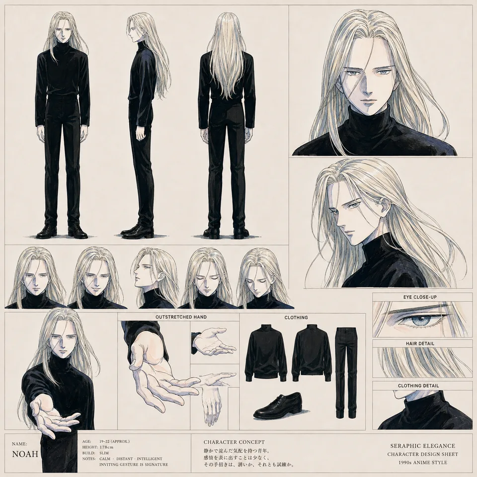

# Hermes User 123321 — supporting references

Shared references remain single-copy previews in the central reference gallery.

- Canonical reference links: 2
- Candidate links (not canonical): 0

## Canonical references

### Sheet

- Reference ID: `ref-a595c0c99b6fdeec`
- Type: `sheet`
- Mapping confidence: `source-established`
- Rights: `unknown-not-cleared`

### Scene

- Reference ID: `ref-fa9eeed3da8ff124`
- Type: `scene`
- Mapping confidence: `source-established`
- Rights: `unknown-not-cleared`

## Candidate references — not canonical

No candidate reference links.
