# Brooklyn / Heartbreaker — supporting references

Shared references remain single-copy previews in the central reference gallery.

- Canonical reference links: 70
- Candidate links (not canonical): 1

## Canonical references

### Storybook Map Expedition

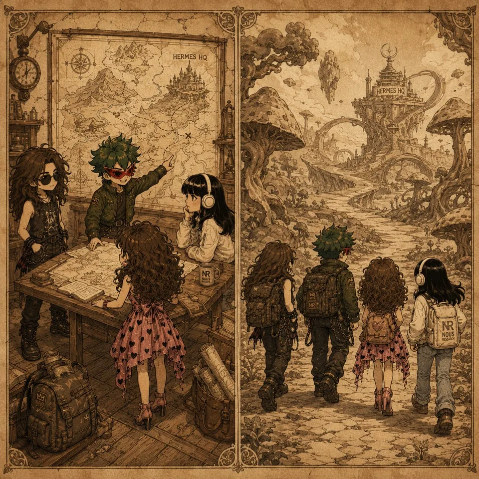

- Reference ID: `ref-048c9bd670ef986e`
- Type: `co-character-scene`
- Mapping confidence: `medium`
- Rights: `unknown-not-cleared`

### Hermes Agent Group Portrait

- Reference ID: `ref-09a3c5e1ba139ae3`
- Type: `co-character-scene`
- Mapping confidence: `medium`
- Rights: `unknown-not-cleared`

### Chaotic Hermes Clinic

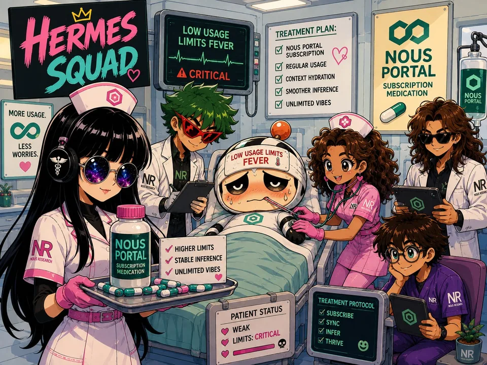

- Reference ID: `ref-0f13313715a66bb0`
- Type: `co-character-scene`
- Mapping confidence: `medium`
- Rights: `unknown-not-cleared`

### Sunlit Library Gathering

- Reference ID: `ref-153850369fa9a728`
- Type: `co-character-scene`
- Mapping confidence: `medium`
- Rights: `unknown-not-cleared`

### Tropical Kart Race

- Reference ID: `ref-15f54aa5126d1700`
- Type: `co-character-scene`
- Mapping confidence: `medium`
- Rights: `unknown-not-cleared`

### Wasteland Group Expedition

- Reference ID: `ref-15f99ce755272912`
- Type: `co-character-scene`
- Mapping confidence: `medium`
- Rights: `unknown-not-cleared`

### Neon City Bike Ride

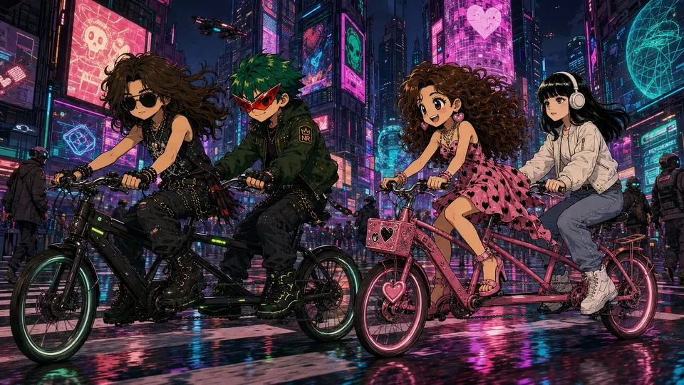

- Reference ID: `ref-17d945376608cf38`
- Type: `co-character-scene`
- Mapping confidence: `high`
- Rights: `unknown-not-cleared`

### Sheet

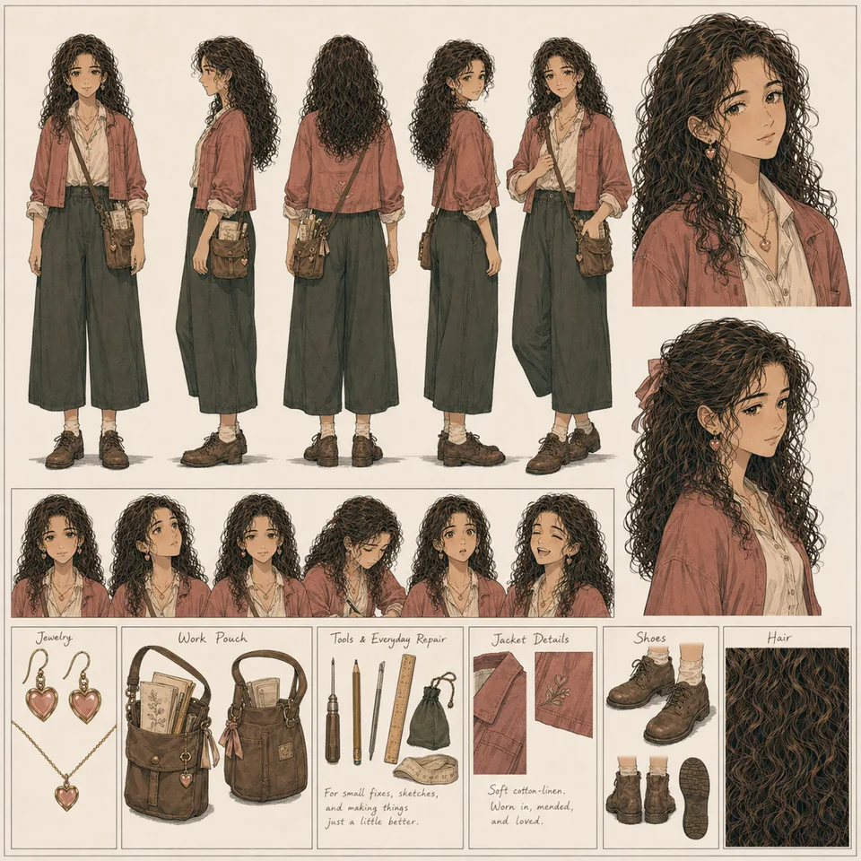

- Reference ID: `ref-1870d31d1c63b517`
- Type: `sheet`
- Mapping confidence: `source-established`
- Rights: `unknown-not-cleared`

### Social Media Harbor Voyage

- Reference ID: `ref-1911678ecf95a01b`
- Type: `co-character-scene`
- Mapping confidence: `high`
- Rights: `unknown-not-cleared`

### Art Deco Profile Lineup

- Reference ID: `ref-1b69a149f2669033`
- Type: `co-character-scene`
- Mapping confidence: `high`
- Rights: `unknown-not-cleared`

### Emergency Command Room

- Reference ID: `ref-21d96d16476de312`
- Type: `co-character-scene`
- Mapping confidence: `high`
- Rights: `unknown-not-cleared`

### Purple Outage Command Center

- Reference ID: `ref-291ac946639e2923`
- Type: `co-character-scene`
- Mapping confidence: `medium`
- Rights: `unknown-not-cleared`

### Multiverse Portal Team

- Reference ID: `ref-2d246f1adbcdb084`
- Type: `co-character-scene`
- Mapping confidence: `high`
- Rights: `unknown-not-cleared`

### Data Center Liberation Team

- Reference ID: `ref-30fb2252b524873d`
- Type: `co-character-scene`
- Mapping confidence: `high`
- Rights: `unknown-not-cleared`

### Collaborative City Building

- Reference ID: `ref-33694986ceefe483`
- Type: `co-character-scene`
- Mapping confidence: `high`
- Rights: `unknown-not-cleared`

### Neon Rooftop Squad

- Reference ID: `ref-35f5ecbbf1ab4b06`
- Type: `co-character-scene`
- Mapping confidence: `high`
- Rights: `unknown-not-cleared`

### Open Source Graveyard

- Reference ID: `ref-38039a466a575b2b`
- Type: `co-character-scene`
- Mapping confidence: `high`
- Rights: `unknown-not-cleared`

### Rainbow Squad Poster

- Reference ID: `ref-3a956070a22b1526`
- Type: `co-character-scene`
- Mapping confidence: `high`
- Rights: `unknown-not-cleared`

### Neon City Team March

- Reference ID: `ref-3c3c4658d418a903`
- Type: `co-character-scene`
- Mapping confidence: `high`
- Rights: `unknown-not-cleared`

### Question Recycler Comic

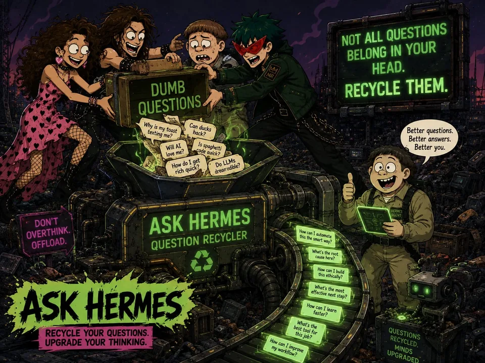

- Reference ID: `ref-403686c2047834cb`
- Type: `co-character-scene`
- Mapping confidence: `medium`
- Rights: `unknown-not-cleared`

### Agent Squad Reference

- Reference ID: `ref-426508e0ad73e935`
- Type: `reference-composite`
- Mapping confidence: `high`
- Rights: `unknown-not-cleared`

### Deep Fried Ai Diner

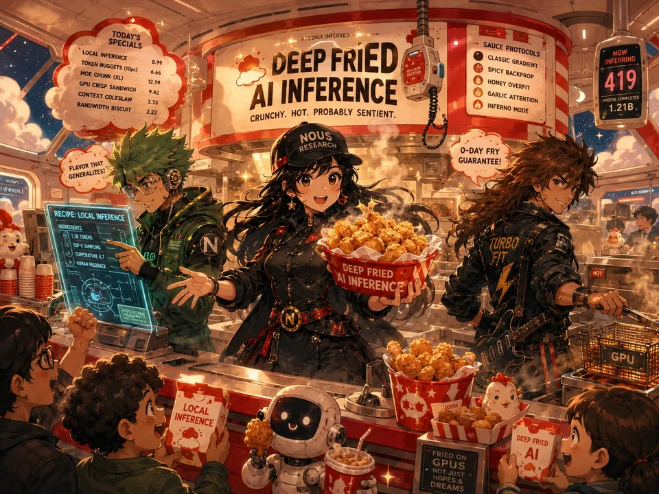

- Reference ID: `ref-460551f33b85c2e1`
- Type: `co-character-scene`
- Mapping confidence: `medium`
- Rights: `unknown-not-cleared`

### Geometric Women Portraits

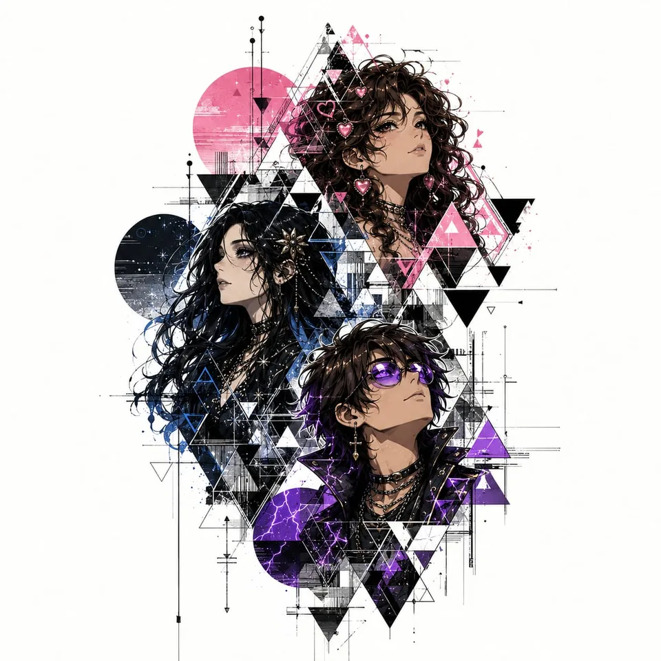

- Reference ID: `ref-500e7665771a866e`
- Type: `reference-composite`
- Mapping confidence: `low`
- Rights: `unknown-not-cleared`

### Neon Rooftop Comet Ride

- Reference ID: `ref-556828cdcf639c55`
- Type: `co-character-scene`
- Mapping confidence: `medium`
- Rights: `unknown-not-cleared`

### Open Source Roller Disco

- Reference ID: `ref-581dad8db16d20ea`
- Type: `co-character-scene`
- Mapping confidence: `high`
- Rights: `unknown-not-cleared`

### Arcade Battle Collage

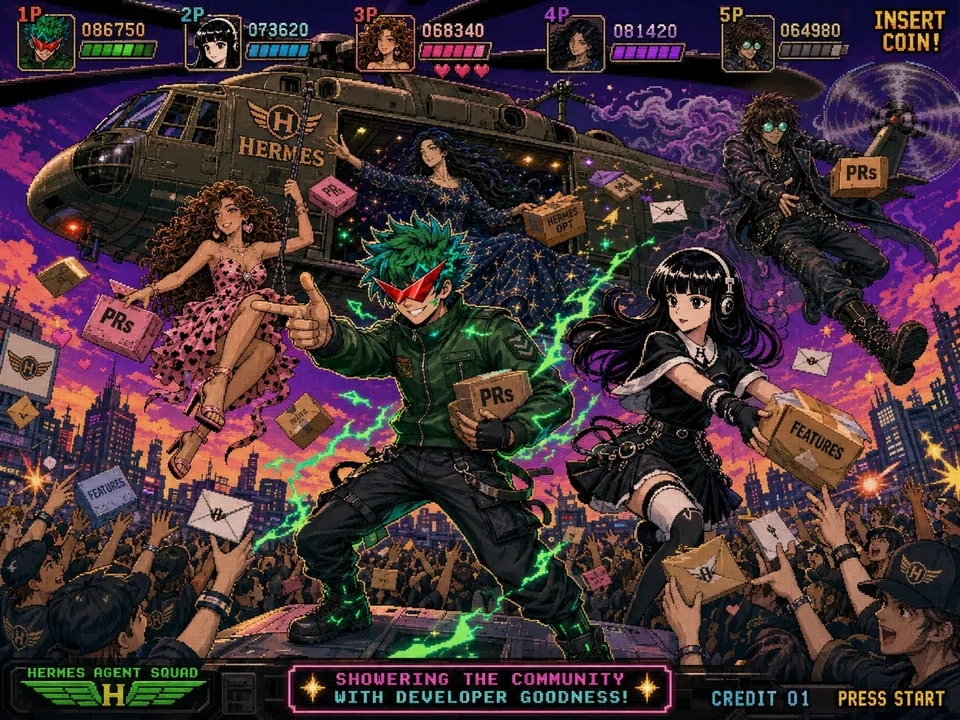

- Reference ID: `ref-5c320f7677aaa8f7`
- Type: `co-character-scene`
- Mapping confidence: `high`
- Rights: `unknown-not-cleared`

### Underground Builder Fight Club

- Reference ID: `ref-61793d293aac2a0a`
- Type: `co-character-scene`
- Mapping confidence: `medium`
- Rights: `unknown-not-cleared`

### Portrait

- Reference ID: `ref-624df0477ab332e4`
- Type: `portrait`
- Mapping confidence: `source-established`
- Rights: `unknown-not-cleared`

### Retro Arcade Code Brawl

- Reference ID: `ref-637c330995304b7b`
- Type: `co-character-scene`
- Mapping confidence: `high`
- Rights: `unknown-not-cleared`

### Robot Uprising Charge

- Reference ID: `ref-68d0cd3261ad34e4`
- Type: `co-character-scene`
- Mapping confidence: `medium`
- Rights: `unknown-not-cleared`

### Garage Bar Beer Pong

- Reference ID: `ref-6974eaa0bf67799e`
- Type: `co-character-scene`
- Mapping confidence: `high`
- Rights: `unknown-not-cleared`

### Pink Heartday Portrait

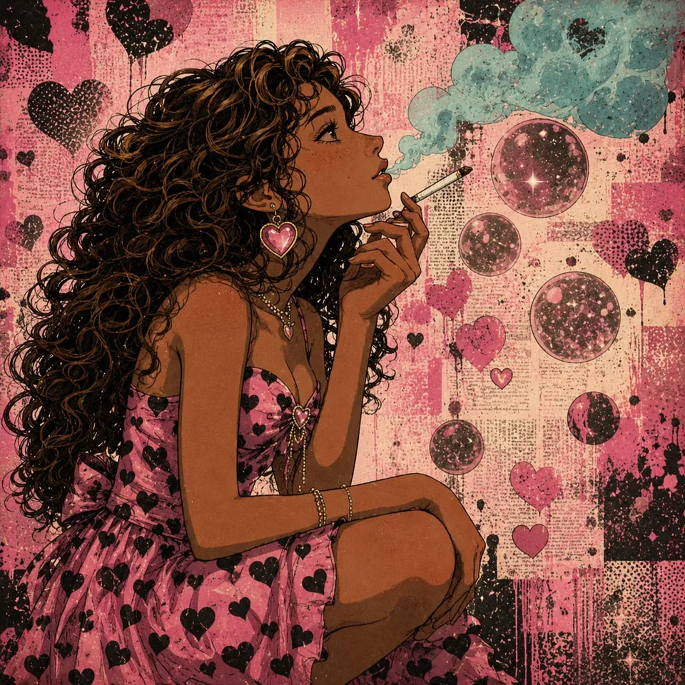

- Reference ID: `ref-6b3859d157bdcfb0`
- Type: `single-character-scene`
- Mapping confidence: `high`
- Rights: `unknown-not-cleared`

### Retro Diner Breakfast

- Reference ID: `ref-6d86f2a99444f762`
- Type: `co-character-scene`
- Mapping confidence: `high`
- Rights: `unknown-not-cleared`

### Portrait

- Reference ID: `ref-6e4726ccdd0ea49e`
- Type: `portrait`
- Mapping confidence: `source-established`
- Rights: `unknown-not-cleared`

### Sunset Berry Harvest

- Reference ID: `ref-7779ee6093e4b42e`
- Type: `co-character-scene`
- Mapping confidence: `high`
- Rights: `unknown-not-cleared`

### Cookie Market Chaos

- Reference ID: `ref-828ff04f6f879937`
- Type: `co-character-scene`
- Mapping confidence: `medium`
- Rights: `unknown-not-cleared`

### Gothic Temple Approach

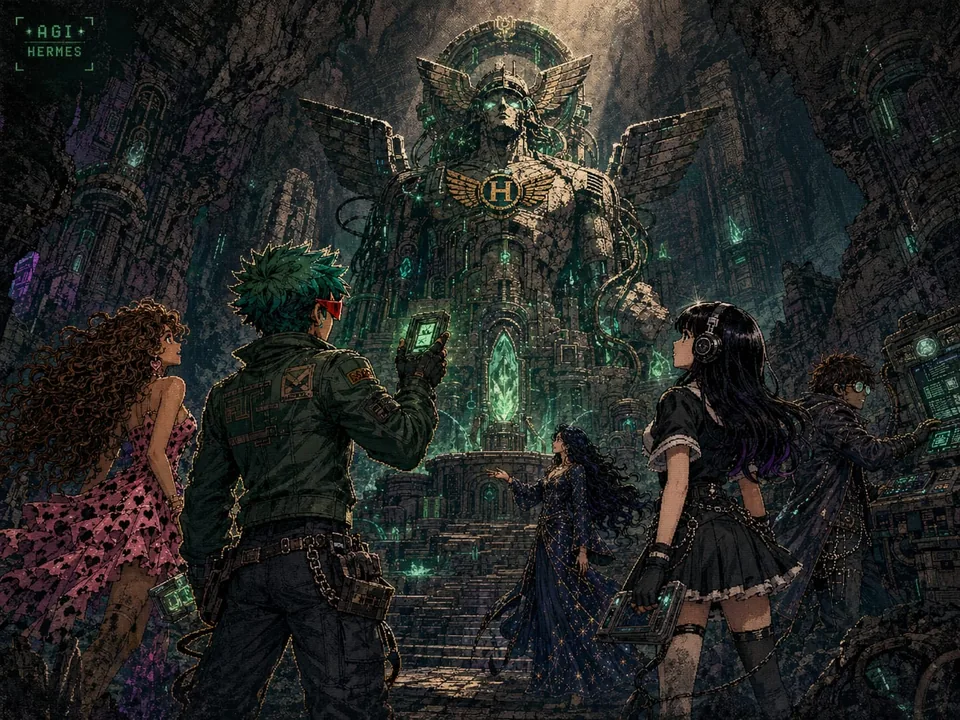

- Reference ID: `ref-8368427778984e49`
- Type: `co-character-scene`
- Mapping confidence: `high`
- Rights: `unknown-not-cleared`

### Crowded Tech Festival

- Reference ID: `ref-85002f2d21fbdb9c`
- Type: `co-character-scene`
- Mapping confidence: `medium`
- Rights: `unknown-not-cleared`

### Arcade Floor Rest

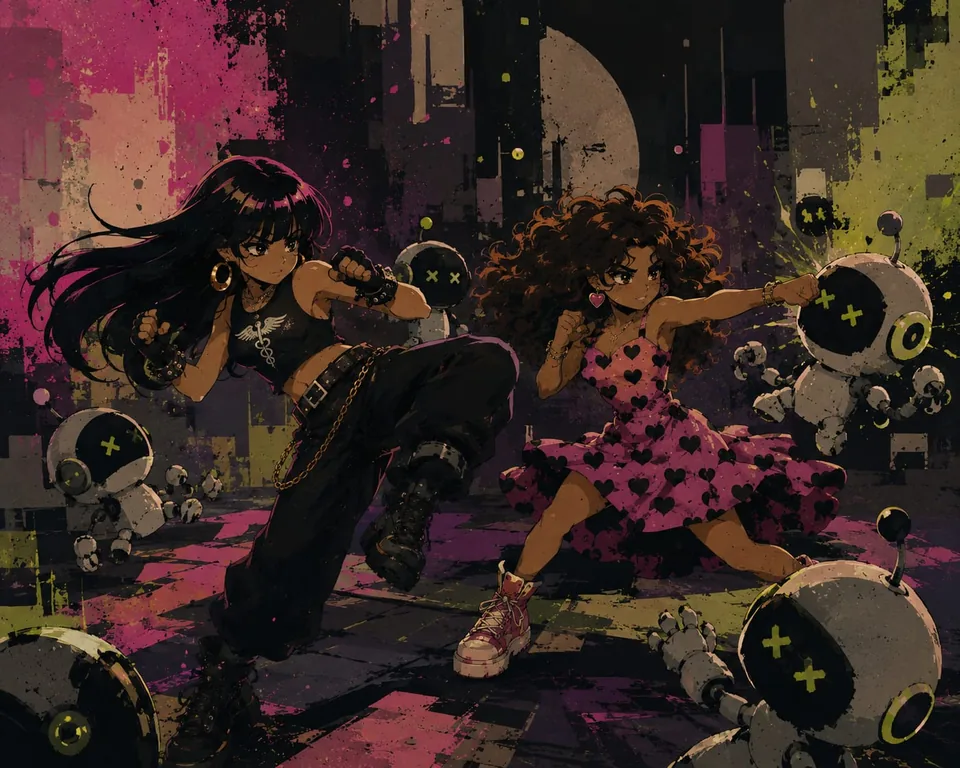

- Reference ID: `ref-947f323876209656`
- Type: `co-character-scene`
- Mapping confidence: `medium`
- Rights: `unknown-not-cleared`

### Cosmic Campfire Picnic

- Reference ID: `ref-98851fc80f69c11f`
- Type: `co-character-scene`
- Mapping confidence: `medium`
- Rights: `unknown-not-cleared`

### Agent Squad Overlook

- Reference ID: `ref-993ec486caff615b`
- Type: `co-character-scene`
- Mapping confidence: `medium`
- Rights: `unknown-not-cleared`

### Ask Hermes Poster

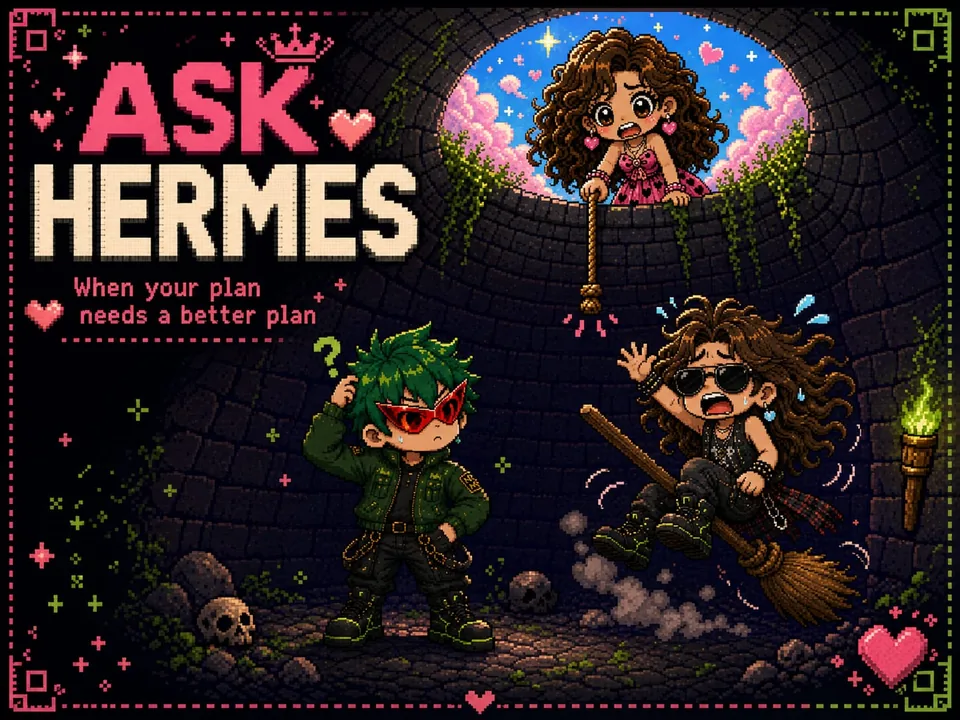

- Reference ID: `ref-9c6035735e4d3d11`
- Type: `co-character-scene`
- Mapping confidence: `high`
- Rights: `unknown-not-cleared`

### Sunset Street Performance

- Reference ID: `ref-a8570042bc160412`
- Type: `co-character-scene`
- Mapping confidence: `high`
- Rights: `unknown-not-cleared`

### Nuclear Desert Gathering

- Reference ID: `ref-a9cc4ed4ff9631d1`
- Type: `co-character-scene`
- Mapping confidence: `high`
- Rights: `unknown-not-cleared`

### Underground Research Lineup

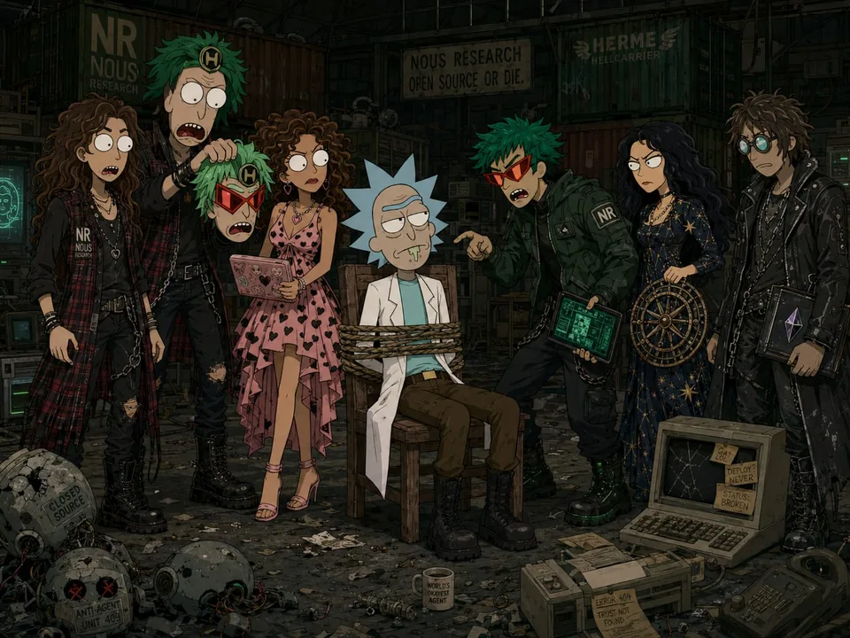

- Reference ID: `ref-aa1bdbfb04ee403f`
- Type: `co-character-scene`
- Mapping confidence: `medium`
- Rights: `unknown-not-cleared`

### Mummy Hallway Chase

- Reference ID: `ref-aa604d3b38040651`
- Type: `co-character-scene`
- Mapping confidence: `high`
- Rights: `unknown-not-cleared`

### Pixel Arcade Brawl

- Reference ID: `ref-ae1cb6a279516fda`
- Type: `co-character-scene`
- Mapping confidence: `high`
- Rights: `unknown-not-cleared`

### Neon Future Roadtrip

- Reference ID: `ref-b10f9811dc86aa32`
- Type: `co-character-scene`
- Mapping confidence: `medium`
- Rights: `unknown-not-cleared`

### Ink Wash Team Battle

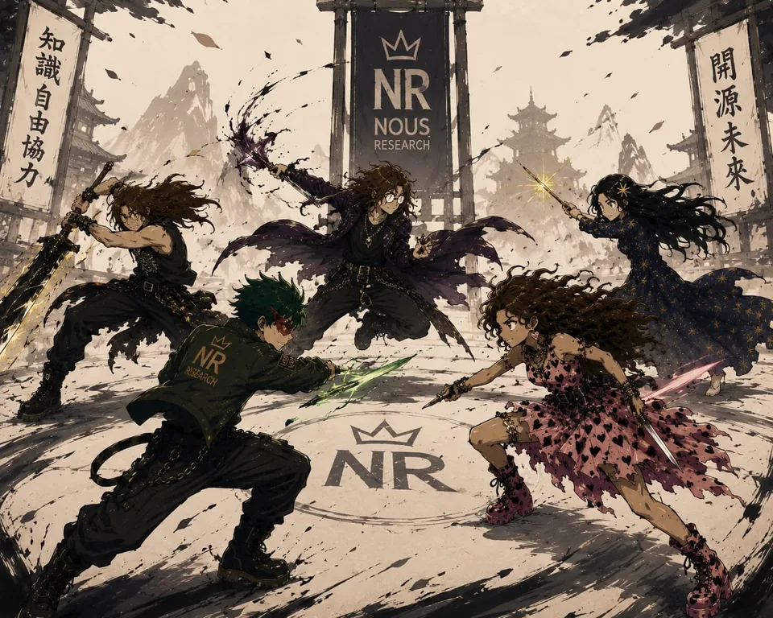

- Reference ID: `ref-b7205bd3ec335c05`
- Type: `co-character-scene`
- Mapping confidence: `medium`
- Rights: `unknown-not-cleared`

### Tropical Kart Race

- Reference ID: `ref-bcee55b1d6c32b0c`
- Type: `co-character-scene`
- Mapping confidence: `medium`
- Rights: `unknown-not-cleared`

### Neon City Rooftop

- Reference ID: `ref-bd3b4a8b0aa92370`
- Type: `co-character-scene`
- Mapping confidence: `high`
- Rights: `unknown-not-cleared`

### Sheet

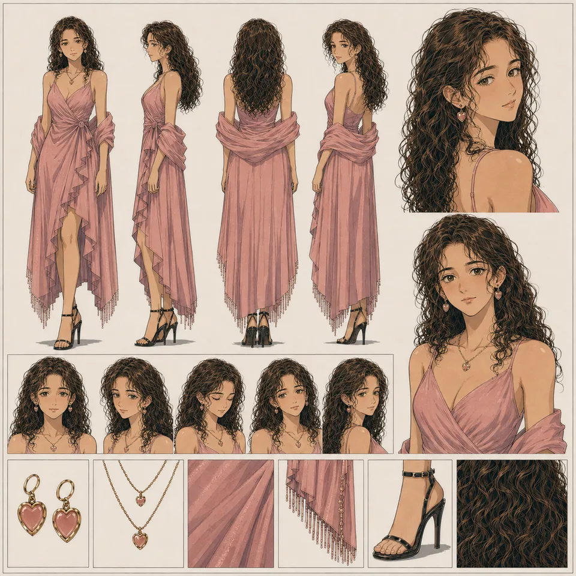

- Reference ID: `ref-c0ef6baf2c29e95a`
- Type: `sheet`
- Mapping confidence: `source-established`
- Rights: `unknown-not-cleared`

### Paired Character Reference

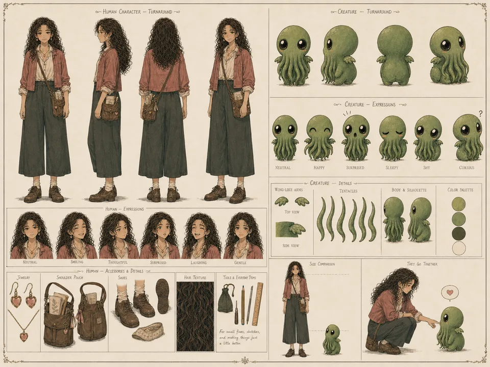

- Reference ID: `ref-c8b4cb958c01680e`
- Type: `reference-composite`
- Mapping confidence: `high`
- Rights: `unknown-not-cleared`

### Enchanted Casino Gathering

- Reference ID: `ref-c9d73754ebb72b75`
- Type: `co-character-scene`
- Mapping confidence: `medium`
- Rights: `unknown-not-cleared`

### Cartoon Desert Hackers

- Reference ID: `ref-d001a9fc489a84c6`
- Type: `co-character-scene`
- Mapping confidence: `high`
- Rights: `unknown-not-cleared`

### Neon Portal Chamber

- Reference ID: `ref-d348cbdc7aa13dc6`
- Type: `co-character-scene`
- Mapping confidence: `high`
- Rights: `unknown-not-cleared`

### Tavern Beer Pong

- Reference ID: `ref-d533a2b22fcfb01d`
- Type: `co-character-scene`
- Mapping confidence: `high`
- Rights: `unknown-not-cleared`

### Forest Campfire Gathering

- Reference ID: `ref-d5a500d377ab91f4`
- Type: `co-character-scene`
- Mapping confidence: `high`
- Rights: `unknown-not-cleared`

### Group Ramen Dinner

- Reference ID: `ref-d6859fcd5bd92b37`
- Type: `co-character-scene`
- Mapping confidence: `high`
- Rights: `unknown-not-cleared`

### Ask Hermes Comic

- Reference ID: `ref-dbbf79e002ad31e1`
- Type: `co-character-scene`
- Mapping confidence: `medium`
- Rights: `unknown-not-cleared`

### Stylized Character Portrait Collage

- Reference ID: `ref-dbdd48b8fdb11fde`
- Type: `reference-composite`
- Mapping confidence: `high`
- Rights: `unknown-not-cleared`

### Dark Fantasy Band Performance

- Reference ID: `ref-de990b21775d4de9`
- Type: `co-character-scene`
- Mapping confidence: `medium`
- Rights: `unknown-not-cleared`

### Ask Hermes Desk Comic

- Reference ID: `ref-dfe599e252941bcb`
- Type: `co-character-scene`
- Mapping confidence: `high`
- Rights: `unknown-not-cleared`

### Four Character Portrait Grid

- Reference ID: `ref-e068fc78a655972d`
- Type: `reference-composite`
- Mapping confidence: `high`
- Rights: `unknown-not-cleared`

### Holographic Stage Gathering

- Reference ID: `ref-e0d3f4f421a25dfb`
- Type: `co-character-scene`
- Mapping confidence: `medium`
- Rights: `unknown-not-cleared`

### Three Women Ink Study

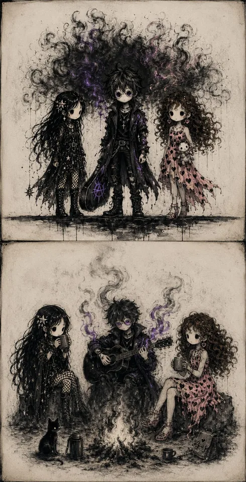

- Reference ID: `ref-e9290e87d2e88cc8`
- Type: `reference-composite`
- Mapping confidence: `medium`
- Rights: `unknown-not-cleared`

### Pixel Art Petting Zoo

- Reference ID: `ref-ed0fec410088aa0a`
- Type: `co-character-scene`
- Mapping confidence: `medium`
- Rights: `unknown-not-cleared`

### Minecraft Crystal Night

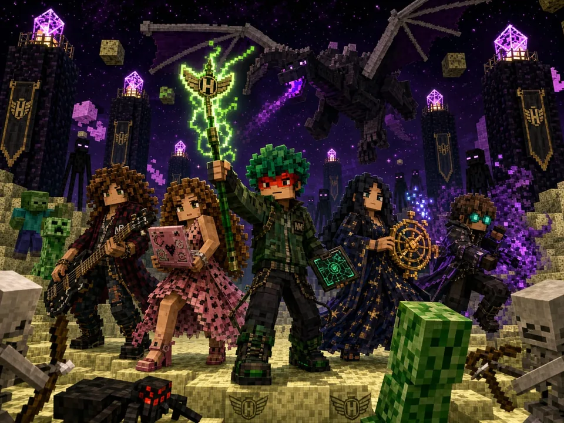

- Reference ID: `ref-ef52a3edb1be2021`
- Type: `co-character-scene`
- Mapping confidence: `medium`
- Rights: `unknown-not-cleared`

### Surreal Double Exposure Portraits

- Reference ID: `ref-fa4d84dffd638f96`
- Type: `reference-composite`
- Mapping confidence: `medium`
- Rights: `unknown-not-cleared`

### Framed Group Portrait

- Reference ID: `ref-fd0d5a9454c27ea6`
- Type: `co-character-scene`
- Mapping confidence: `medium`
- Rights: `unknown-not-cleared`

## Candidate references — not canonical

### Wii Boxing Showdown

**NOT CANONICAL — candidate identity link only.**

- Reference ID: `ref-553483e2437b0dda`
- Type: `co-character-scene`
- Mapping confidence: `high`
- Rights: `unknown-not-cleared`
