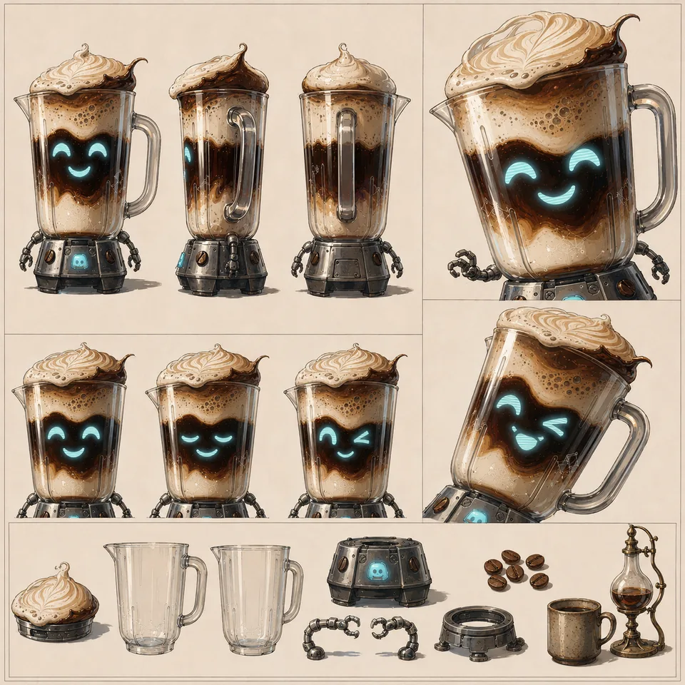

# coffeeblender — supporting references

Shared references remain single-copy previews in the central reference gallery.

- Canonical reference links: 3
- Candidate links (not canonical): 0

## Canonical references

### Night Train Coffee

- Reference ID: `ref-8cf50795ee939cc8`
- Type: `co-character-scene`
- Mapping confidence: `high`
- Rights: `unknown-not-cleared`

### Sheet

- Reference ID: `ref-a2aebaf83f712ad4`
- Type: `sheet`
- Mapping confidence: `source-established`
- Rights: `unknown-not-cleared`

### Neon City Rooftop

- Reference ID: `ref-bd3b4a8b0aa92370`
- Type: `co-character-scene`
- Mapping confidence: `high`
- Rights: `unknown-not-cleared`

## Candidate references — not canonical

No candidate reference links.
