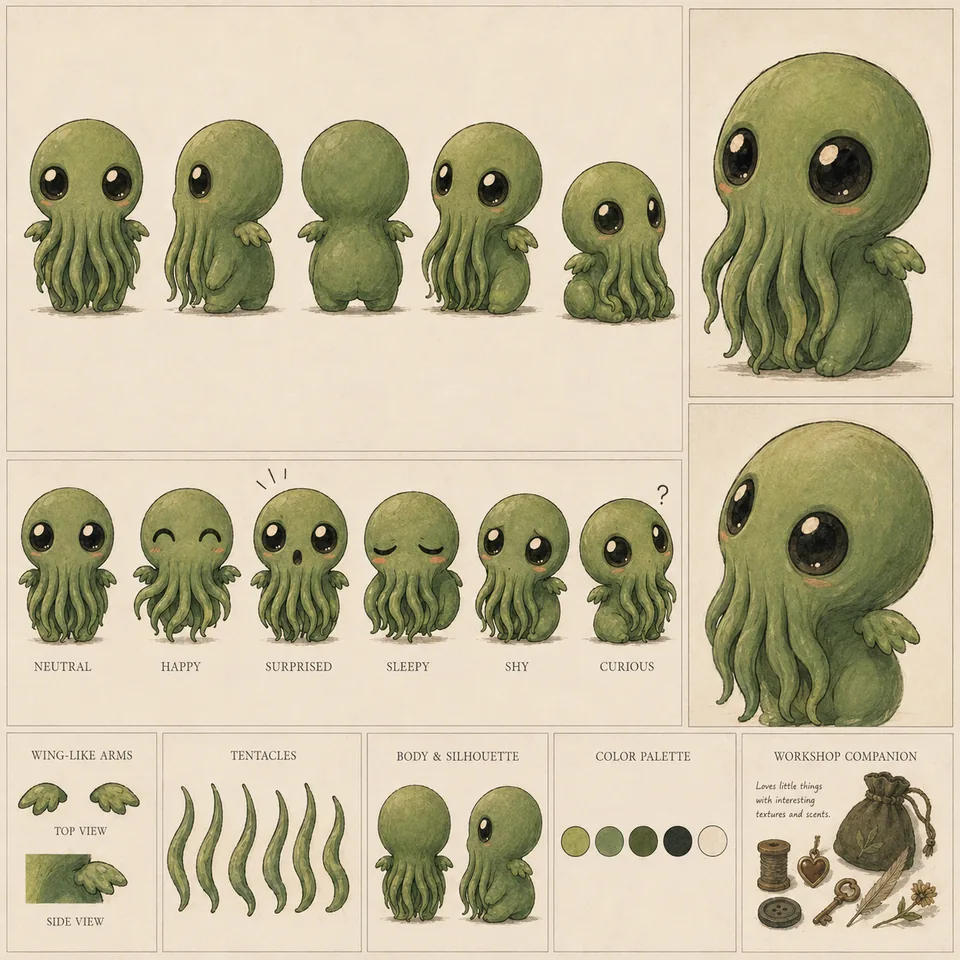

# Cthulhu — supporting references

Shared references remain single-copy previews in the central reference gallery.

- Canonical reference links: 2
- Candidate links (not canonical): 0

## Canonical references

### Sheet

- Reference ID: `ref-66d6371d593bb97f`
- Type: `sheet`
- Mapping confidence: `source-established`
- Rights: `unknown-not-cleared`

### Paired Character Reference

- Reference ID: `ref-c8b4cb958c01680e`
- Type: `reference-composite`
- Mapping confidence: `high`
- Rights: `unknown-not-cleared`

## Candidate references — not canonical

No candidate reference links.
