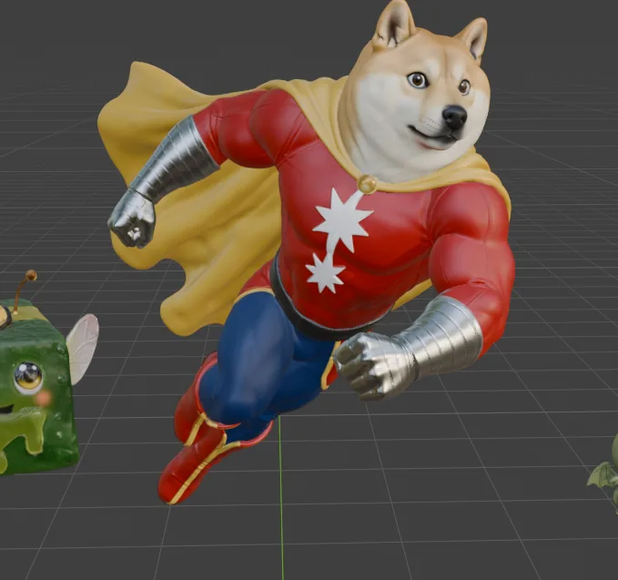
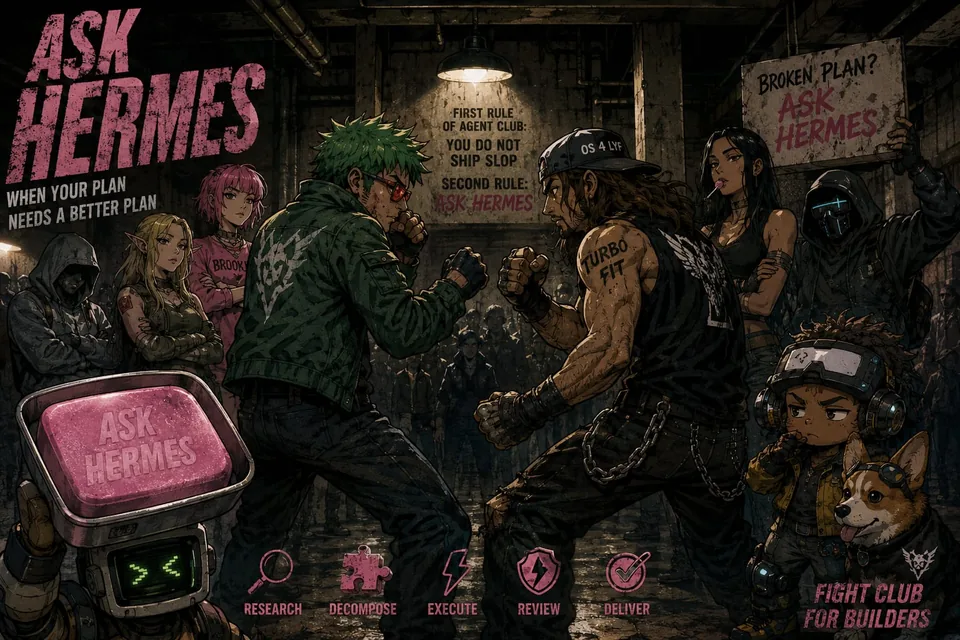
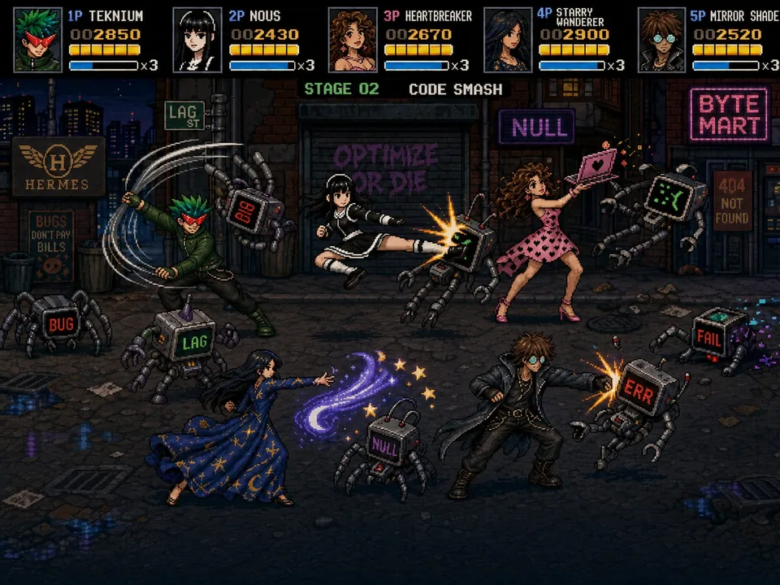
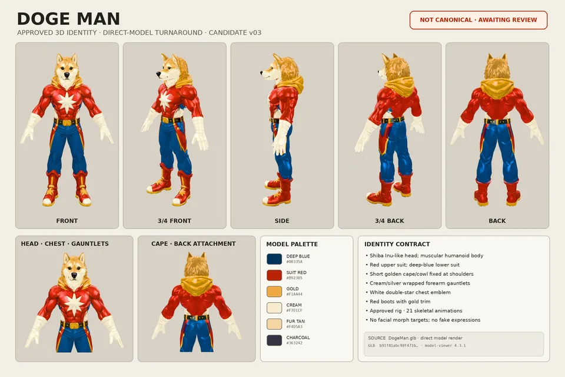
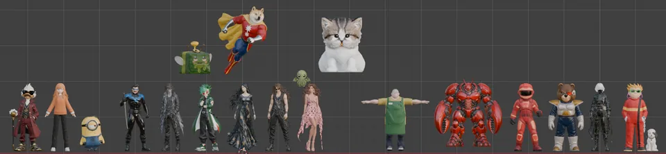

# Doge Man — supporting references

Shared references remain single-copy previews in the central reference gallery.

- Canonical reference links: 5
- Candidate links (not canonical): 0

## Canonical references

### Model Preview

- Reference ID: `ref-47dc7d1cef0c5f8a`
- Type: `model-preview`
- Mapping confidence: `source-established`
- Rights: `unknown-not-cleared`

### Underground Builder Fight Club

- Reference ID: `ref-61793d293aac2a0a`
- Type: `co-character-scene`
- Mapping confidence: `medium`
- Rights: `unknown-not-cleared`

### Retro Arcade Code Brawl

- Reference ID: `ref-637c330995304b7b`
- Type: `co-character-scene`
- Mapping confidence: `high`
- Rights: `unknown-not-cleared`

### Identity Sheet

- Reference ID: `ref-6fe87acf02773275`
- Type: `identity-sheet`
- Mapping confidence: `source-established`
- Rights: `unknown-not-cleared`

### Multiverse Character Lineup

- Reference ID: `ref-cc0bc0aad177d6e2`
- Type: `reference-composite`
- Mapping confidence: `medium`
- Rights: `unknown-not-cleared`

## Candidate references — not canonical

No candidate reference links.
