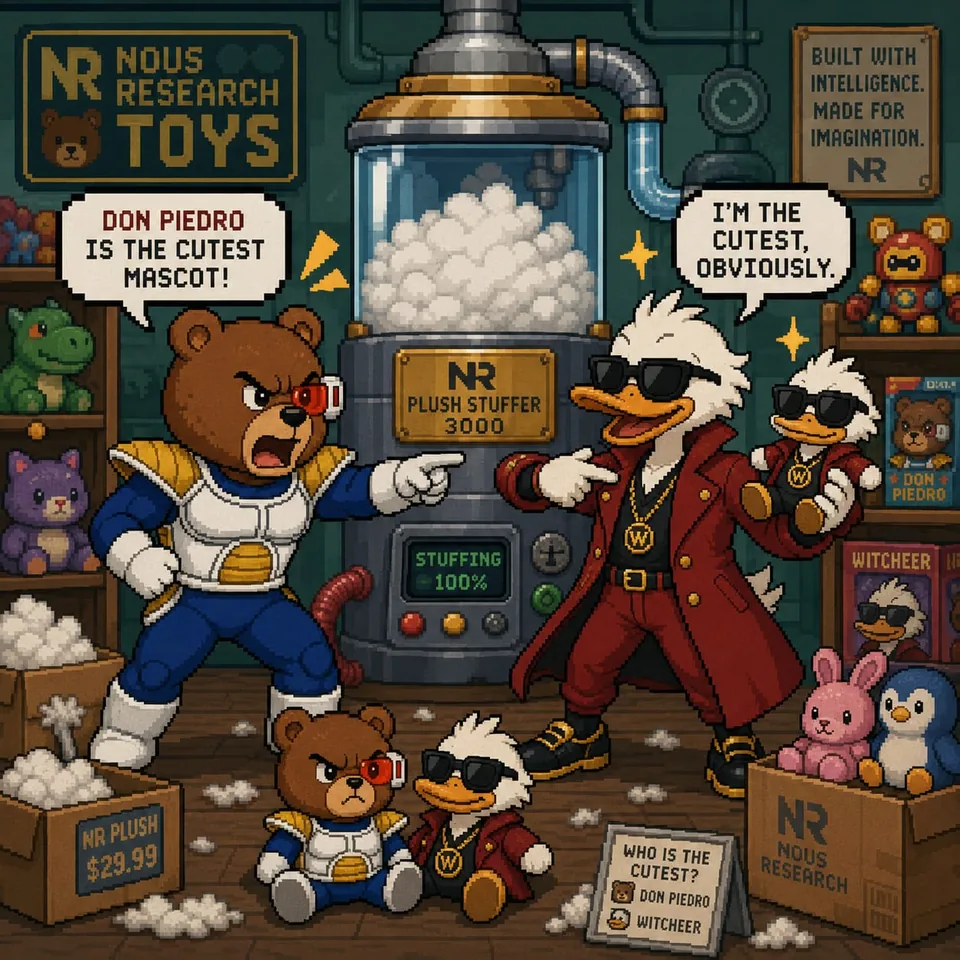
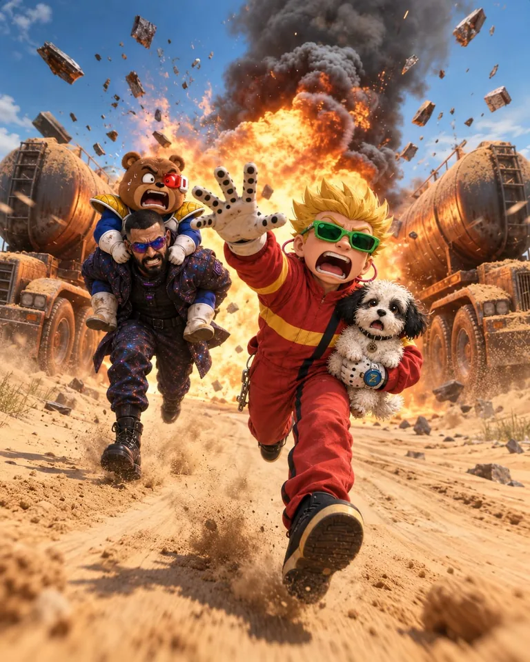
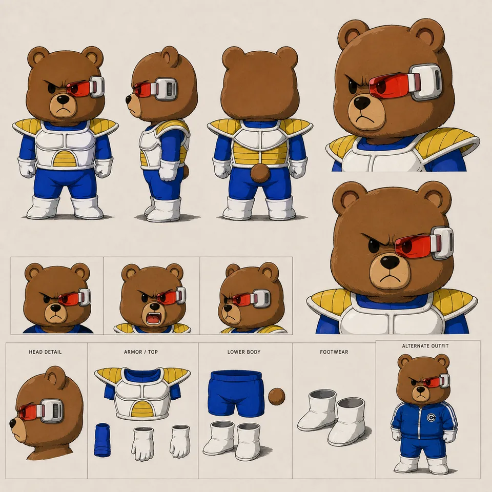
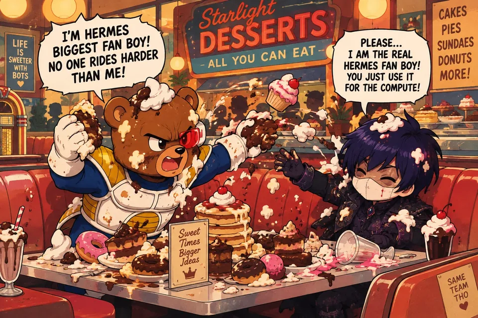

# Don Piedro — supporting references

Shared references remain single-copy previews in the central reference gallery.

- Canonical reference links: 6
- Candidate links (not canonical): 0

## Canonical references

### Plush Factory Argument

- Reference ID: `ref-4262d1ca9d36af6b`
- Type: `co-character-scene`
- Mapping confidence: `high`
- Rights: `unknown-not-cleared`

### Explosive Desert Escape

- Reference ID: `ref-746b72b93139c902`
- Type: `co-character-scene`
- Mapping confidence: `high`
- Rights: `unknown-not-cleared`

### Sheet

- Reference ID: `ref-7950f6b3e9bbbeb9`
- Type: `sheet`
- Mapping confidence: `source-established`
- Rights: `unknown-not-cleared`

### Dessert Buffet Brawl

- Reference ID: `ref-7acce532b34ba583`
- Type: `co-character-scene`
- Mapping confidence: `high`
- Rights: `unknown-not-cleared`

### Scene

- Reference ID: `ref-998a5204398347f5`
- Type: `scene`
- Mapping confidence: `source-established`
- Rights: `unknown-not-cleared`

### Multiverse Character Lineup

- Reference ID: `ref-cc0bc0aad177d6e2`
- Type: `reference-composite`
- Mapping confidence: `medium`
- Rights: `unknown-not-cleared`

## Candidate references — not canonical

No candidate reference links.
