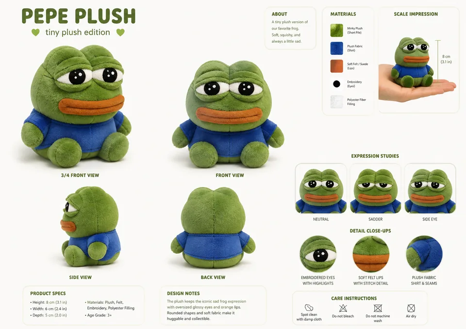

# ee.dd — supporting references

Shared references remain single-copy previews in the central reference gallery.

- Canonical reference links: 2
- Candidate links (not canonical): 0

## Canonical references

### Sheet

- Reference ID: `ref-1c877c970073f4b6`
- Type: `sheet`
- Mapping confidence: `source-established`
- Rights: `unknown-not-cleared`

### Paired Character Reference

- Reference ID: `ref-bd2470771c42e3e0`
- Type: `reference-composite`
- Mapping confidence: `high`
- Rights: `unknown-not-cleared`

## Candidate references — not canonical

No candidate reference links.
