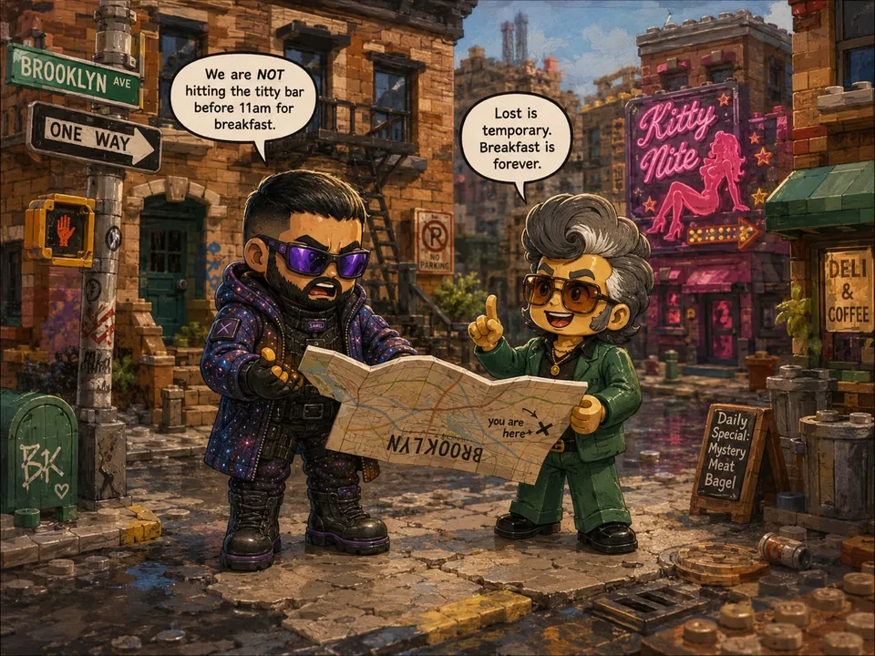
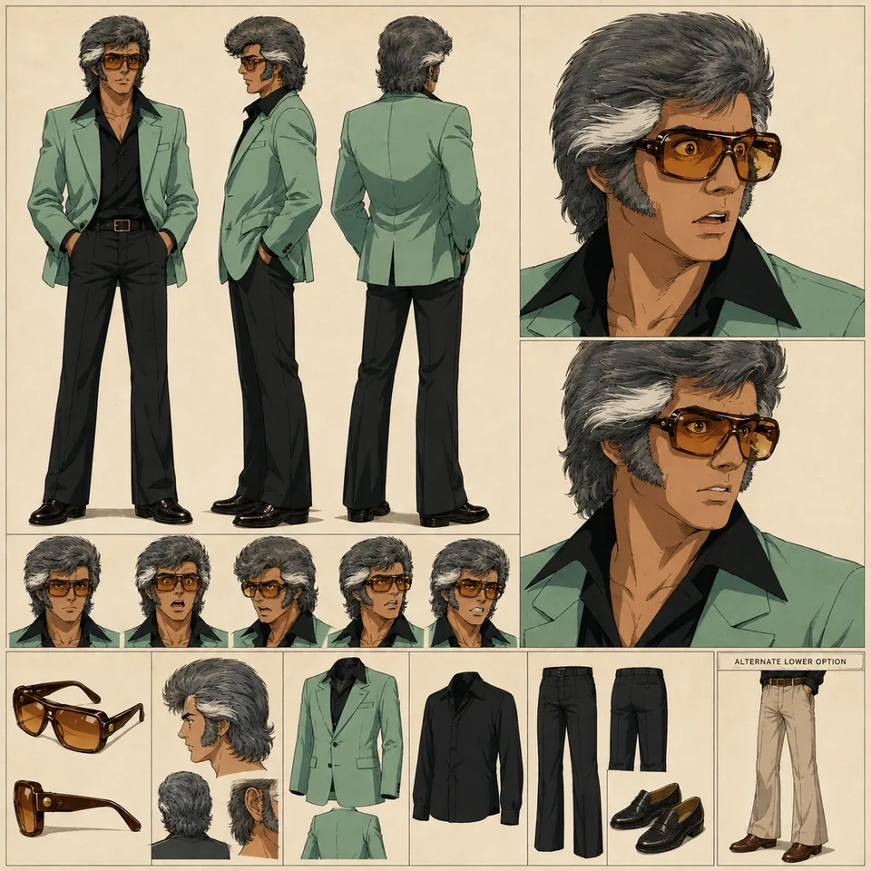

# Fleety13 — supporting references

Shared references remain single-copy previews in the central reference gallery.

- Canonical reference links: 5
- Candidate links (not canonical): 0

## Canonical references

### Psychedelic Pizza Feast

- Reference ID: `ref-09eaa0322d8f28b8`
- Type: `co-character-scene`
- Mapping confidence: `high`
- Rights: `unknown-not-cleared`

### Lunar Cat Confrontation

- Reference ID: `ref-22f9bcd1dc376667`
- Type: `co-character-scene`
- Mapping confidence: `high`
- Rights: `unknown-not-cleared`

### Brooklyn Map Dispute

- Reference ID: `ref-392cdab8982753fc`
- Type: `co-character-scene`
- Mapping confidence: `high`
- Rights: `unknown-not-cleared`

### Sheet

- Reference ID: `ref-b4b5ec0483df3467`
- Type: `sheet`
- Mapping confidence: `source-established`
- Rights: `unknown-not-cleared`

### Circus Cat Performance

- Reference ID: `ref-b7c2dc4040f2d454`
- Type: `co-character-scene`
- Mapping confidence: `high`
- Rights: `unknown-not-cleared`

## Candidate references — not canonical

No candidate reference links.
