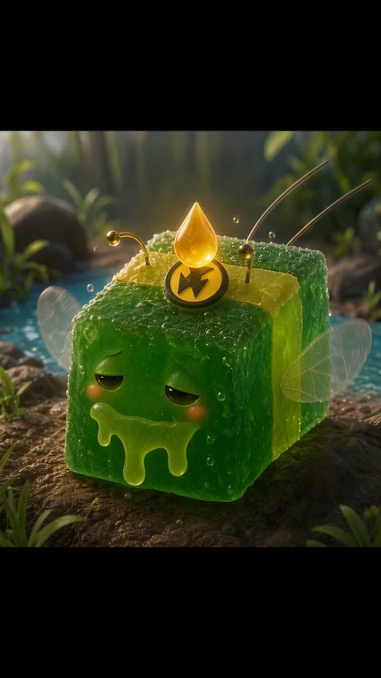

# GGB — Gummy Bee — supporting references

Shared references remain single-copy previews in the central reference gallery.

- Canonical reference links: 1
- Candidate links (not canonical): 0

## Canonical references

### Portrait

- Reference ID: `ref-29c35a8001d84410`
- Type: `portrait`
- Mapping confidence: `source-established`
- Rights: `unknown-not-cleared`

## Candidate references — not canonical

No candidate reference links.
