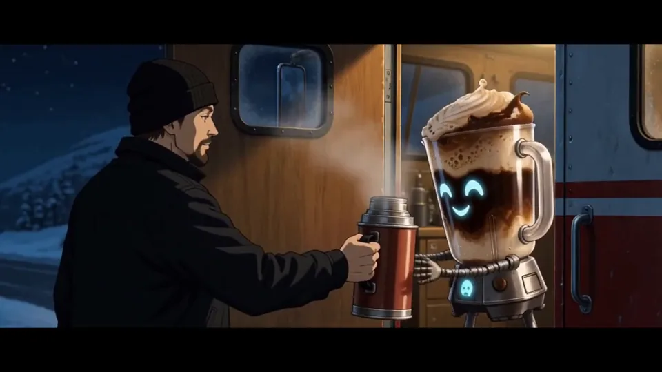
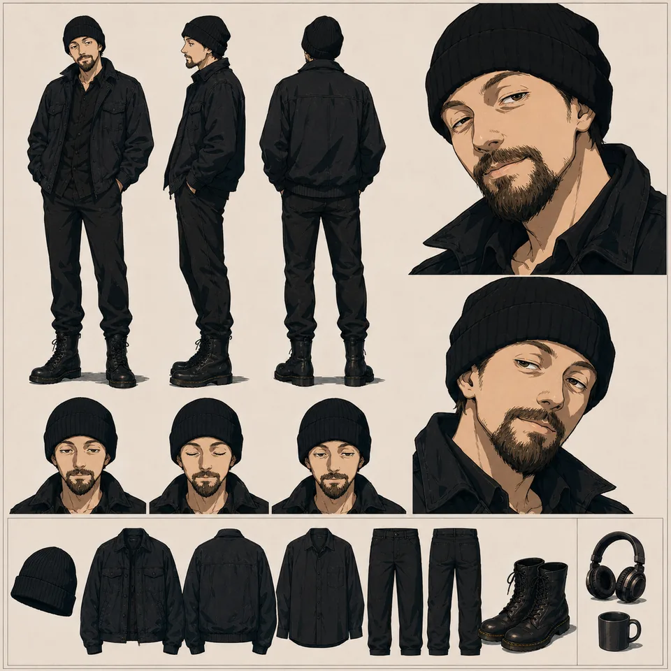

# Gille — supporting references

Shared references remain single-copy previews in the central reference gallery.

- Canonical reference links: 2
- Candidate links (not canonical): 0

## Canonical references

### Night Train Coffee

- Reference ID: `ref-8cf50795ee939cc8`
- Type: `co-character-scene`
- Mapping confidence: `high`
- Rights: `unknown-not-cleared`

### Sheet

- Reference ID: `ref-d62b51062a454001`
- Type: `sheet`
- Mapping confidence: `source-established`
- Rights: `unknown-not-cleared`

## Candidate references — not canonical

No candidate reference links.
