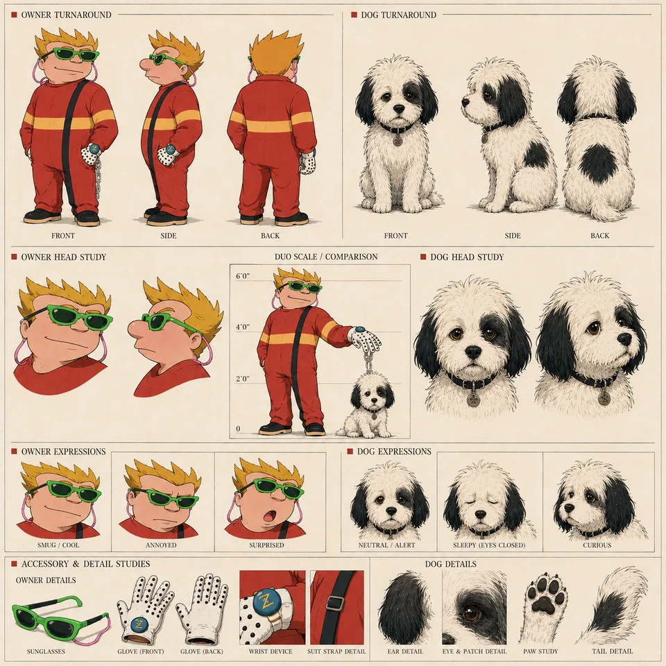
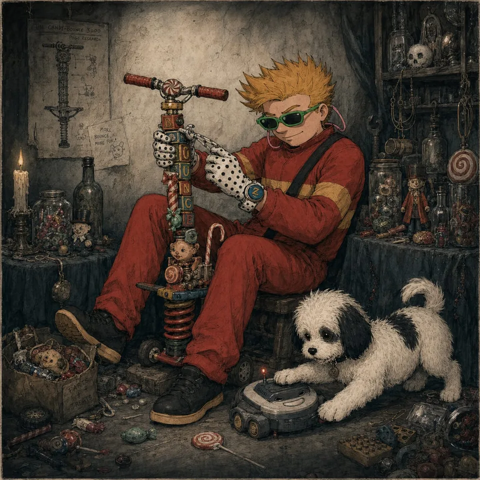
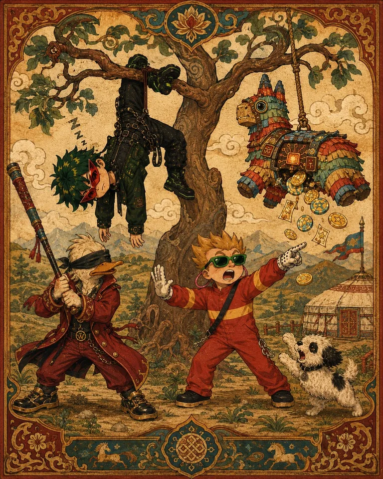
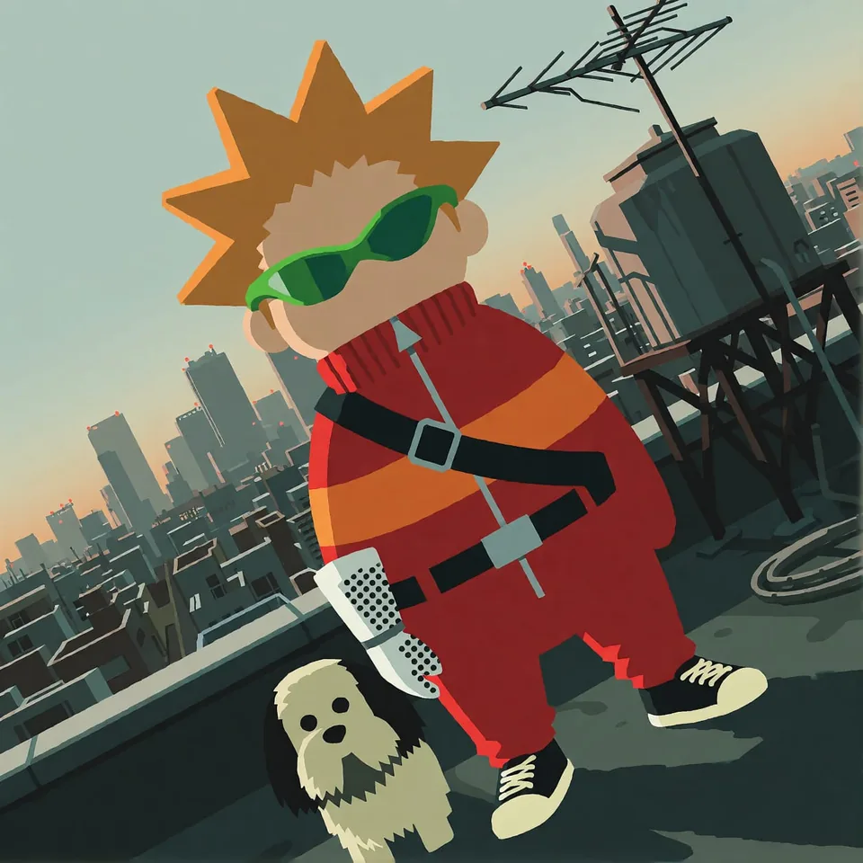
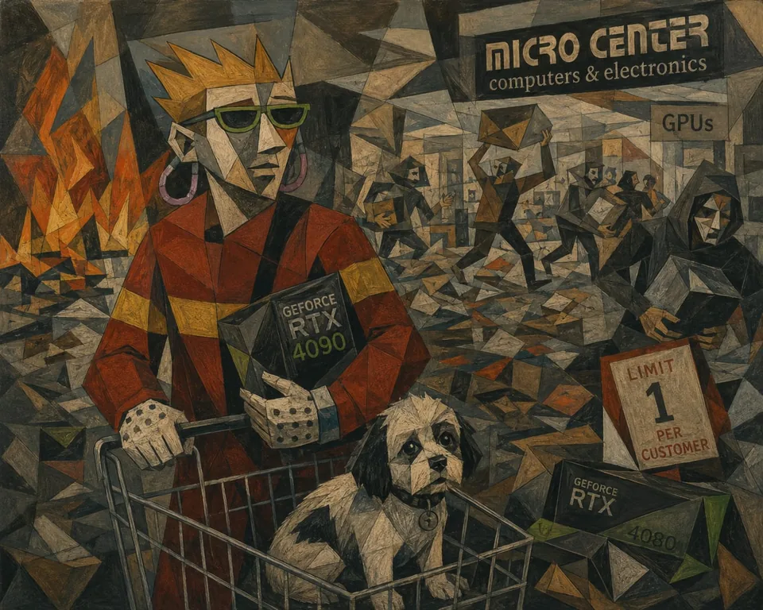
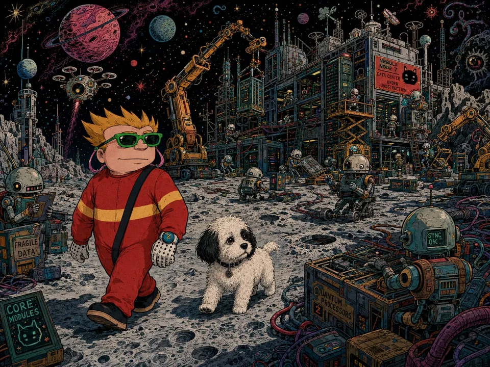

# I Sneeze Kittens — supporting references

Shared references remain single-copy previews in the central reference gallery.

- Canonical reference links: 13
- Candidate links (not canonical): 0

## Canonical references

### Teamwork Propaganda Poster

- Reference ID: `ref-0022ed4f3c3d8335`
- Type: `co-character-scene`
- Mapping confidence: `high`
- Rights: `unknown-not-cleared`

### Sheet

- Reference ID: `ref-133aa3f47876c962`
- Type: `sheet`
- Mapping confidence: `source-established`
- Rights: `unknown-not-cleared`

### Workshop Scooter Repair

- Reference ID: `ref-1cffb91a8085499f`
- Type: `single-character-scene`
- Mapping confidence: `high`
- Rights: `unknown-not-cleared`

### Fantasy Tapestry Adventure

- Reference ID: `ref-25b32f7d64519773`
- Type: `co-character-scene`
- Mapping confidence: `medium`
- Rights: `unknown-not-cleared`

### Stylized Rooftop Pose

- Reference ID: `ref-269ca1583b91b793`
- Type: `single-character-scene`
- Mapping confidence: `high`
- Rights: `unknown-not-cleared`

### Cubist Computer Store

- Reference ID: `ref-320c3001ad952697`
- Type: `single-character-scene`
- Mapping confidence: `high`
- Rights: `unknown-not-cleared`

### Explosive Desert Escape

- Reference ID: `ref-746b72b93139c902`
- Type: `co-character-scene`
- Mapping confidence: `high`
- Rights: `unknown-not-cleared`

### Lunar Machine Yard

- Reference ID: `ref-7cdc0ddbb99c9a5f`
- Type: `single-character-scene`
- Mapping confidence: `high`
- Rights: `unknown-not-cleared`

### Pixel Game Team Run

- Reference ID: `ref-9c85846ce80212d1`
- Type: `co-character-scene`
- Mapping confidence: `high`
- Rights: `unknown-not-cleared`

### Cabin Card Game

- Reference ID: `ref-a3aca202771383ef`
- Type: `co-character-scene`
- Mapping confidence: `high`
- Rights: `unknown-not-cleared`

### Sheet

- Reference ID: `ref-bea35570755626af`
- Type: `sheet`
- Mapping confidence: `source-established`
- Rights: `unknown-not-cleared`

### Multiverse Character Lineup

- Reference ID: `ref-cc0bc0aad177d6e2`
- Type: `reference-composite`
- Mapping confidence: `medium`
- Rights: `unknown-not-cleared`

### Teamwork Propaganda Poster

- Reference ID: `ref-fd3759368f2bcd6a`
- Type: `co-character-scene`
- Mapping confidence: `high`
- Rights: `unknown-not-cleared`

## Candidate references — not canonical

No candidate reference links.
