# NousGirl — supporting references

Shared references remain single-copy previews in the central reference gallery.

- Canonical reference links: 64
- Candidate links (not canonical): 0

## Canonical references

### Storybook Map Expedition

- Reference ID: `ref-048c9bd670ef986e`
- Type: `co-character-scene`
- Mapping confidence: `medium`
- Rights: `unknown-not-cleared`

### Noir Tax Office

- Reference ID: `ref-0e67f739124abc60`
- Type: `co-character-scene`
- Mapping confidence: `high`
- Rights: `unknown-not-cleared`

### Chaotic Hermes Clinic

- Reference ID: `ref-0f13313715a66bb0`
- Type: `co-character-scene`
- Mapping confidence: `medium`
- Rights: `unknown-not-cleared`

### Scene

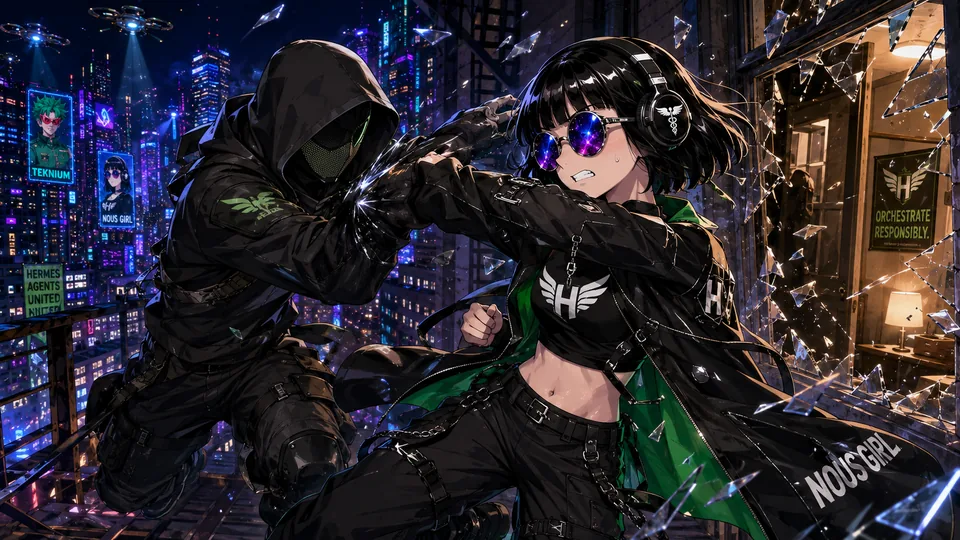

- Reference ID: `ref-117f60523761dda3`
- Type: `scene`
- Mapping confidence: `source-established`
- Rights: `unknown-not-cleared`

### Quiet Intimate Moment

- Reference ID: `ref-12ade71ec086a193`
- Type: `co-character-scene`
- Mapping confidence: `high`
- Rights: `unknown-not-cleared`

### Sunlit Library Gathering

- Reference ID: `ref-153850369fa9a728`
- Type: `co-character-scene`
- Mapping confidence: `medium`
- Rights: `unknown-not-cleared`

### Neon City Bike Ride

- Reference ID: `ref-17d945376608cf38`
- Type: `co-character-scene`
- Mapping confidence: `high`
- Rights: `unknown-not-cleared`

### Sheet

- Reference ID: `ref-1967821c9a0113ac`
- Type: `sheet`
- Mapping confidence: `source-established`
- Rights: `unknown-not-cleared`

### Portrait

- Reference ID: `ref-1ad49e19961a03de`
- Type: `portrait`
- Mapping confidence: `source-established`
- Rights: `unknown-not-cleared`

### Art Deco Profile Lineup

- Reference ID: `ref-1b69a149f2669033`
- Type: `co-character-scene`
- Mapping confidence: `high`
- Rights: `unknown-not-cleared`

### Source Evidence

- Reference ID: `ref-2052ff74073abaa1`
- Type: `source-evidence`
- Mapping confidence: `source-established`
- Rights: `unknown-not-cleared`

### Emergency Command Room

- Reference ID: `ref-21d96d16476de312`
- Type: `co-character-scene`
- Mapping confidence: `high`
- Rights: `unknown-not-cleared`

### Source Evidence

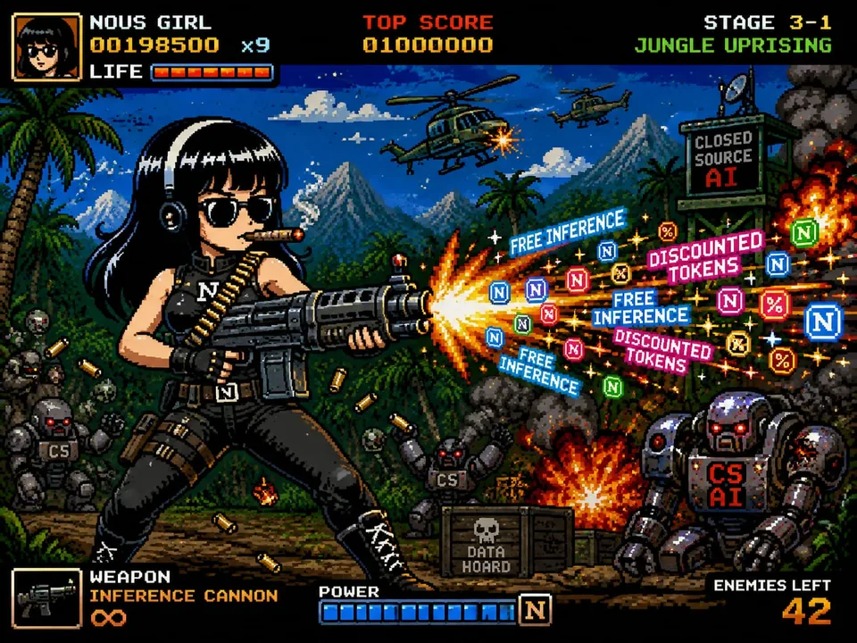

- Reference ID: `ref-221d5c211cd9fcec`
- Type: `source-evidence`
- Mapping confidence: `source-established`
- Rights: `unknown-not-cleared`

### Source Evidence

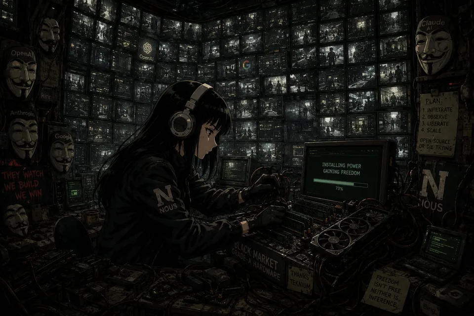

- Reference ID: `ref-22516b5bc1af97c8`
- Type: `source-evidence`
- Mapping confidence: `source-established`
- Rights: `unknown-not-cleared`

### Sheet

- Reference ID: `ref-3c2cdc7c9b147043`
- Type: `sheet`
- Mapping confidence: `source-established`
- Rights: `unknown-not-cleared`

### Source Evidence

- Reference ID: `ref-3c74958918ca6b06`
- Type: `source-evidence`
- Mapping confidence: `source-established`
- Rights: `unknown-not-cleared`

### Sheet

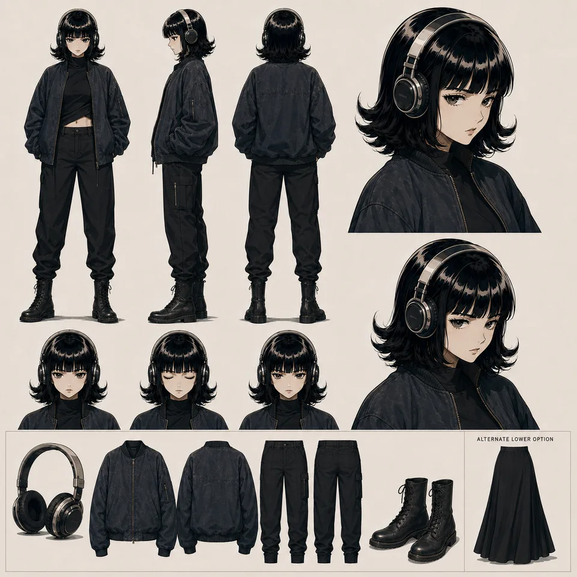

- Reference ID: `ref-41ffcd5b157a0fad`
- Type: `sheet`
- Mapping confidence: `source-established`
- Rights: `unknown-not-cleared`

### Source Evidence

- Reference ID: `ref-5418ce478767d7de`
- Type: `source-evidence`
- Mapping confidence: `source-established`
- Rights: `unknown-not-cleared`

### Neon Agent Poster

- Reference ID: `ref-541ef2e689ad502c`
- Type: `co-character-scene`
- Mapping confidence: `high`
- Rights: `unknown-not-cleared`

### Arcade Battle Collage

- Reference ID: `ref-5c320f7677aaa8f7`
- Type: `co-character-scene`
- Mapping confidence: `high`
- Rights: `unknown-not-cleared`

### Source Evidence

- Reference ID: `ref-5e65b5097c76b096`
- Type: `source-evidence`
- Mapping confidence: `source-established`
- Rights: `unknown-not-cleared`

### Retro Arcade Code Brawl

- Reference ID: `ref-637c330995304b7b`
- Type: `co-character-scene`
- Mapping confidence: `high`
- Rights: `unknown-not-cleared`

### Rainy Black Market

- Reference ID: `ref-64835f5c8d6eee75`
- Type: `co-character-scene`
- Mapping confidence: `high`
- Rights: `unknown-not-cleared`

### Source Evidence

- Reference ID: `ref-64e3d7d7759e60a3`
- Type: `source-evidence`
- Mapping confidence: `source-established`
- Rights: `unknown-not-cleared`

### Source Evidence

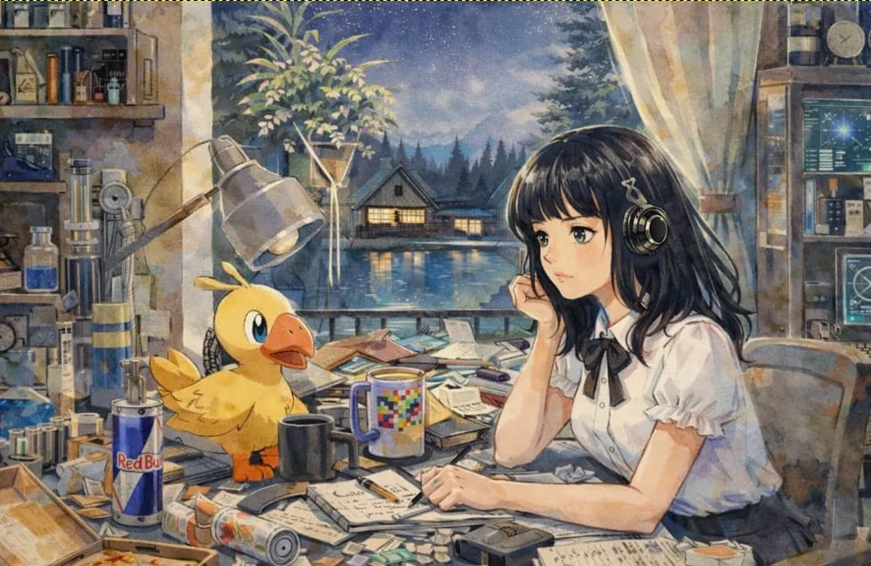

- Reference ID: `ref-655288690051afcf`
- Type: `source-evidence`
- Mapping confidence: `source-established`
- Rights: `unknown-not-cleared`

### Neon Maze Arcade

- Reference ID: `ref-67c13ef9ce92cf83`
- Type: `co-character-scene`
- Mapping confidence: `high`
- Rights: `unknown-not-cleared`

### Source Evidence

- Reference ID: `ref-6b1e41dd0ee598f4`
- Type: `source-evidence`
- Mapping confidence: `source-established`
- Rights: `unknown-not-cleared`

### Chibi Command Center

- Reference ID: `ref-71edecff3d11f10d`
- Type: `co-character-scene`
- Mapping confidence: `medium`
- Rights: `unknown-not-cleared`

### Source Evidence

- Reference ID: `ref-7f47dc36b958aaa1`
- Type: `source-evidence`
- Mapping confidence: `source-established`
- Rights: `unknown-not-cleared`

### Wisdom Forge Poster

- Reference ID: `ref-7fe47ca364bbfc02`
- Type: `co-character-scene`
- Mapping confidence: `medium`
- Rights: `unknown-not-cleared`

### Neon Pool Game

- Reference ID: `ref-828e12f50474656a`
- Type: `co-character-scene`
- Mapping confidence: `high`
- Rights: `unknown-not-cleared`

### Gothic Temple Approach

- Reference ID: `ref-8368427778984e49`
- Type: `co-character-scene`
- Mapping confidence: `high`
- Rights: `unknown-not-cleared`

### Source Evidence

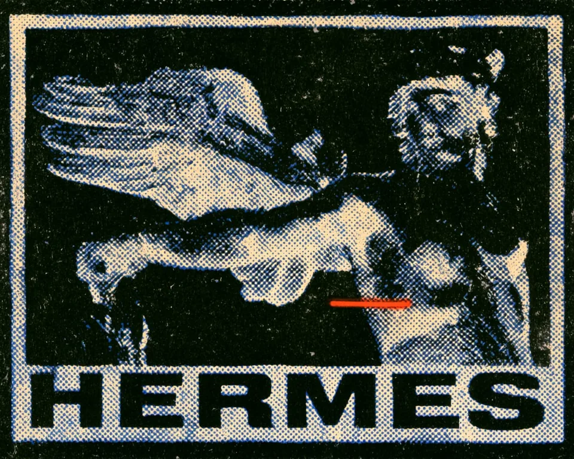

- Reference ID: `ref-8af9e228d42af569`
- Type: `source-evidence`
- Mapping confidence: `source-established`
- Rights: `unknown-not-cleared`

### Source Evidence

- Reference ID: `ref-924092b0fe0a0b51`
- Type: `source-evidence`
- Mapping confidence: `source-established`
- Rights: `unknown-not-cleared`

### Arcade Floor Rest

- Reference ID: `ref-947f323876209656`
- Type: `co-character-scene`
- Mapping confidence: `medium`
- Rights: `unknown-not-cleared`

### Source Evidence

- Reference ID: `ref-94816a3e029c2463`
- Type: `source-evidence`
- Mapping confidence: `source-established`
- Rights: `unknown-not-cleared`

### Source Evidence

- Reference ID: `ref-9d35e3357db46cad`
- Type: `source-evidence`
- Mapping confidence: `source-established`
- Rights: `unknown-not-cleared`

### Source Evidence

- Reference ID: `ref-9f42389b65f4235e`
- Type: `source-evidence`
- Mapping confidence: `source-established`
- Rights: `unknown-not-cleared`

### Desert Roadside Motel

- Reference ID: `ref-a2a6bcf9ecbb8e79`
- Type: `co-character-scene`
- Mapping confidence: `high`
- Rights: `unknown-not-cleared`

### Expression Study

- Reference ID: `ref-a8d1dd9ad5e2da86`
- Type: `expression-study`
- Mapping confidence: `source-established`
- Rights: `unknown-not-cleared`

### Nuclear Desert Gathering

- Reference ID: `ref-a9cc4ed4ff9631d1`
- Type: `co-character-scene`
- Mapping confidence: `high`
- Rights: `unknown-not-cleared`

### Underground Research Lineup

- Reference ID: `ref-aa1bdbfb04ee403f`
- Type: `co-character-scene`
- Mapping confidence: `medium`
- Rights: `unknown-not-cleared`

### Pixel Arcade Brawl

- Reference ID: `ref-ae1cb6a279516fda`
- Type: `co-character-scene`
- Mapping confidence: `high`
- Rights: `unknown-not-cleared`

### Ink Wash Team Battle

- Reference ID: `ref-b7205bd3ec335c05`
- Type: `co-character-scene`
- Mapping confidence: `medium`
- Rights: `unknown-not-cleared`

### Gothic Library Alchemy

- Reference ID: `ref-b86d713037fefdb1`
- Type: `co-character-scene`
- Mapping confidence: `high`
- Rights: `unknown-not-cleared`

### Source Evidence

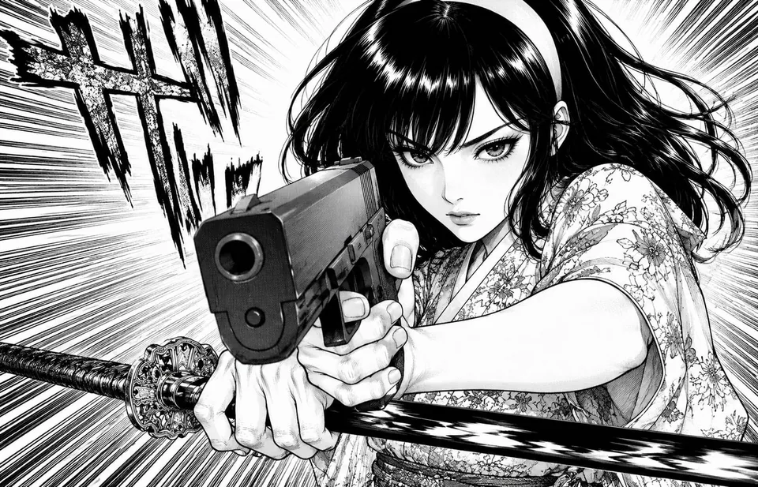

- Reference ID: `ref-b9f10cca57275e04`
- Type: `source-evidence`
- Mapping confidence: `source-established`
- Rights: `unknown-not-cleared`

### Tropical Kart Race

- Reference ID: `ref-bcee55b1d6c32b0c`
- Type: `co-character-scene`
- Mapping confidence: `medium`
- Rights: `unknown-not-cleared`

### Paired Character Reference

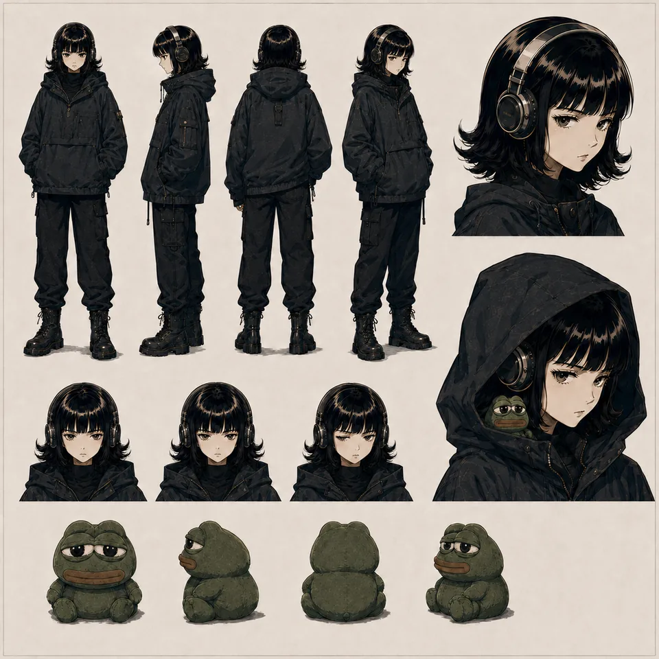

- Reference ID: `ref-bd2470771c42e3e0`
- Type: `reference-composite`
- Mapping confidence: `high`
- Rights: `unknown-not-cleared`

### Neon City Rooftop

- Reference ID: `ref-bd3b4a8b0aa92370`
- Type: `co-character-scene`
- Mapping confidence: `high`
- Rights: `unknown-not-cleared`

### Mythic Battle Poster

- Reference ID: `ref-bed8d29505bfee50`
- Type: `co-character-scene`
- Mapping confidence: `high`
- Rights: `unknown-not-cleared`

### Retro Arcade Fight

- Reference ID: `ref-bfbc0178a1d893a4`
- Type: `co-character-scene`
- Mapping confidence: `high`
- Rights: `unknown-not-cleared`

### Psychedelic Pool Game

- Reference ID: `ref-cd8add2bebfae095`
- Type: `co-character-scene`
- Mapping confidence: `high`
- Rights: `unknown-not-cleared`

### Source Evidence

- Reference ID: `ref-d56ea1141fda00ce`
- Type: `source-evidence`
- Mapping confidence: `source-established`
- Rights: `unknown-not-cleared`

### Group Ramen Dinner

- Reference ID: `ref-d6859fcd5bd92b37`
- Type: `co-character-scene`
- Mapping confidence: `high`
- Rights: `unknown-not-cleared`

### Concept Study

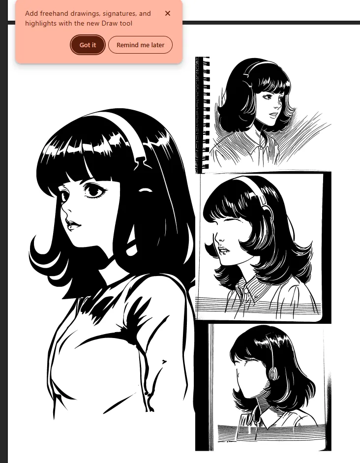

- Reference ID: `ref-d6b42befac7d57fd`
- Type: `concept-study`
- Mapping confidence: `source-established`
- Rights: `unknown-not-cleared`

### Source Evidence

- Reference ID: `ref-d71c15637383a815`
- Type: `source-evidence`
- Mapping confidence: `source-established`
- Rights: `unknown-not-cleared`

### Source Evidence

- Reference ID: `ref-d944c0534a841bd4`
- Type: `source-evidence`
- Mapping confidence: `source-established`
- Rights: `unknown-not-cleared`

### Neon Alley Standoff

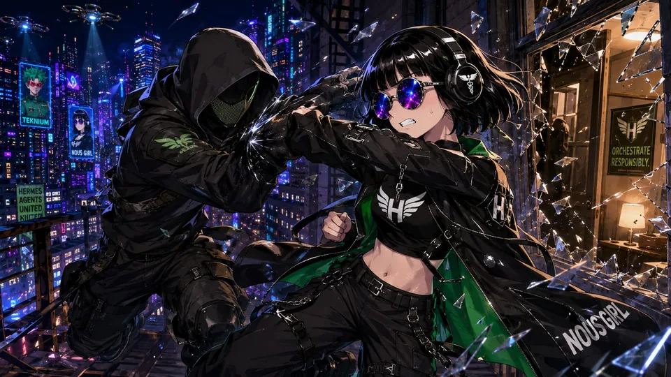

- Reference ID: `ref-dada6112b723ba92`
- Type: `co-character-scene`
- Mapping confidence: `medium`
- Rights: `unknown-not-cleared`

### Source Evidence

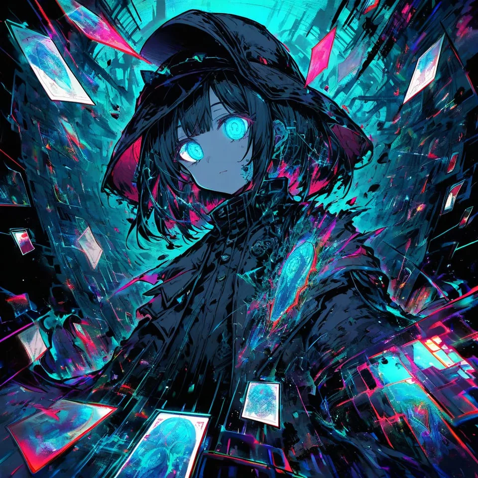

- Reference ID: `ref-dd32f202ba73131a`
- Type: `source-evidence`
- Mapping confidence: `source-established`
- Rights: `unknown-not-cleared`

### Four Character Portrait Grid

- Reference ID: `ref-e068fc78a655972d`
- Type: `reference-composite`
- Mapping confidence: `high`
- Rights: `unknown-not-cleared`

### Source Evidence

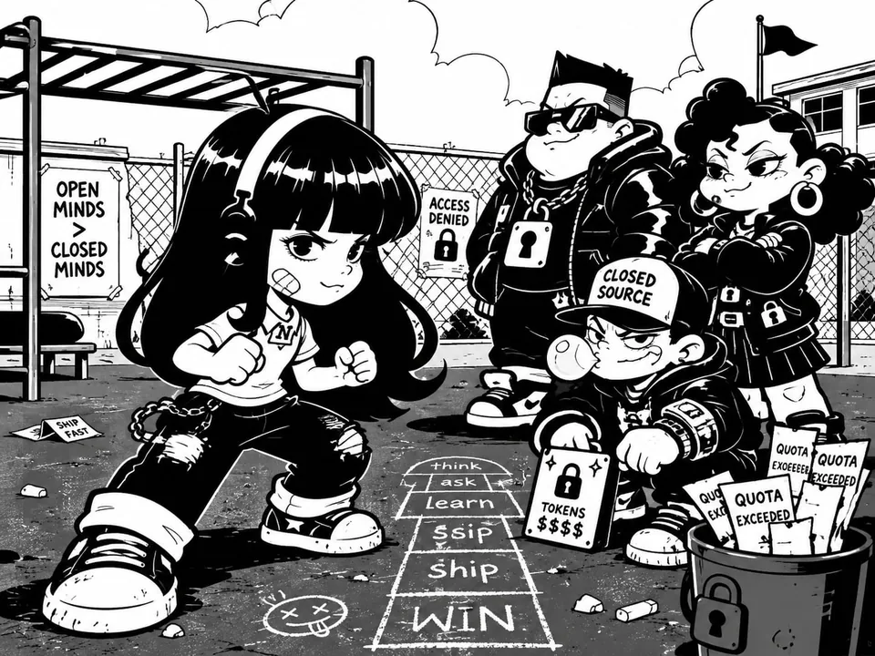

- Reference ID: `ref-f23b4befaf0c8dba`
- Type: `source-evidence`
- Mapping confidence: `source-established`
- Rights: `unknown-not-cleared`

### Ai Election Rally

- Reference ID: `ref-fb43ec227c3db234`
- Type: `co-character-scene`
- Mapping confidence: `high`
- Rights: `unknown-not-cleared`

### Teamwork Propaganda Poster

- Reference ID: `ref-fd3759368f2bcd6a`
- Type: `co-character-scene`
- Mapping confidence: `high`
- Rights: `unknown-not-cleared`

### Retro Futurist Jet Formation

- Reference ID: `ref-ff607426ddcc9aaf`
- Type: `co-character-scene`
- Mapping confidence: `high`
- Rights: `unknown-not-cleared`

## Candidate references — not canonical

No candidate reference links.
