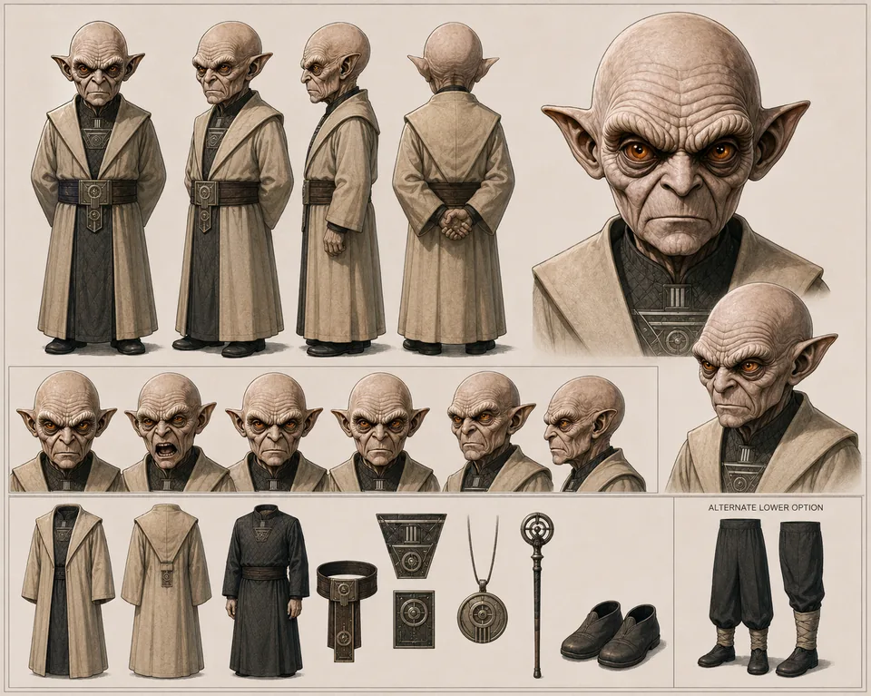

# quark2world — supporting references

Shared references remain single-copy previews in the central reference gallery.

- Canonical reference links: 1
- Candidate links (not canonical): 0

## Canonical references

### Sheet

- Reference ID: `ref-8618c56719a16cee`
- Type: `sheet`
- Mapping confidence: `source-established`
- Rights: `unknown-not-cleared`

## Candidate references — not canonical

No candidate reference links.
