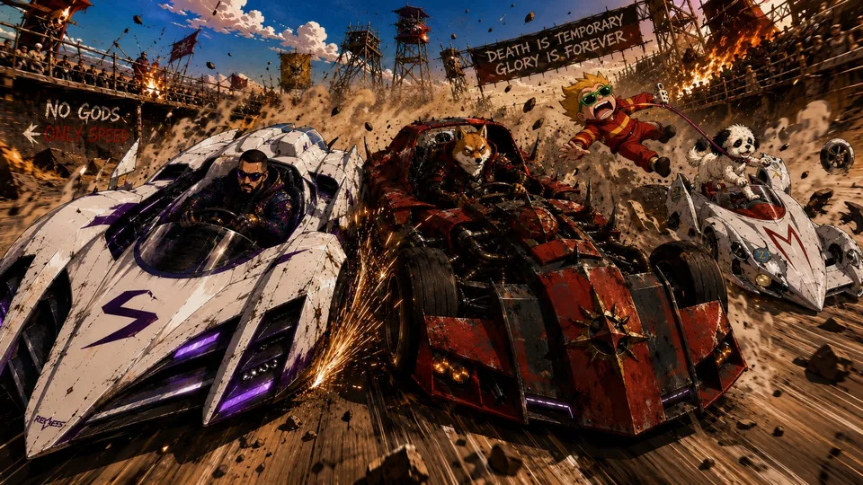
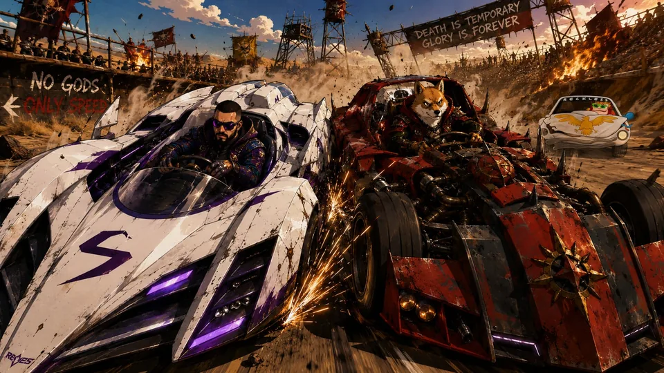
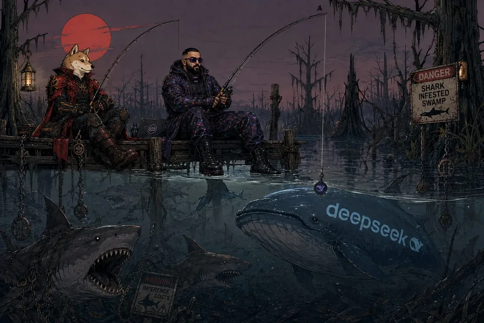

# Sahil — supporting references

Shared references remain single-copy previews in the central reference gallery.

- Canonical reference links: 7
- Candidate links (not canonical): 0

## Canonical references

### Armored Car Collision

- Reference ID: `ref-155af608a08302c9`
- Type: `co-character-scene`
- Mapping confidence: `medium`
- Rights: `unknown-not-cleared`

### Brooklyn Map Dispute

- Reference ID: `ref-392cdab8982753fc`
- Type: `co-character-scene`
- Mapping confidence: `high`
- Rights: `unknown-not-cleared`

### Armored Car Impact

- Reference ID: `ref-45ae934b8bdf5bb8`
- Type: `co-character-scene`
- Mapping confidence: `medium`
- Rights: `unknown-not-cleared`

### Neon Agent Poster

- Reference ID: `ref-541ef2e689ad502c`
- Type: `co-character-scene`
- Mapping confidence: `high`
- Rights: `unknown-not-cleared`

### Swamp Shark Fishing

- Reference ID: `ref-56600e5e50e23fa7`
- Type: `co-character-scene`
- Mapping confidence: `medium`
- Rights: `unknown-not-cleared`

### Explosive Desert Escape

- Reference ID: `ref-746b72b93139c902`
- Type: `co-character-scene`
- Mapping confidence: `high`
- Rights: `unknown-not-cleared`

### Ai Subscription Bazaar

- Reference ID: `ref-f2d331574a397701`
- Type: `co-character-scene`
- Mapping confidence: `medium`
- Rights: `unknown-not-cleared`

## Candidate references — not canonical

No candidate reference links.
