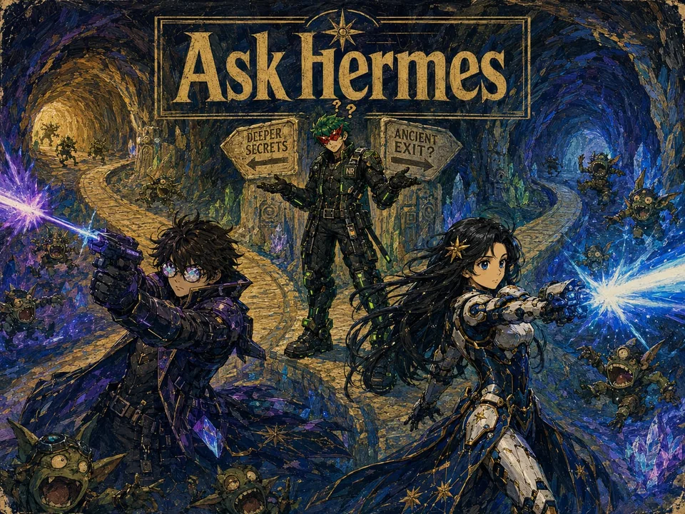
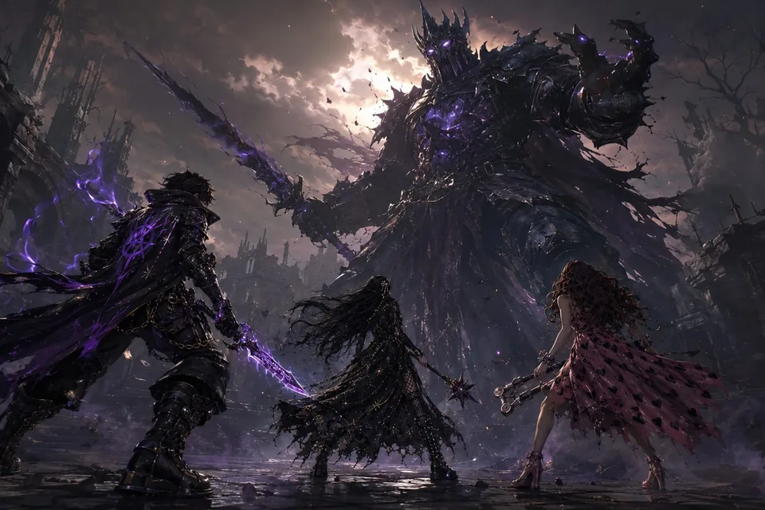

# Sidbin — Mirror Shade — supporting references

Shared references remain single-copy previews in the central reference gallery.

- Canonical reference links: 28
- Candidate links (not canonical): 3

## Canonical references

### Multiverse Portal Team

- Reference ID: `ref-2d246f1adbcdb084`
- Type: `co-character-scene`
- Mapping confidence: `high`
- Rights: `unknown-not-cleared`

### Data Center Liberation Team

- Reference ID: `ref-30fb2252b524873d`
- Type: `co-character-scene`
- Mapping confidence: `high`
- Rights: `unknown-not-cleared`

### Collaborative City Building

- Reference ID: `ref-33694986ceefe483`
- Type: `co-character-scene`
- Mapping confidence: `high`
- Rights: `unknown-not-cleared`

### Neon Rooftop Squad

- Reference ID: `ref-35f5ecbbf1ab4b06`
- Type: `co-character-scene`
- Mapping confidence: `high`
- Rights: `unknown-not-cleared`

### Open Source Graveyard

- Reference ID: `ref-38039a466a575b2b`
- Type: `co-character-scene`
- Mapping confidence: `high`
- Rights: `unknown-not-cleared`

### Rainbow Squad Poster

- Reference ID: `ref-3a956070a22b1526`
- Type: `co-character-scene`
- Mapping confidence: `high`
- Rights: `unknown-not-cleared`

### Neon City Team March

- Reference ID: `ref-3c3c4658d418a903`
- Type: `co-character-scene`
- Mapping confidence: `high`
- Rights: `unknown-not-cleared`

### Agent Squad Reference

- Reference ID: `ref-426508e0ad73e935`
- Type: `reference-composite`
- Mapping confidence: `high`
- Rights: `unknown-not-cleared`

### Rainbow Squad Silhouettes

- Reference ID: `ref-4ff64e3403ce9b04`
- Type: `co-character-scene`
- Mapping confidence: `low`
- Rights: `unknown-not-cleared`

### Neon Rooftop Comet Ride

- Reference ID: `ref-556828cdcf639c55`
- Type: `co-character-scene`
- Mapping confidence: `medium`
- Rights: `unknown-not-cleared`

### Open Source Roller Disco

- Reference ID: `ref-581dad8db16d20ea`
- Type: `co-character-scene`
- Mapping confidence: `high`
- Rights: `unknown-not-cleared`

### Overgrown Wasteland Expedition

- Reference ID: `ref-60d746cadb1eacce`
- Type: `environment-concept`
- Mapping confidence: `medium`
- Rights: `unknown-not-cleared`

### Retro Diner Breakfast

- Reference ID: `ref-6d86f2a99444f762`
- Type: `co-character-scene`
- Mapping confidence: `high`
- Rights: `unknown-not-cleared`

### Chibi Command Center

- Reference ID: `ref-71edecff3d11f10d`
- Type: `co-character-scene`
- Mapping confidence: `medium`
- Rights: `unknown-not-cleared`

### Sunset Berry Harvest

- Reference ID: `ref-7779ee6093e4b42e`
- Type: `co-character-scene`
- Mapping confidence: `high`
- Rights: `unknown-not-cleared`

### Cosmic Campfire Picnic

- Reference ID: `ref-98851fc80f69c11f`
- Type: `co-character-scene`
- Mapping confidence: `medium`
- Rights: `unknown-not-cleared`

### Sunset Street Performance

- Reference ID: `ref-a8570042bc160412`
- Type: `co-character-scene`
- Mapping confidence: `high`
- Rights: `unknown-not-cleared`

### Pixel Arcade Brawl

- Reference ID: `ref-ae1cb6a279516fda`
- Type: `co-character-scene`
- Mapping confidence: `high`
- Rights: `unknown-not-cleared`

### Tropical Kart Race

- Reference ID: `ref-bcee55b1d6c32b0c`
- Type: `co-character-scene`
- Mapping confidence: `medium`
- Rights: `unknown-not-cleared`

### Neon City Rooftop

- Reference ID: `ref-bd3b4a8b0aa92370`
- Type: `co-character-scene`
- Mapping confidence: `high`
- Rights: `unknown-not-cleared`

### Mystical Hermes Mural

- Reference ID: `ref-bd7c9892b70b932f`
- Type: `co-character-scene`
- Mapping confidence: `medium`
- Rights: `unknown-not-cleared`

### Pink Cyber Eye

- Reference ID: `ref-c8f02140f111eca3`
- Type: `single-character-reference`
- Mapping confidence: `medium`
- Rights: `unknown-not-cleared`

### Neon Portal Chamber

- Reference ID: `ref-d348cbdc7aa13dc6`
- Type: `co-character-scene`
- Mapping confidence: `high`
- Rights: `unknown-not-cleared`

### Tavern Beer Pong

- Reference ID: `ref-d533a2b22fcfb01d`
- Type: `co-character-scene`
- Mapping confidence: `high`
- Rights: `unknown-not-cleared`

### Forest Campfire Gathering

- Reference ID: `ref-d5a500d377ab91f4`
- Type: `co-character-scene`
- Mapping confidence: `high`
- Rights: `unknown-not-cleared`

### Group Ramen Dinner

- Reference ID: `ref-d6859fcd5bd92b37`
- Type: `co-character-scene`
- Mapping confidence: `high`
- Rights: `unknown-not-cleared`

### Stormy Monster Confrontation

- Reference ID: `ref-fe6764f1dd9c82dd`
- Type: `co-character-scene`
- Mapping confidence: `low`
- Rights: `unknown-not-cleared`

### Retro Futurist Jet Formation

- Reference ID: `ref-ff607426ddcc9aaf`
- Type: `co-character-scene`
- Mapping confidence: `high`
- Rights: `unknown-not-cleared`

## Candidate references — not canonical

### Garage Bar Beer Pong

**NOT CANONICAL — candidate identity link only.**

- Reference ID: `ref-6974eaa0bf67799e`
- Type: `co-character-scene`
- Mapping confidence: `high`
- Rights: `unknown-not-cleared`

### Ink Wash Team Battle

**NOT CANONICAL — candidate identity link only.**

- Reference ID: `ref-b7205bd3ec335c05`
- Type: `co-character-scene`
- Mapping confidence: `medium`
- Rights: `unknown-not-cleared`

### Holographic Stage Gathering

**NOT CANONICAL — candidate identity link only.**

- Reference ID: `ref-e0d3f4f421a25dfb`
- Type: `co-character-scene`
- Mapping confidence: `medium`
- Rights: `unknown-not-cleared`
