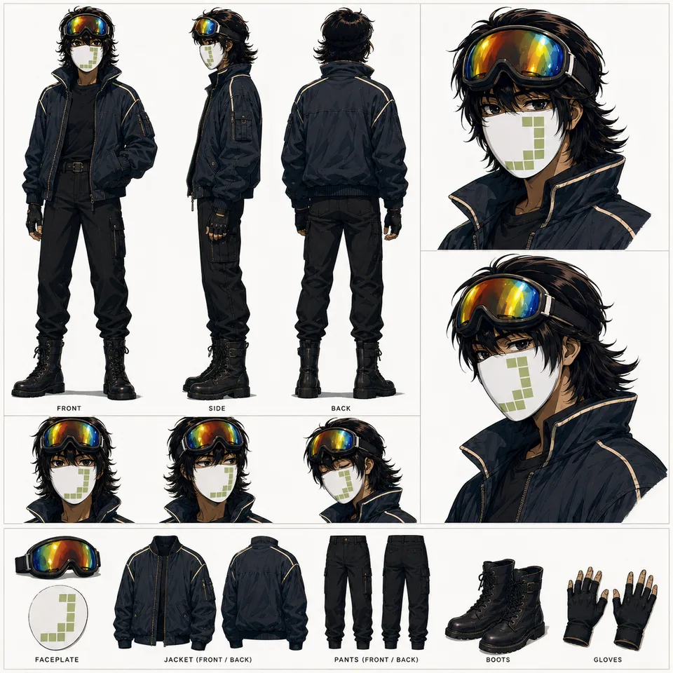

# tdamre — supporting references

Shared references remain single-copy previews in the central reference gallery.

- Canonical reference links: 3
- Candidate links (not canonical): 0

## Canonical references

### Sheet

- Reference ID: `ref-9a51de798216efcd`
- Type: `sheet`
- Mapping confidence: `source-established`
- Rights: `unknown-not-cleared`

### Volcanic Motorcycle Crossroads

- Reference ID: `ref-d7d5504f0eca9806`
- Type: `co-character-scene`
- Mapping confidence: `medium`
- Rights: `unknown-not-cleared`

### Surreal Double Exposure Portraits

- Reference ID: `ref-fa4d84dffd638f96`
- Type: `reference-composite`
- Mapping confidence: `medium`
- Rights: `unknown-not-cleared`

## Candidate references — not canonical

No candidate reference links.
