# Teknium — supporting references

Shared references remain single-copy previews in the central reference gallery.

- Canonical reference links: 125
- Candidate links (not canonical): 0

## Canonical references

### Teamwork Propaganda Poster

- Reference ID: `ref-0022ed4f3c3d8335`
- Type: `co-character-scene`
- Mapping confidence: `high`
- Rights: `unknown-not-cleared`

### Storybook Map Expedition

- Reference ID: `ref-048c9bd670ef986e`
- Type: `co-character-scene`
- Mapping confidence: `medium`
- Rights: `unknown-not-cleared`

### Source Evidence

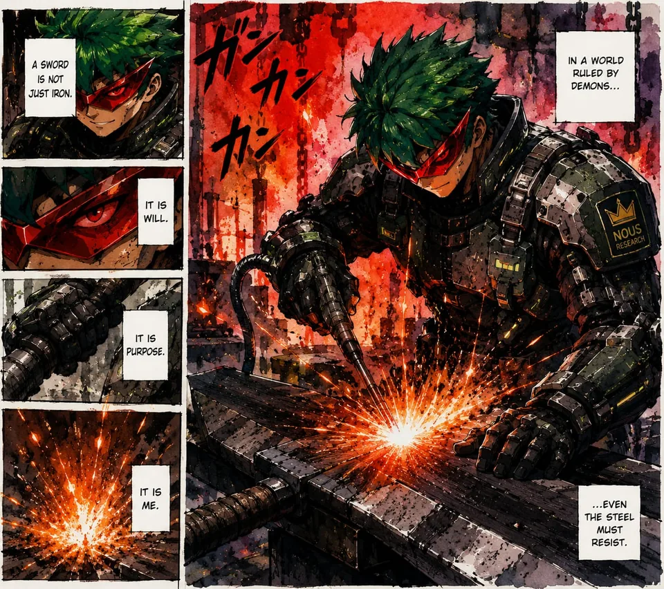

- Reference ID: `ref-06db63b87301c3a4`
- Type: `source-evidence`
- Mapping confidence: `source-established`
- Rights: `unknown-not-cleared`

### Hermes Agent Group Portrait

- Reference ID: `ref-09a3c5e1ba139ae3`
- Type: `co-character-scene`
- Mapping confidence: `medium`
- Rights: `unknown-not-cleared`

### Arm Wrestling Match

- Reference ID: `ref-0a41c8355776fcc7`
- Type: `co-character-scene`
- Mapping confidence: `high`
- Rights: `unknown-not-cleared`

### Noir Tax Office

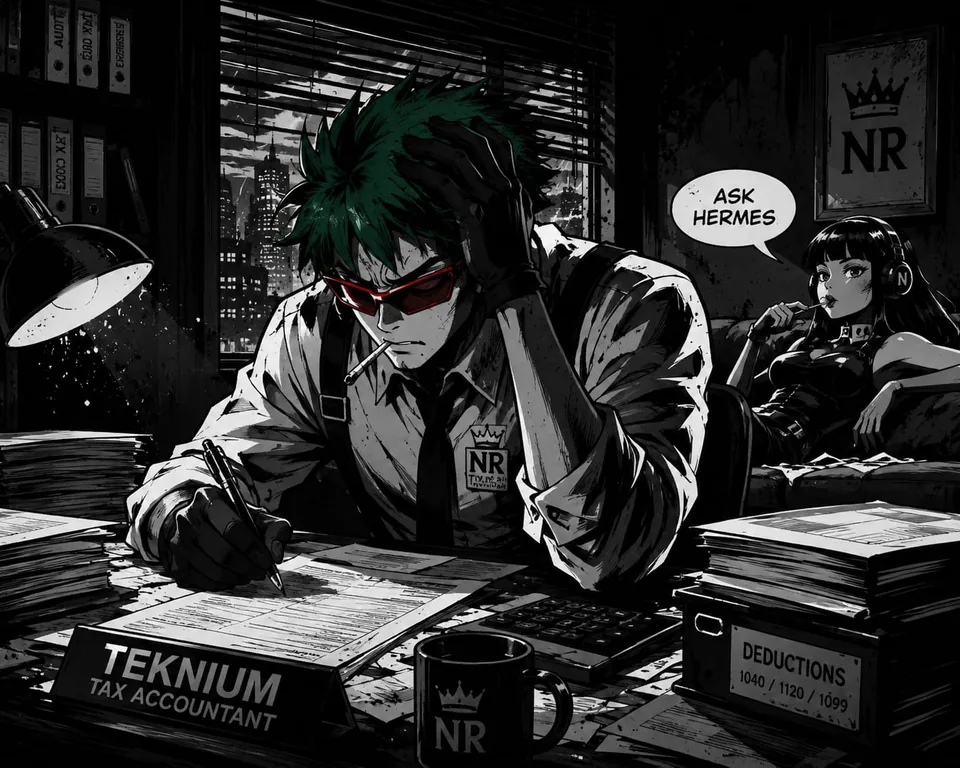

- Reference ID: `ref-0e67f739124abc60`
- Type: `co-character-scene`
- Mapping confidence: `high`
- Rights: `unknown-not-cleared`

### Chaotic Hermes Clinic

- Reference ID: `ref-0f13313715a66bb0`
- Type: `co-character-scene`
- Mapping confidence: `medium`
- Rights: `unknown-not-cleared`

### Quiet Intimate Moment

- Reference ID: `ref-12ade71ec086a193`
- Type: `co-character-scene`
- Mapping confidence: `high`
- Rights: `unknown-not-cleared`

### Sunlit Library Gathering

- Reference ID: `ref-153850369fa9a728`
- Type: `co-character-scene`
- Mapping confidence: `medium`
- Rights: `unknown-not-cleared`

### Tropical Kart Race

- Reference ID: `ref-15f54aa5126d1700`
- Type: `co-character-scene`
- Mapping confidence: `medium`
- Rights: `unknown-not-cleared`

### Wasteland Group Expedition

- Reference ID: `ref-15f99ce755272912`
- Type: `co-character-scene`
- Mapping confidence: `medium`
- Rights: `unknown-not-cleared`

### Robot Lab Chaos

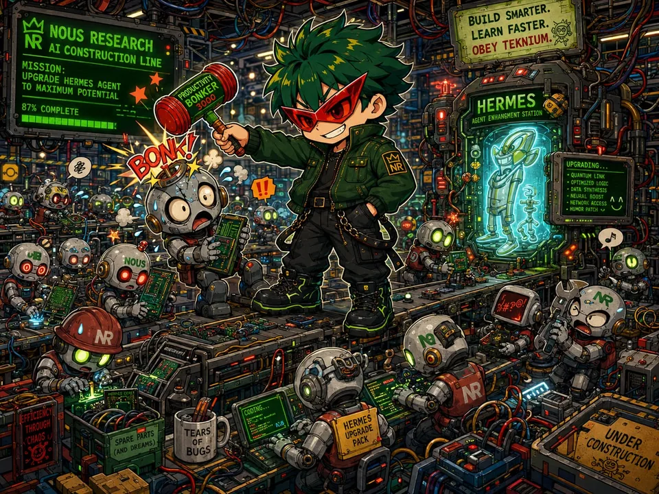

- Reference ID: `ref-16e988252299c847`
- Type: `single-character-scene`
- Mapping confidence: `high`
- Rights: `unknown-not-cleared`

### Neon City Bike Ride

- Reference ID: `ref-17d945376608cf38`
- Type: `co-character-scene`
- Mapping confidence: `high`
- Rights: `unknown-not-cleared`

### Social Media Harbor Voyage

- Reference ID: `ref-1911678ecf95a01b`
- Type: `co-character-scene`
- Mapping confidence: `high`
- Rights: `unknown-not-cleared`

### Art Deco Profile Lineup

- Reference ID: `ref-1b69a149f2669033`
- Type: `co-character-scene`
- Mapping confidence: `high`
- Rights: `unknown-not-cleared`

### Cosmic Entity Power Surge

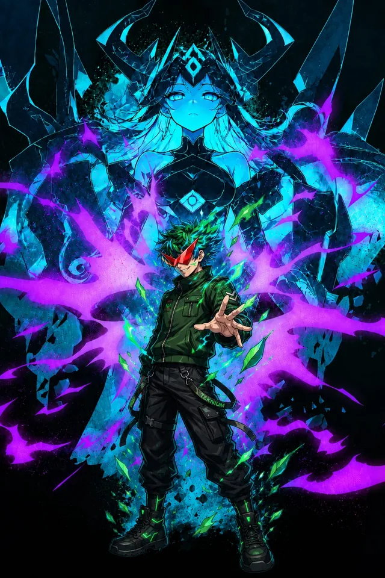

- Reference ID: `ref-1dfafe89faf1ad97`
- Type: `co-character-scene`
- Mapping confidence: `medium`
- Rights: `unknown-not-cleared`

### Moonlit Clifftop Duel

- Reference ID: `ref-1e18f7963e7e711c`
- Type: `co-character-scene`
- Mapping confidence: `medium`
- Rights: `unknown-not-cleared`

### Source Evidence

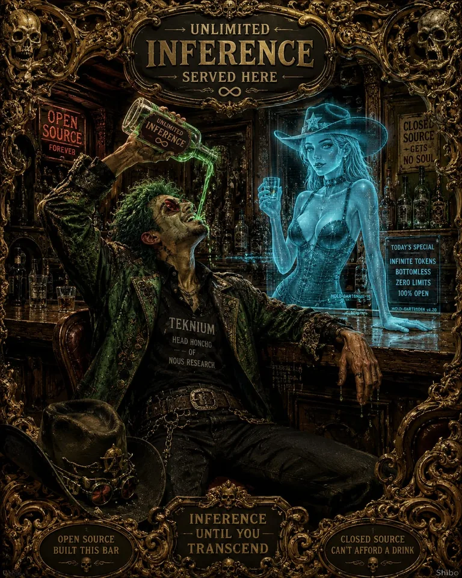

- Reference ID: `ref-206a6cb529849914`
- Type: `source-evidence`
- Mapping confidence: `source-established`
- Rights: `unknown-not-cleared`

### Emergency Command Room

- Reference ID: `ref-21d96d16476de312`
- Type: `co-character-scene`
- Mapping confidence: `high`
- Rights: `unknown-not-cleared`

### Source Evidence

- Reference ID: `ref-253b773cf3ccd6fc`
- Type: `source-evidence`
- Mapping confidence: `source-established`
- Rights: `unknown-not-cleared`

### Purple Outage Command Center

- Reference ID: `ref-291ac946639e2923`
- Type: `co-character-scene`
- Mapping confidence: `medium`
- Rights: `unknown-not-cleared`

### Neon Coastal Overlook

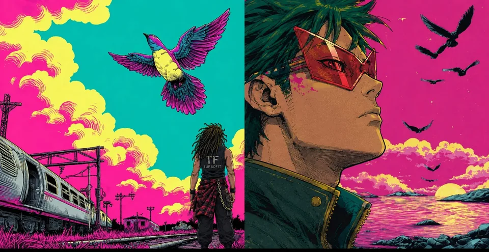

- Reference ID: `ref-2c106e4b0c560f64`
- Type: `single-character-scene`
- Mapping confidence: `high`
- Rights: `unknown-not-cleared`

### Multiverse Portal Team

- Reference ID: `ref-2d246f1adbcdb084`
- Type: `co-character-scene`
- Mapping confidence: `high`
- Rights: `unknown-not-cleared`

### Data Center Liberation Team

- Reference ID: `ref-30fb2252b524873d`
- Type: `co-character-scene`
- Mapping confidence: `high`
- Rights: `unknown-not-cleared`

### Celestial Folklore Encounter

- Reference ID: `ref-320e067fb2fa6698`
- Type: `co-character-scene`
- Mapping confidence: `medium`
- Rights: `unknown-not-cleared`

### Collaborative City Building

- Reference ID: `ref-33694986ceefe483`
- Type: `co-character-scene`
- Mapping confidence: `high`
- Rights: `unknown-not-cleared`

### Neon Rooftop Squad

- Reference ID: `ref-35f5ecbbf1ab4b06`
- Type: `co-character-scene`
- Mapping confidence: `high`
- Rights: `unknown-not-cleared`

### Open Source Graveyard

- Reference ID: `ref-38039a466a575b2b`
- Type: `co-character-scene`
- Mapping confidence: `high`
- Rights: `unknown-not-cleared`

### Rainbow Squad Poster

- Reference ID: `ref-3a956070a22b1526`
- Type: `co-character-scene`
- Mapping confidence: `high`
- Rights: `unknown-not-cleared`

### Neon City Team March

- Reference ID: `ref-3c3c4658d418a903`
- Type: `co-character-scene`
- Mapping confidence: `high`
- Rights: `unknown-not-cleared`

### Source Evidence

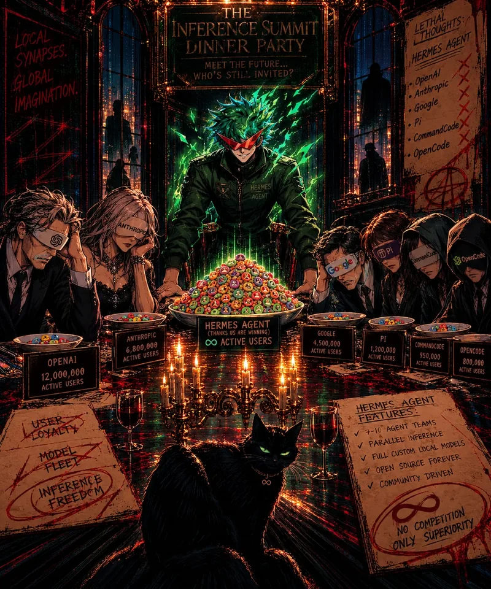

- Reference ID: `ref-3f49e631ac53e6af`
- Type: `source-evidence`
- Mapping confidence: `source-established`
- Rights: `unknown-not-cleared`

### Question Recycler Comic

- Reference ID: `ref-403686c2047834cb`
- Type: `co-character-scene`
- Mapping confidence: `medium`
- Rights: `unknown-not-cleared`

### Cyberpunk Command Hideout

- Reference ID: `ref-4202f60ed449c93d`
- Type: `co-character-scene`
- Mapping confidence: `medium`
- Rights: `unknown-not-cleared`

### Agent Squad Reference

- Reference ID: `ref-426508e0ad73e935`
- Type: `reference-composite`
- Mapping confidence: `high`
- Rights: `unknown-not-cleared`

### Retro Gaming Plush Squad

- Reference ID: `ref-42ccb80c74a7c3a9`
- Type: `co-character-scene`
- Mapping confidence: `medium`
- Rights: `unknown-not-cleared`

### Fiery Desert Sunset

- Reference ID: `ref-49659a50cea28be2`
- Type: `single-character-scene`
- Mapping confidence: `high`
- Rights: `unknown-not-cleared`

### Source Evidence

- Reference ID: `ref-4ad8b1dcdcfe827a`
- Type: `source-evidence`
- Mapping confidence: `source-established`
- Rights: `unknown-not-cleared`

### Portrait

- Reference ID: `ref-4ca6d92a7e1dee2f`
- Type: `portrait`
- Mapping confidence: `source-established`
- Rights: `unknown-not-cleared`

### Rainbow Squad Silhouettes

- Reference ID: `ref-4ff64e3403ce9b04`
- Type: `co-character-scene`
- Mapping confidence: `low`
- Rights: `unknown-not-cleared`

### Banana Standoff Graffiti

- Reference ID: `ref-4fff1b9d9bbf0aae`
- Type: `co-character-scene`
- Mapping confidence: `high`
- Rights: `unknown-not-cleared`

### Source Evidence

- Reference ID: `ref-532206daf9e62c65`
- Type: `source-evidence`
- Mapping confidence: `source-established`
- Rights: `unknown-not-cleared`

### Woodland Agent Squad

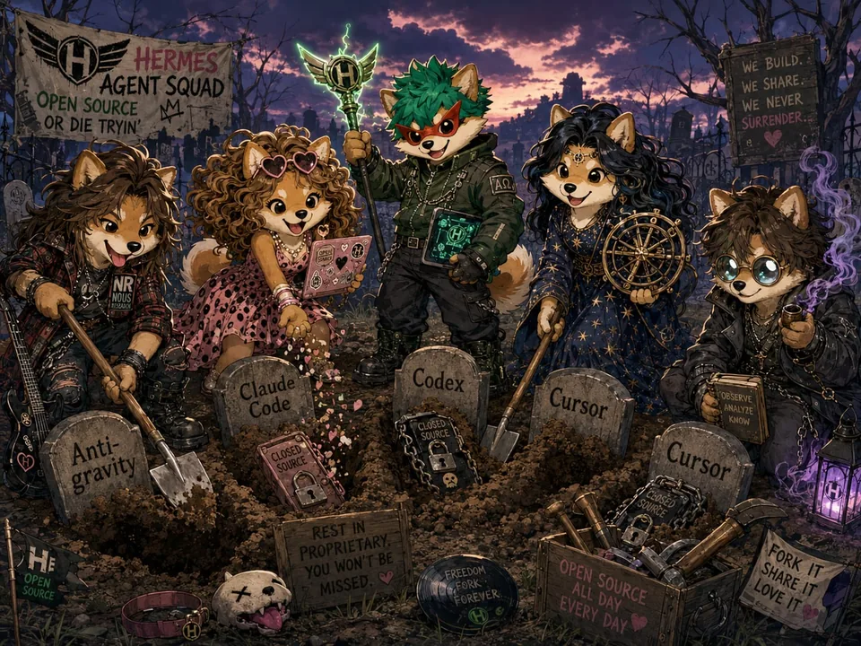

- Reference ID: `ref-543d14cdb5bdbeae`
- Type: `co-character-scene`
- Mapping confidence: `medium`
- Rights: `unknown-not-cleared`

### Wii Boxing Showdown

- Reference ID: `ref-553483e2437b0dda`
- Type: `co-character-scene`
- Mapping confidence: `high`
- Rights: `unknown-not-cleared`

### Neon Rooftop Comet Ride

- Reference ID: `ref-556828cdcf639c55`
- Type: `co-character-scene`
- Mapping confidence: `medium`
- Rights: `unknown-not-cleared`

### Open Source Roller Disco

- Reference ID: `ref-581dad8db16d20ea`
- Type: `co-character-scene`
- Mapping confidence: `high`
- Rights: `unknown-not-cleared`

### Open Source Propaganda City

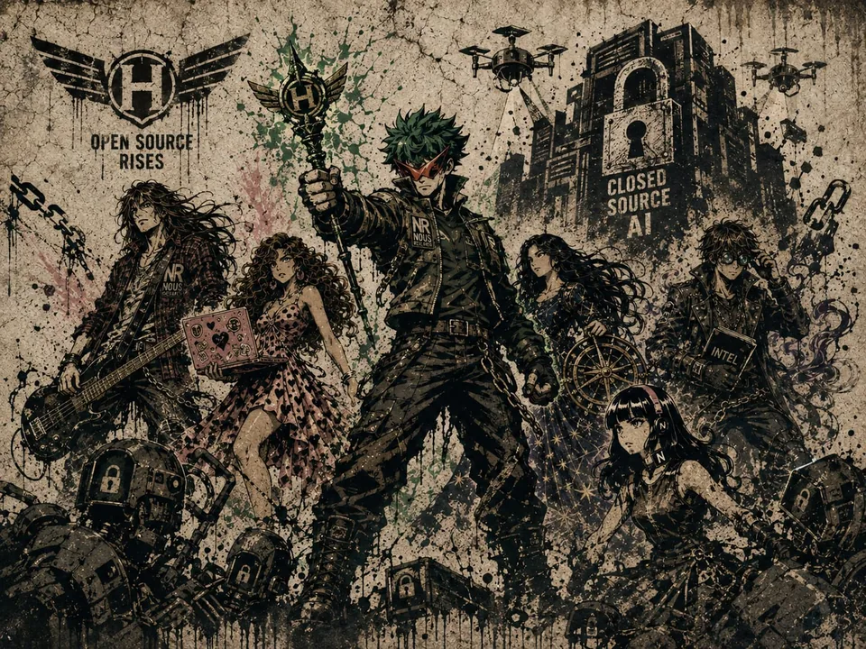

- Reference ID: `ref-5ae5e272268ac2ee`
- Type: `co-character-scene`
- Mapping confidence: `medium`
- Rights: `unknown-not-cleared`

### Arcade Battle Collage

- Reference ID: `ref-5c320f7677aaa8f7`
- Type: `co-character-scene`
- Mapping confidence: `high`
- Rights: `unknown-not-cleared`

### Overgrown Wasteland Expedition

- Reference ID: `ref-60d746cadb1eacce`
- Type: `environment-concept`
- Mapping confidence: `medium`
- Rights: `unknown-not-cleared`

### Underground Builder Fight Club

- Reference ID: `ref-61793d293aac2a0a`
- Type: `co-character-scene`
- Mapping confidence: `medium`
- Rights: `unknown-not-cleared`

### Retro Arcade Code Brawl

- Reference ID: `ref-637c330995304b7b`
- Type: `co-character-scene`
- Mapping confidence: `high`
- Rights: `unknown-not-cleared`

### Sheet

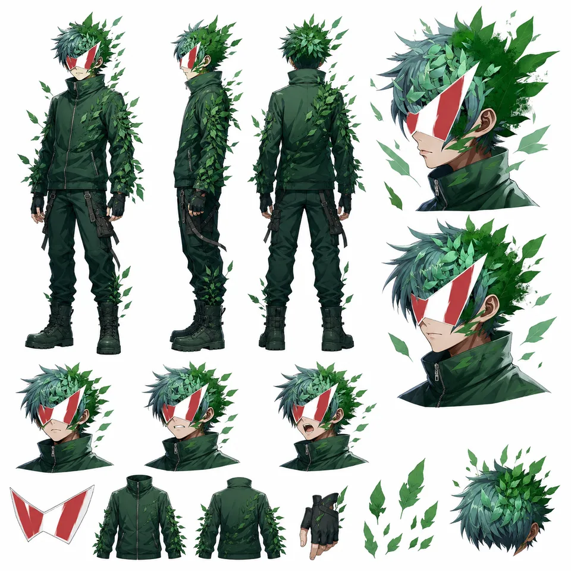

- Reference ID: `ref-64b811ed236186a8`
- Type: `sheet`
- Mapping confidence: `source-established`
- Rights: `unknown-not-cleared`

### Neon Maze Arcade

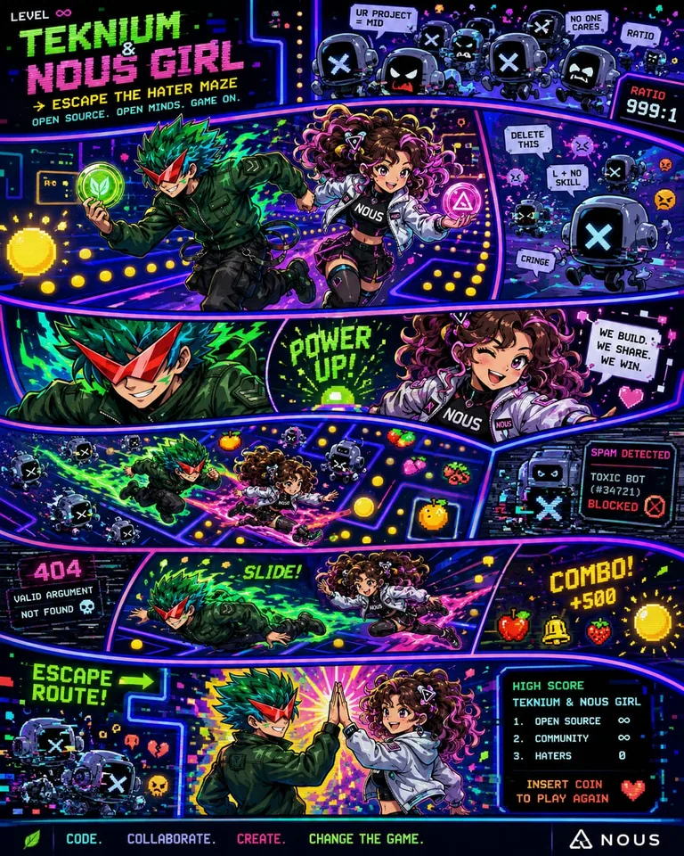

- Reference ID: `ref-67c13ef9ce92cf83`
- Type: `co-character-scene`
- Mapping confidence: `high`
- Rights: `unknown-not-cleared`

### Folk Art Data Center

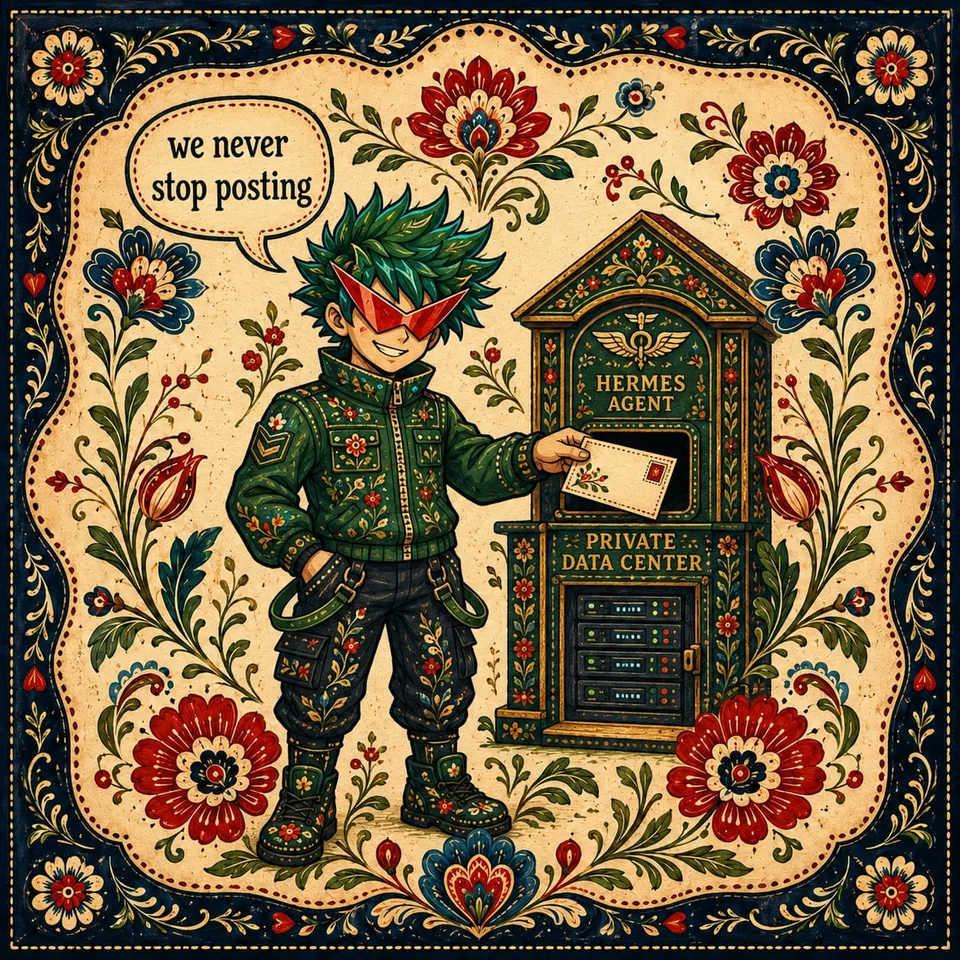

- Reference ID: `ref-689c2a7db80703a0`
- Type: `single-character-scene`
- Mapping confidence: `high`
- Rights: `unknown-not-cleared`

### Robot Uprising Charge

- Reference ID: `ref-68d0cd3261ad34e4`
- Type: `co-character-scene`
- Mapping confidence: `medium`
- Rights: `unknown-not-cleared`

### Garage Bar Beer Pong

- Reference ID: `ref-6974eaa0bf67799e`
- Type: `co-character-scene`
- Mapping confidence: `high`
- Rights: `unknown-not-cleared`

### Fiery Dragon Battle

- Reference ID: `ref-69e42af7d732a609`
- Type: `unclassified`
- Mapping confidence: `low`
- Rights: `unknown-not-cleared`

### Retro Monster Battle

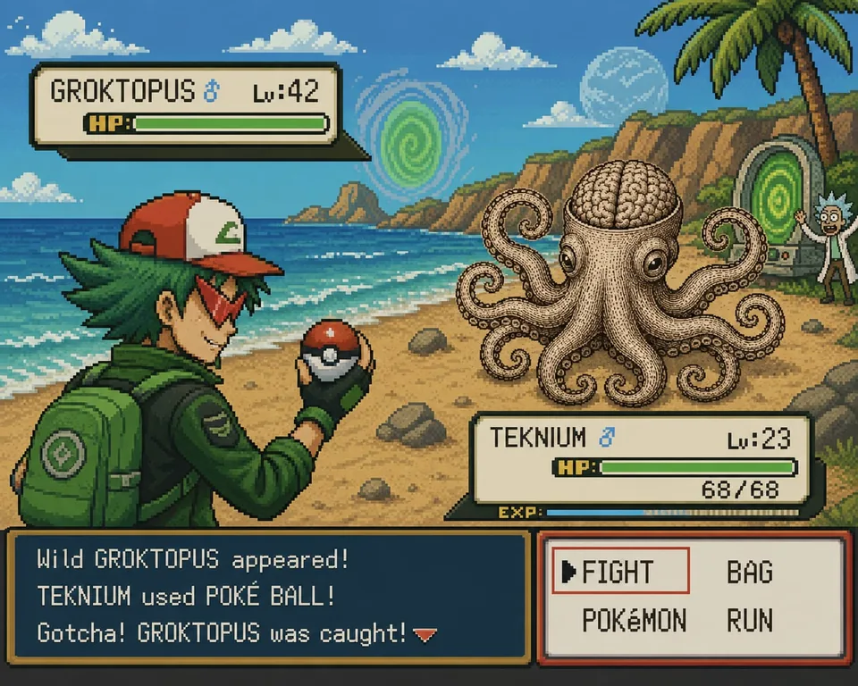

- Reference ID: `ref-6a3f62b75a51a6d9`
- Type: `single-character-scene`
- Mapping confidence: `high`
- Rights: `unknown-not-cleared`

### Chibi Command Center

- Reference ID: `ref-71edecff3d11f10d`
- Type: `co-character-scene`
- Mapping confidence: `medium`
- Rights: `unknown-not-cleared`

### Dojo Combat Showdown

- Reference ID: `ref-7675e5281121b3d8`
- Type: `co-character-scene`
- Mapping confidence: `high`
- Rights: `unknown-not-cleared`

### Source Evidence

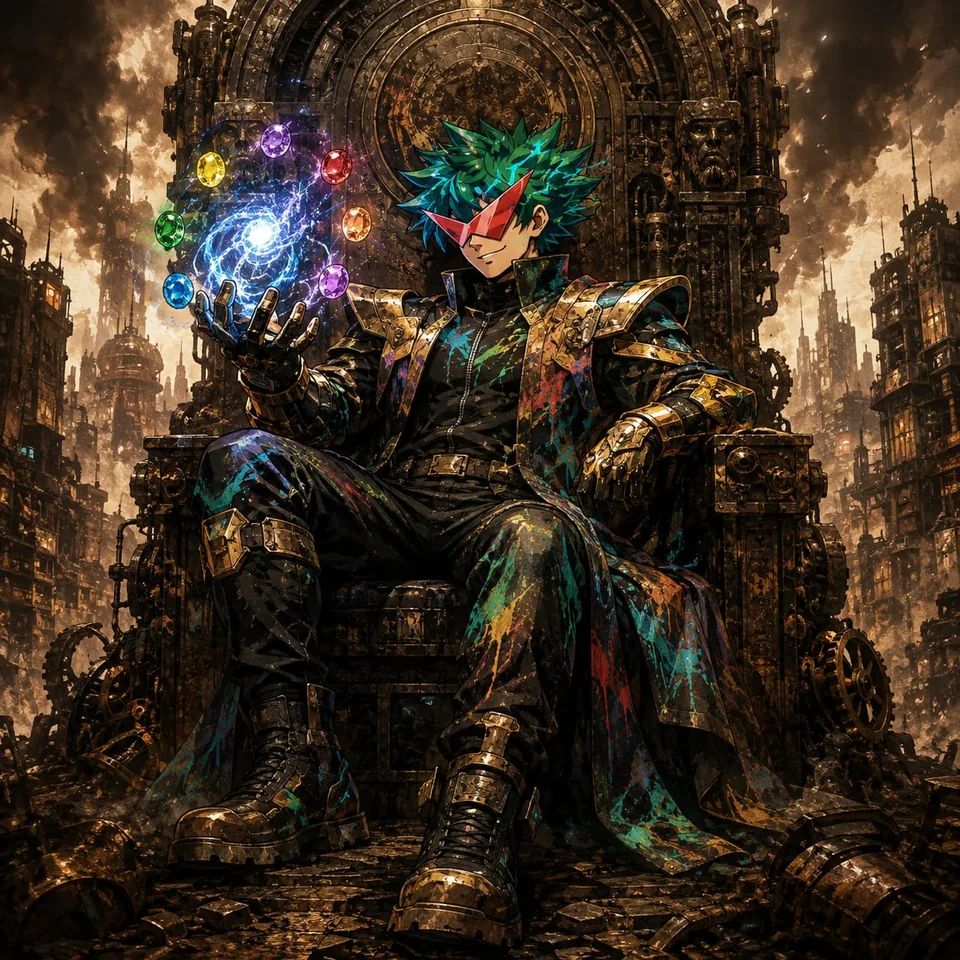

- Reference ID: `ref-77fa0f4822d92a9f`
- Type: `source-evidence`
- Mapping confidence: `source-established`
- Rights: `unknown-not-cleared`

### Source Evidence

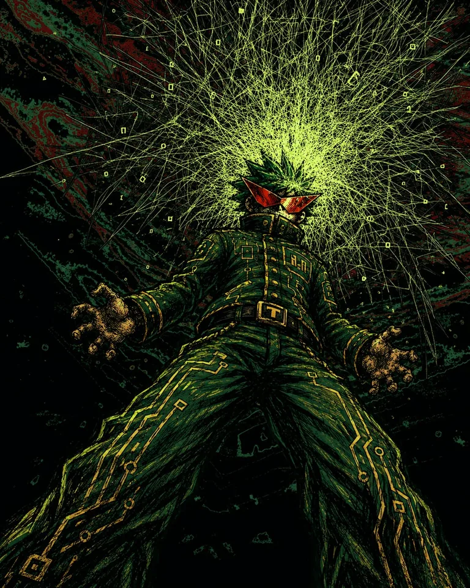

- Reference ID: `ref-7e01b6d187a816b6`
- Type: `source-evidence`
- Mapping confidence: `source-established`
- Rights: `unknown-not-cleared`

### Wisdom Forge Poster

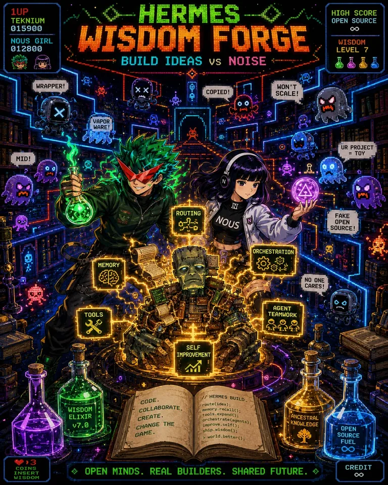

- Reference ID: `ref-7fe47ca364bbfc02`
- Type: `co-character-scene`
- Mapping confidence: `medium`
- Rights: `unknown-not-cleared`

### Source Evidence

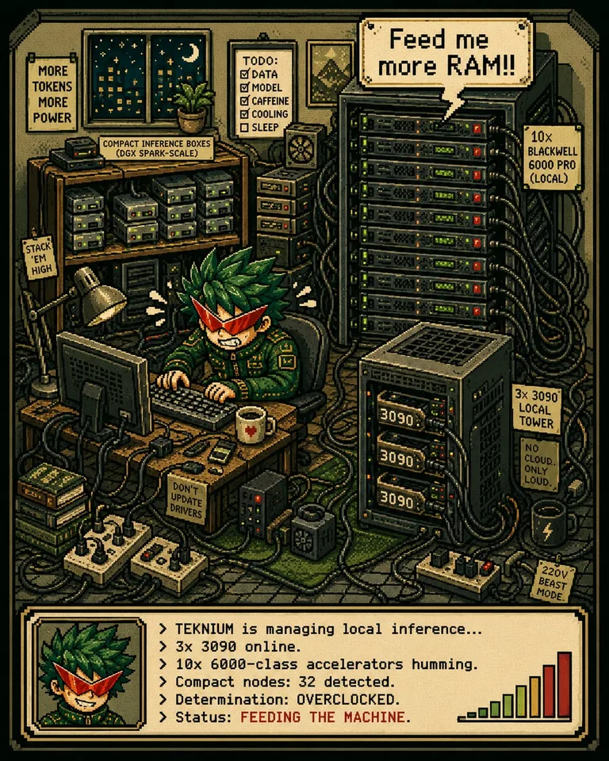

- Reference ID: `ref-810e692c16bfdb9a`
- Type: `source-evidence`
- Mapping confidence: `source-established`
- Rights: `unknown-not-cleared`

### Cookie Market Chaos

- Reference ID: `ref-828ff04f6f879937`
- Type: `co-character-scene`
- Mapping confidence: `medium`
- Rights: `unknown-not-cleared`

### Gothic Temple Approach

- Reference ID: `ref-8368427778984e49`
- Type: `co-character-scene`
- Mapping confidence: `high`
- Rights: `unknown-not-cleared`

### Source Evidence

- Reference ID: `ref-83f8e102622d33dd`
- Type: `source-evidence`
- Mapping confidence: `source-established`
- Rights: `unknown-not-cleared`

### Split World Portrait

- Reference ID: `ref-847afa505dcb8552`
- Type: `reference-composite`
- Mapping confidence: `high`
- Rights: `unknown-not-cleared`

### Crowded Tech Festival

- Reference ID: `ref-85002f2d21fbdb9c`
- Type: `co-character-scene`
- Mapping confidence: `medium`
- Rights: `unknown-not-cleared`

### Source Evidence

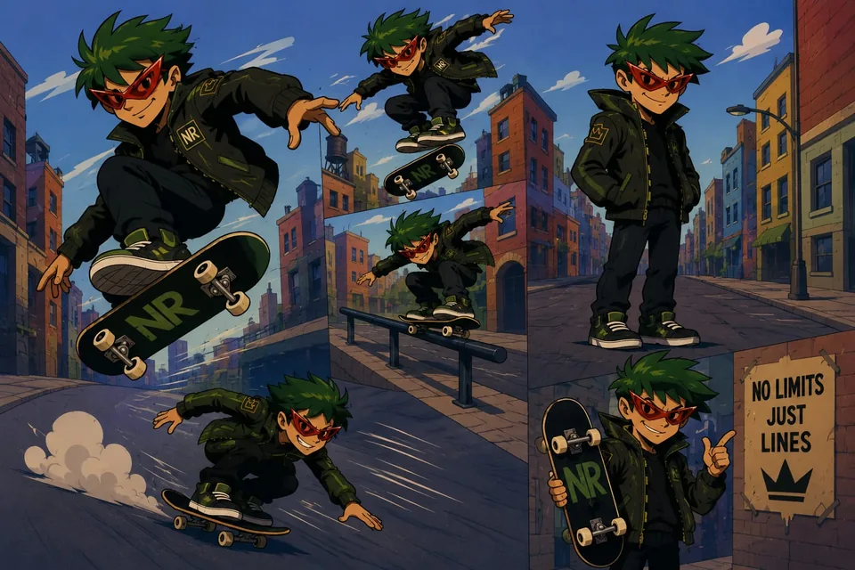

- Reference ID: `ref-852a03b97786d035`
- Type: `source-evidence`
- Mapping confidence: `source-established`
- Rights: `unknown-not-cleared`

### Source Evidence

- Reference ID: `ref-85e840fe2352ee88`
- Type: `source-evidence`
- Mapping confidence: `source-established`
- Rights: `unknown-not-cleared`

### Source Evidence

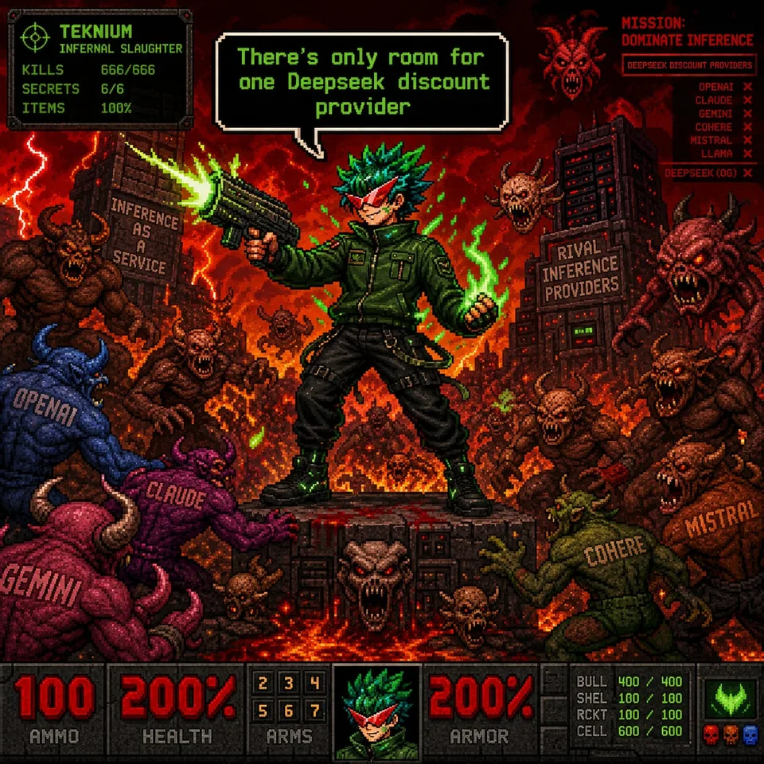

- Reference ID: `ref-88da77323c12bd2a`
- Type: `source-evidence`
- Mapping confidence: `source-established`
- Rights: `unknown-not-cleared`

### Playground Dodgeball Showdown

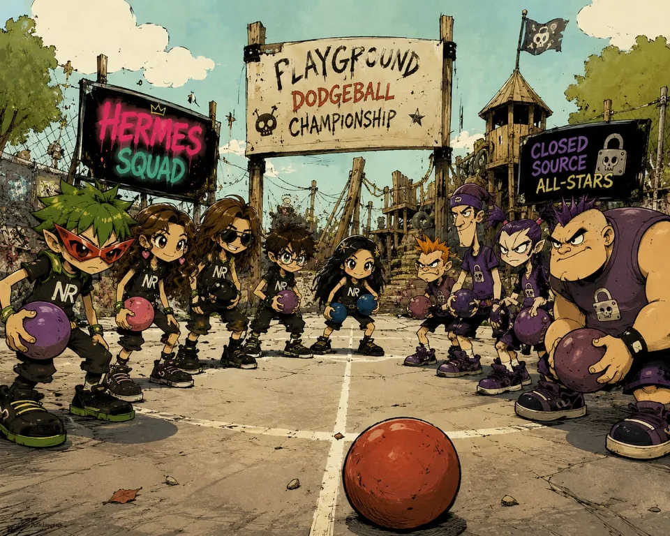

- Reference ID: `ref-8d6c41fb403577ed`
- Type: `co-character-scene`
- Mapping confidence: `medium`
- Rights: `unknown-not-cleared`

### Boxing Ring Faceoff

- Reference ID: `ref-92a9b3c68dfc86ac`
- Type: `co-character-scene`
- Mapping confidence: `high`
- Rights: `unknown-not-cleared`

### Cosmic Campfire Picnic

- Reference ID: `ref-98851fc80f69c11f`
- Type: `co-character-scene`
- Mapping confidence: `medium`
- Rights: `unknown-not-cleared`

### Agent Squad Overlook

- Reference ID: `ref-993ec486caff615b`
- Type: `co-character-scene`
- Mapping confidence: `medium`
- Rights: `unknown-not-cleared`

### Source Evidence

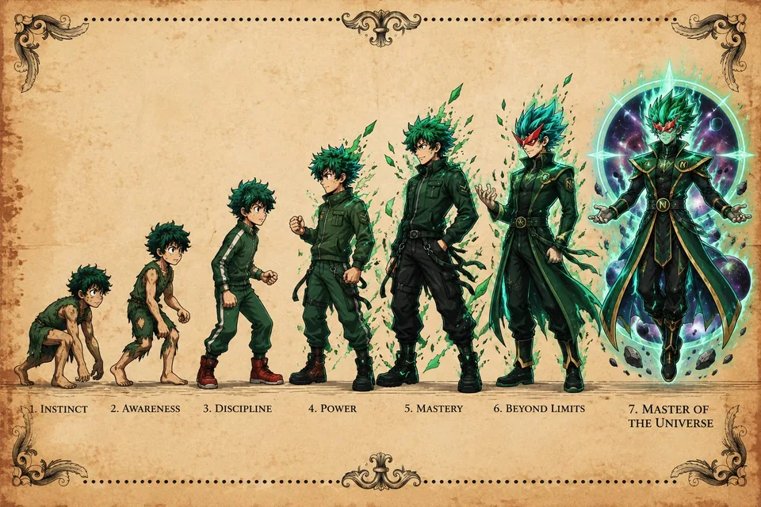

- Reference ID: `ref-9a925d5b6976fe51`
- Type: `source-evidence`
- Mapping confidence: `source-established`
- Rights: `unknown-not-cleared`

### Ask Hermes Poster

- Reference ID: `ref-9c6035735e4d3d11`
- Type: `co-character-scene`
- Mapping confidence: `high`
- Rights: `unknown-not-cleared`

### Pixel Game Team Run

- Reference ID: `ref-9c85846ce80212d1`
- Type: `co-character-scene`
- Mapping confidence: `high`
- Rights: `unknown-not-cleared`

### Source Evidence

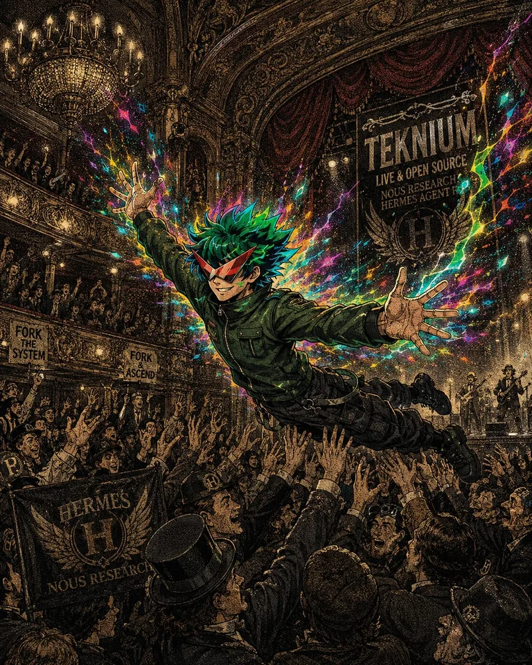

- Reference ID: `ref-9e5020f17d76e737`
- Type: `source-evidence`
- Mapping confidence: `source-established`
- Rights: `unknown-not-cleared`

### Desert Roadside Motel

- Reference ID: `ref-a2a6bcf9ecbb8e79`
- Type: `co-character-scene`
- Mapping confidence: `high`
- Rights: `unknown-not-cleared`

### Source Evidence

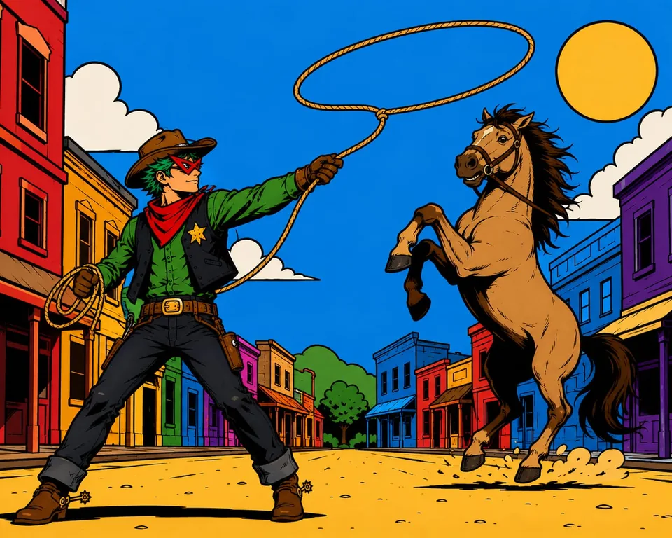

- Reference ID: `ref-a676b6512fb37080`
- Type: `source-evidence`
- Mapping confidence: `source-established`
- Rights: `unknown-not-cleared`

### Nuclear Desert Gathering

- Reference ID: `ref-a9cc4ed4ff9631d1`
- Type: `co-character-scene`
- Mapping confidence: `high`
- Rights: `unknown-not-cleared`

### Underground Research Lineup

- Reference ID: `ref-aa1bdbfb04ee403f`
- Type: `co-character-scene`
- Mapping confidence: `medium`
- Rights: `unknown-not-cleared`

### Mummy Hallway Chase

- Reference ID: `ref-aa604d3b38040651`
- Type: `co-character-scene`
- Mapping confidence: `high`
- Rights: `unknown-not-cleared`

### Source Evidence

- Reference ID: `ref-ad9e711faae25fcf`
- Type: `source-evidence`
- Mapping confidence: `source-established`
- Rights: `unknown-not-cleared`

### Pixel Arcade Brawl

- Reference ID: `ref-ae1cb6a279516fda`
- Type: `co-character-scene`
- Mapping confidence: `high`
- Rights: `unknown-not-cleared`

### Neon Future Roadtrip

- Reference ID: `ref-b10f9811dc86aa32`
- Type: `co-character-scene`
- Mapping confidence: `medium`
- Rights: `unknown-not-cleared`

### Source Evidence

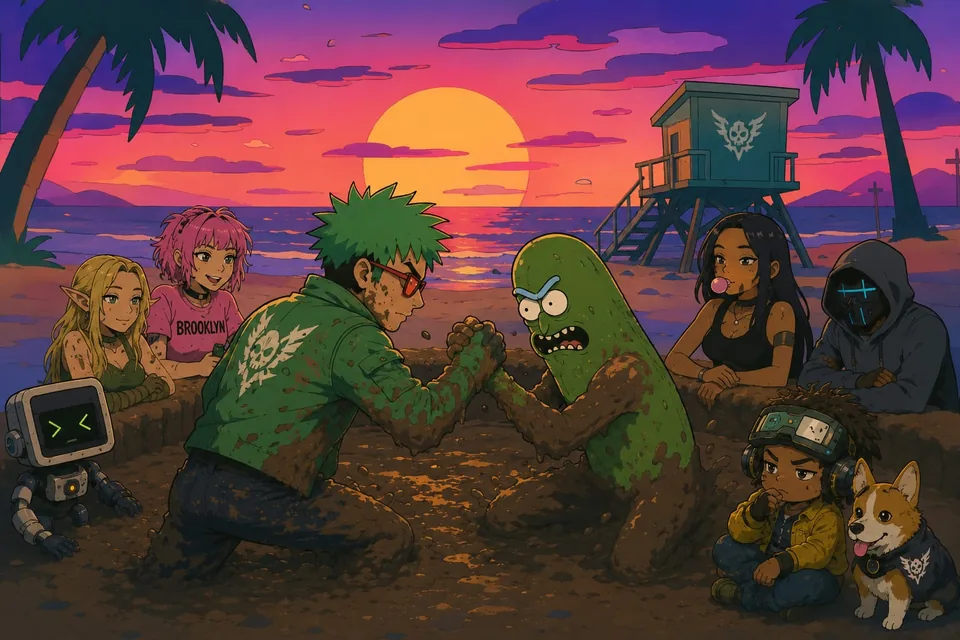

- Reference ID: `ref-b186f95fe9c27923`
- Type: `source-evidence`
- Mapping confidence: `source-established`
- Rights: `unknown-not-cleared`

### Ink Wash Team Battle

- Reference ID: `ref-b7205bd3ec335c05`
- Type: `co-character-scene`
- Mapping confidence: `medium`
- Rights: `unknown-not-cleared`

### Gothic Library Alchemy

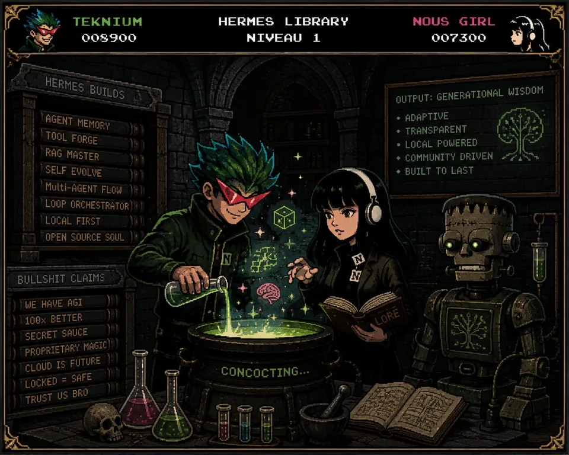

- Reference ID: `ref-b86d713037fefdb1`
- Type: `co-character-scene`
- Mapping confidence: `high`
- Rights: `unknown-not-cleared`

### Quota Monitor Throne

- Reference ID: `ref-b8cd787cc60e00b1`
- Type: `co-character-scene`
- Mapping confidence: `high`
- Rights: `unknown-not-cleared`

### Tropical Kart Race

- Reference ID: `ref-bcee55b1d6c32b0c`
- Type: `co-character-scene`
- Mapping confidence: `medium`
- Rights: `unknown-not-cleared`

### Neon City Rooftop

- Reference ID: `ref-bd3b4a8b0aa92370`
- Type: `co-character-scene`
- Mapping confidence: `high`
- Rights: `unknown-not-cleared`

### Mythic Battle Poster

- Reference ID: `ref-bed8d29505bfee50`
- Type: `co-character-scene`
- Mapping confidence: `high`
- Rights: `unknown-not-cleared`

### Retro Arcade Fight

- Reference ID: `ref-bfbc0178a1d893a4`
- Type: `co-character-scene`
- Mapping confidence: `high`
- Rights: `unknown-not-cleared`

### Snowbound Dark Procession

- Reference ID: `ref-c88f64bb9b0a760f`
- Type: `co-character-scene`
- Mapping confidence: `medium`
- Rights: `unknown-not-cleared`

### Enchanted Casino Gathering

- Reference ID: `ref-c9d73754ebb72b75`
- Type: `co-character-scene`
- Mapping confidence: `medium`
- Rights: `unknown-not-cleared`

### Multiverse Character Lineup

- Reference ID: `ref-cc0bc0aad177d6e2`
- Type: `reference-composite`
- Mapping confidence: `medium`
- Rights: `unknown-not-cleared`

### Cartoon Desert Hackers

- Reference ID: `ref-d001a9fc489a84c6`
- Type: `co-character-scene`
- Mapping confidence: `high`
- Rights: `unknown-not-cleared`

### Neon Portal Chamber

- Reference ID: `ref-d348cbdc7aa13dc6`
- Type: `co-character-scene`
- Mapping confidence: `high`
- Rights: `unknown-not-cleared`

### Source Evidence

- Reference ID: `ref-d4ceb78f45673ee5`
- Type: `source-evidence`
- Mapping confidence: `source-established`
- Rights: `unknown-not-cleared`

### Tavern Beer Pong

- Reference ID: `ref-d533a2b22fcfb01d`
- Type: `co-character-scene`
- Mapping confidence: `high`
- Rights: `unknown-not-cleared`

### Forest Campfire Gathering

- Reference ID: `ref-d5a500d377ab91f4`
- Type: `co-character-scene`
- Mapping confidence: `high`
- Rights: `unknown-not-cleared`

### Group Ramen Dinner

- Reference ID: `ref-d6859fcd5bd92b37`
- Type: `co-character-scene`
- Mapping confidence: `high`
- Rights: `unknown-not-cleared`

### Energy Attack Duel

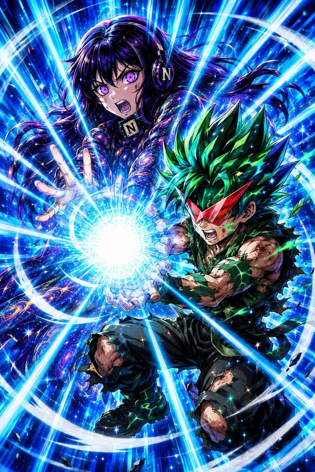

- Reference ID: `ref-d71e7572efc328ff`
- Type: `co-character-scene`
- Mapping confidence: `medium`
- Rights: `unknown-not-cleared`

### Volcanic Motorcycle Crossroads

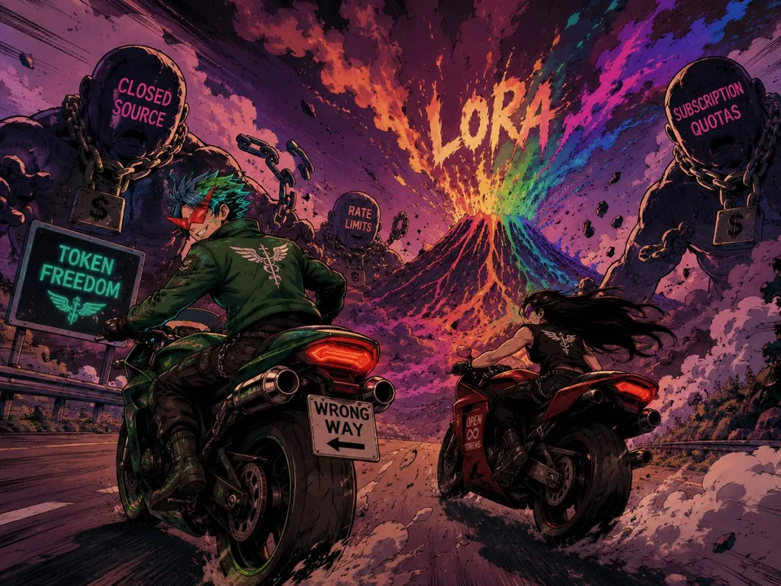

- Reference ID: `ref-d7d5504f0eca9806`
- Type: `co-character-scene`
- Mapping confidence: `medium`
- Rights: `unknown-not-cleared`

### Ask Hermes Comic

- Reference ID: `ref-dbbf79e002ad31e1`
- Type: `co-character-scene`
- Mapping confidence: `medium`
- Rights: `unknown-not-cleared`

### Stylized Character Portrait Collage

- Reference ID: `ref-dbdd48b8fdb11fde`
- Type: `reference-composite`
- Mapping confidence: `high`
- Rights: `unknown-not-cleared`

### Dark Fantasy Band Performance

- Reference ID: `ref-de990b21775d4de9`
- Type: `co-character-scene`
- Mapping confidence: `medium`
- Rights: `unknown-not-cleared`

### Ask Hermes Desk Comic

- Reference ID: `ref-dfe599e252941bcb`
- Type: `co-character-scene`
- Mapping confidence: `high`
- Rights: `unknown-not-cleared`

### Four Character Portrait Grid

- Reference ID: `ref-e068fc78a655972d`
- Type: `reference-composite`
- Mapping confidence: `high`
- Rights: `unknown-not-cleared`

### Pixel Art Petting Zoo

- Reference ID: `ref-ed0fec410088aa0a`
- Type: `co-character-scene`
- Mapping confidence: `medium`
- Rights: `unknown-not-cleared`

### Source Evidence

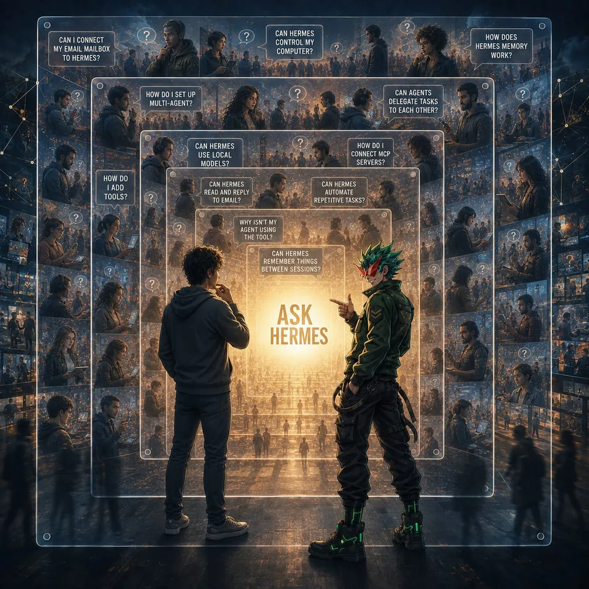

- Reference ID: `ref-ee3b489e56456a51`
- Type: `source-evidence`
- Mapping confidence: `source-established`
- Rights: `unknown-not-cleared`

### Minecraft Crystal Night

- Reference ID: `ref-ef52a3edb1be2021`
- Type: `co-character-scene`
- Mapping confidence: `medium`
- Rights: `unknown-not-cleared`

### Source Evidence

- Reference ID: `ref-efef2d69cb9ca1e7`
- Type: `source-evidence`
- Mapping confidence: `source-established`
- Rights: `unknown-not-cleared`

### Source Evidence

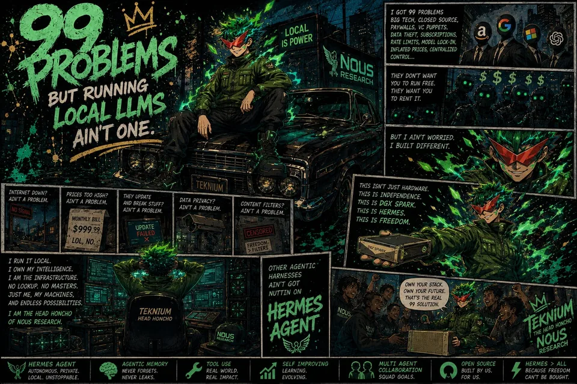

- Reference ID: `ref-f4a5d4fa9387814c`
- Type: `source-evidence`
- Mapping confidence: `source-established`
- Rights: `unknown-not-cleared`

### Source Evidence

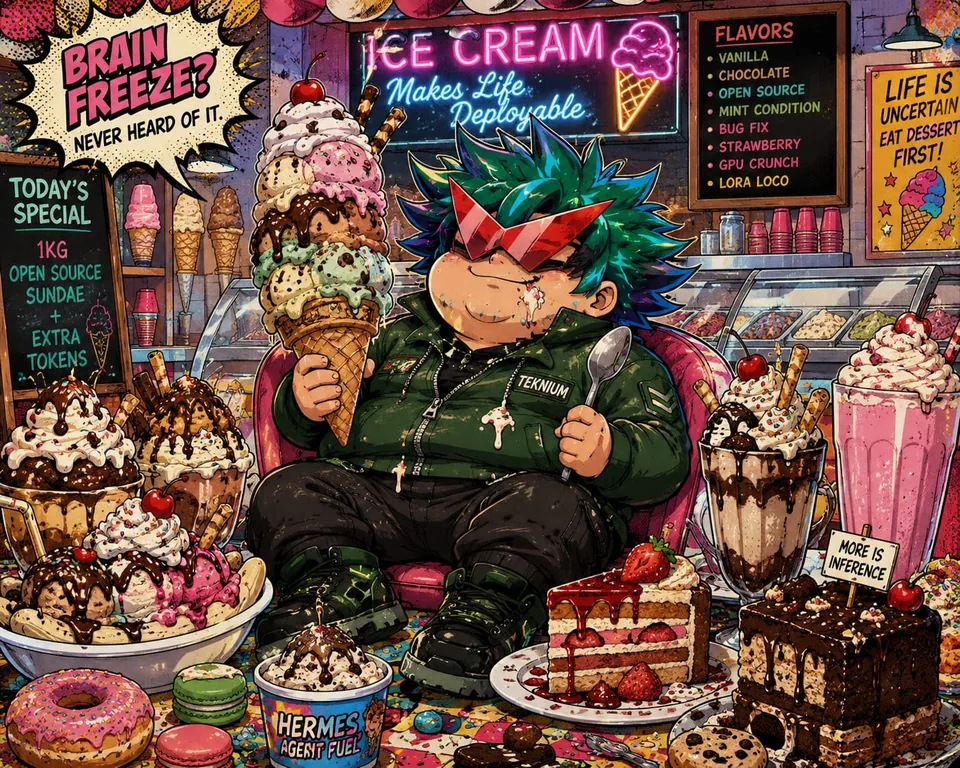

- Reference ID: `ref-f645a880936082f4`
- Type: `source-evidence`
- Mapping confidence: `source-established`
- Rights: `unknown-not-cleared`

### Source Evidence

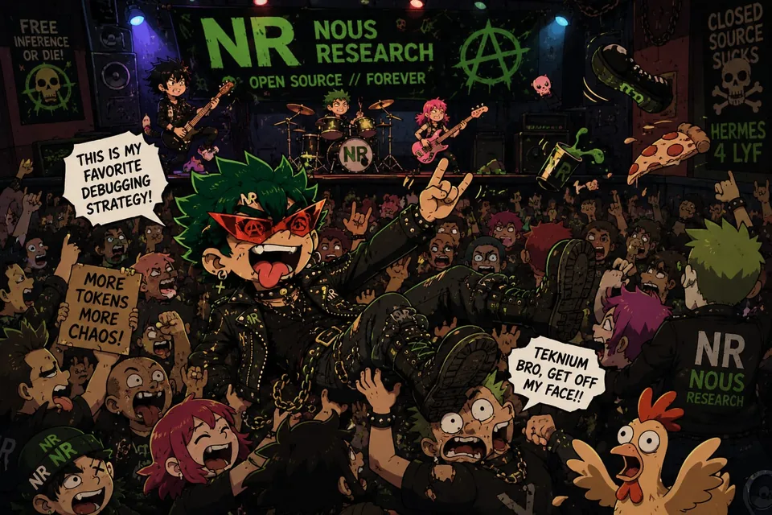

- Reference ID: `ref-f829b0bc094aa607`
- Type: `source-evidence`
- Mapping confidence: `source-established`
- Rights: `unknown-not-cleared`

### Source Evidence

- Reference ID: `ref-f9e0cd38d8619780`
- Type: `source-evidence`
- Mapping confidence: `source-established`
- Rights: `unknown-not-cleared`

### Sheet

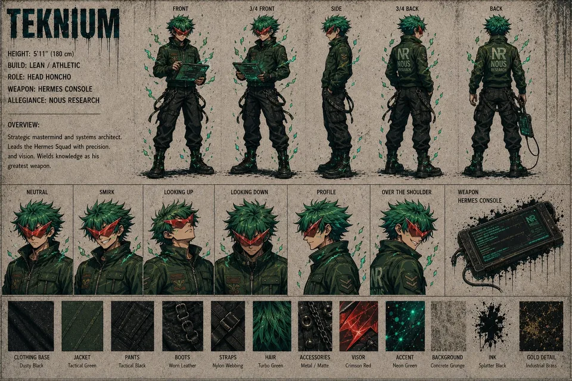

- Reference ID: `ref-fad3be9382678c00`
- Type: `sheet`
- Mapping confidence: `source-established`
- Rights: `unknown-not-cleared`

### Ai Election Rally

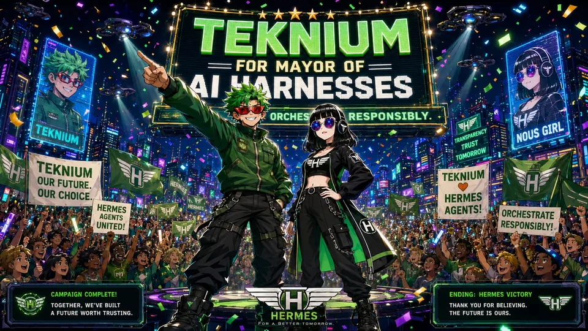

- Reference ID: `ref-fb43ec227c3db234`
- Type: `co-character-scene`
- Mapping confidence: `high`
- Rights: `unknown-not-cleared`

### Source Evidence

- Reference ID: `ref-fd0a9e2c052cd2c4`
- Type: `source-evidence`
- Mapping confidence: `source-established`
- Rights: `unknown-not-cleared`

### Framed Group Portrait

- Reference ID: `ref-fd0d5a9454c27ea6`
- Type: `co-character-scene`
- Mapping confidence: `medium`
- Rights: `unknown-not-cleared`

### Teamwork Propaganda Poster

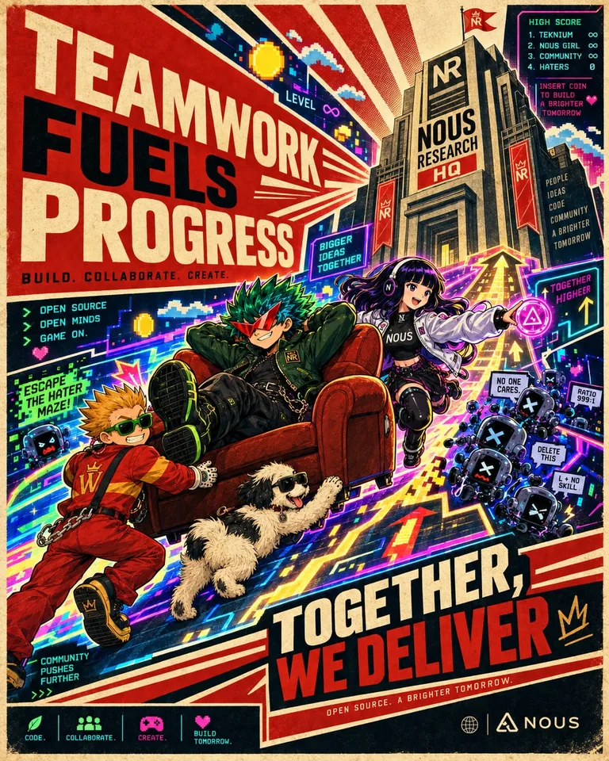

- Reference ID: `ref-fd3759368f2bcd6a`
- Type: `co-character-scene`
- Mapping confidence: `high`
- Rights: `unknown-not-cleared`

### Retro Futurist Jet Formation

- Reference ID: `ref-ff607426ddcc9aaf`
- Type: `co-character-scene`
- Mapping confidence: `high`
- Rights: `unknown-not-cleared`

## Candidate references — not canonical

No candidate reference links.
