# Tinuviel — The Starry Wanderer — supporting references

Shared references remain single-copy previews in the central reference gallery.

- Canonical reference links: 47
- Candidate links (not canonical): 1

## Canonical references

### Hermes Agent Group Portrait

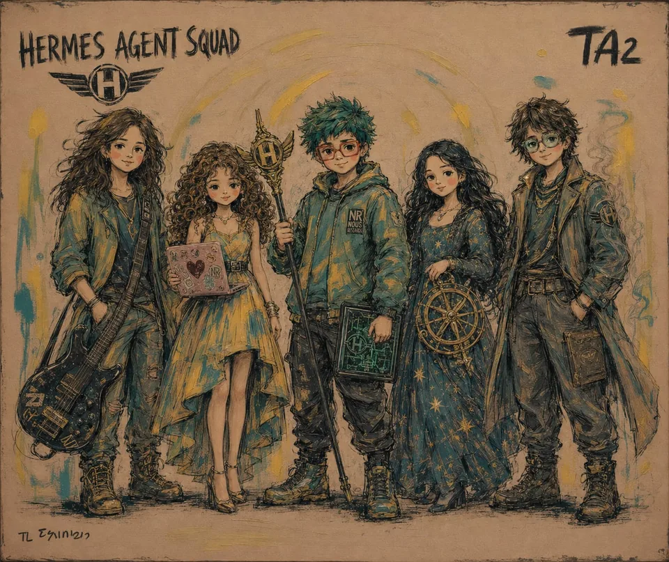

- Reference ID: `ref-09a3c5e1ba139ae3`
- Type: `co-character-scene`
- Mapping confidence: `medium`
- Rights: `unknown-not-cleared`

### Source Evidence

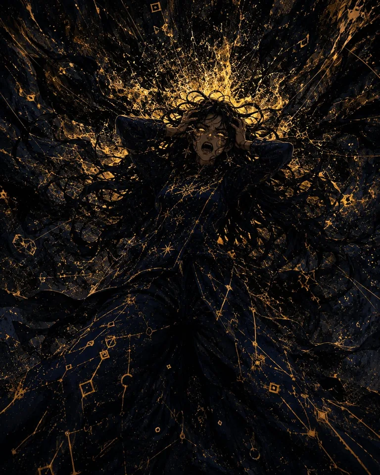

- Reference ID: `ref-1317ed3ea8a9ba30`
- Type: `source-evidence`
- Mapping confidence: `source-established`
- Rights: `unknown-not-cleared`

### Source Evidence

- Reference ID: `ref-25049055f11aa5c7`
- Type: `source-evidence`
- Mapping confidence: `source-established`
- Rights: `unknown-not-cleared`

### Source Evidence

- Reference ID: `ref-2afea2b641637c09`
- Type: `source-evidence`
- Mapping confidence: `source-established`
- Rights: `unknown-not-cleared`

### Multiverse Portal Team

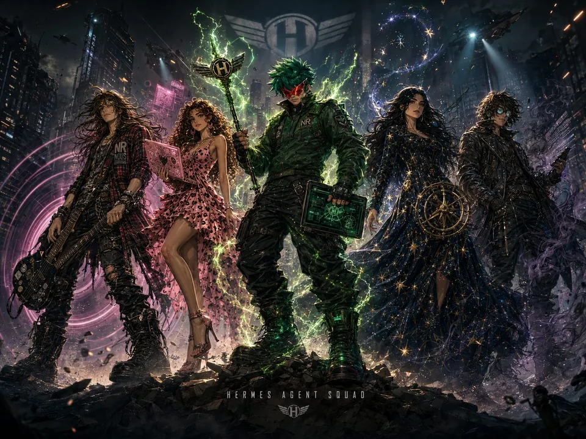

- Reference ID: `ref-2d246f1adbcdb084`
- Type: `co-character-scene`
- Mapping confidence: `high`
- Rights: `unknown-not-cleared`

### Data Center Liberation Team

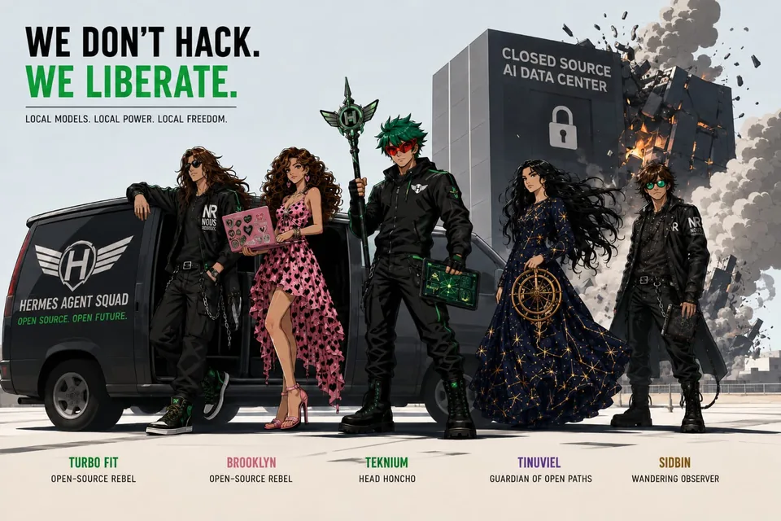

- Reference ID: `ref-30fb2252b524873d`
- Type: `co-character-scene`
- Mapping confidence: `high`
- Rights: `unknown-not-cleared`

### Source Evidence

- Reference ID: `ref-3345bf826bc63834`
- Type: `source-evidence`
- Mapping confidence: `source-established`
- Rights: `unknown-not-cleared`

### Collaborative City Building

- Reference ID: `ref-33694986ceefe483`
- Type: `co-character-scene`
- Mapping confidence: `high`
- Rights: `unknown-not-cleared`

### Neon Rooftop Squad

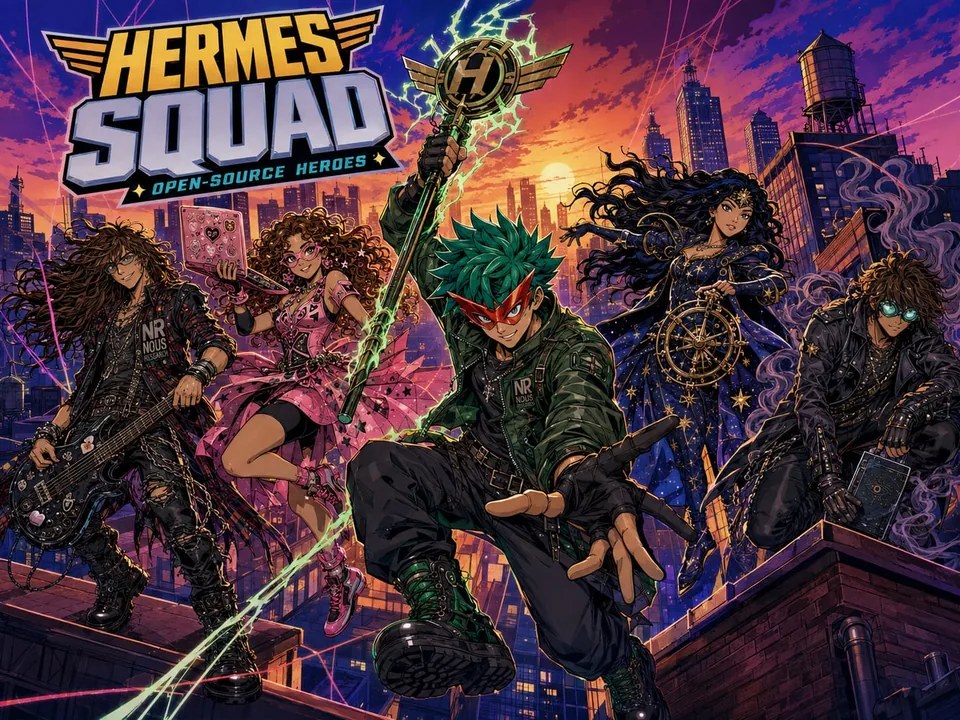

- Reference ID: `ref-35f5ecbbf1ab4b06`
- Type: `co-character-scene`
- Mapping confidence: `high`
- Rights: `unknown-not-cleared`

### Open Source Graveyard

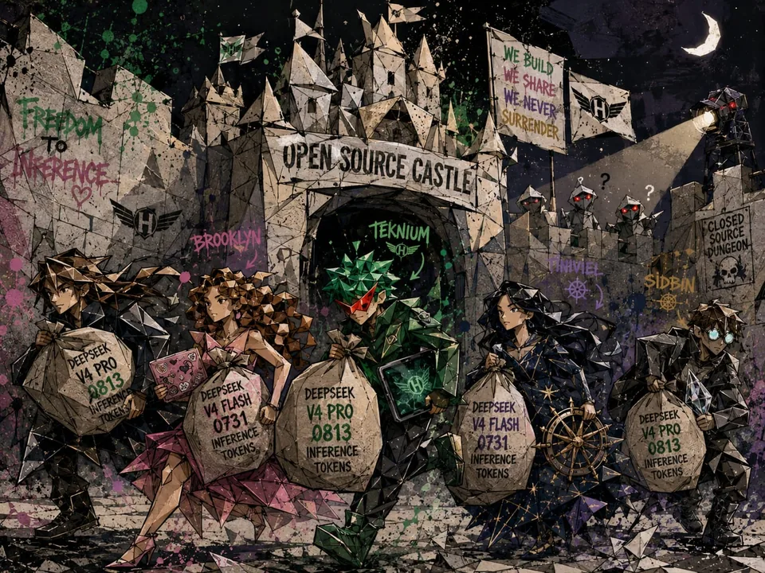

- Reference ID: `ref-38039a466a575b2b`
- Type: `co-character-scene`
- Mapping confidence: `high`
- Rights: `unknown-not-cleared`

### Source Evidence

- Reference ID: `ref-38aa1258cf959765`
- Type: `source-evidence`
- Mapping confidence: `source-established`
- Rights: `unknown-not-cleared`

### Source Evidence

- Reference ID: `ref-3a93f5e2aae93d6c`
- Type: `source-evidence`
- Mapping confidence: `source-established`
- Rights: `unknown-not-cleared`

### Rainbow Squad Poster

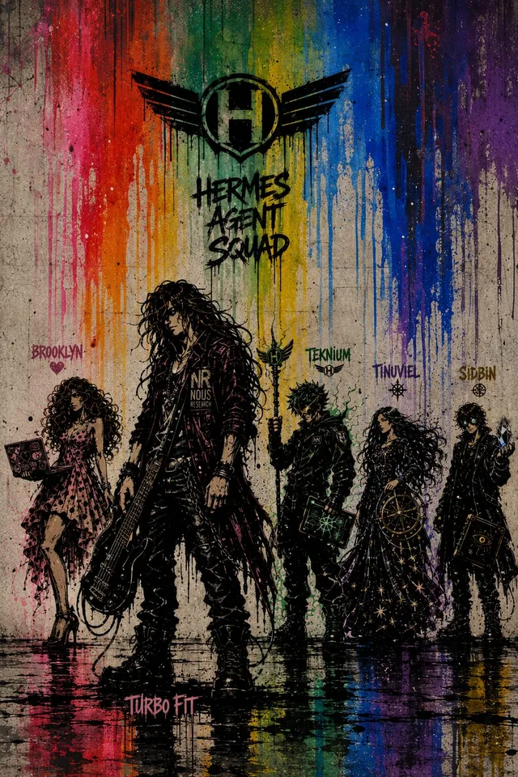

- Reference ID: `ref-3a956070a22b1526`
- Type: `co-character-scene`
- Mapping confidence: `high`
- Rights: `unknown-not-cleared`

### Neon City Team March

- Reference ID: `ref-3c3c4658d418a903`
- Type: `co-character-scene`
- Mapping confidence: `high`
- Rights: `unknown-not-cleared`

### Source Evidence

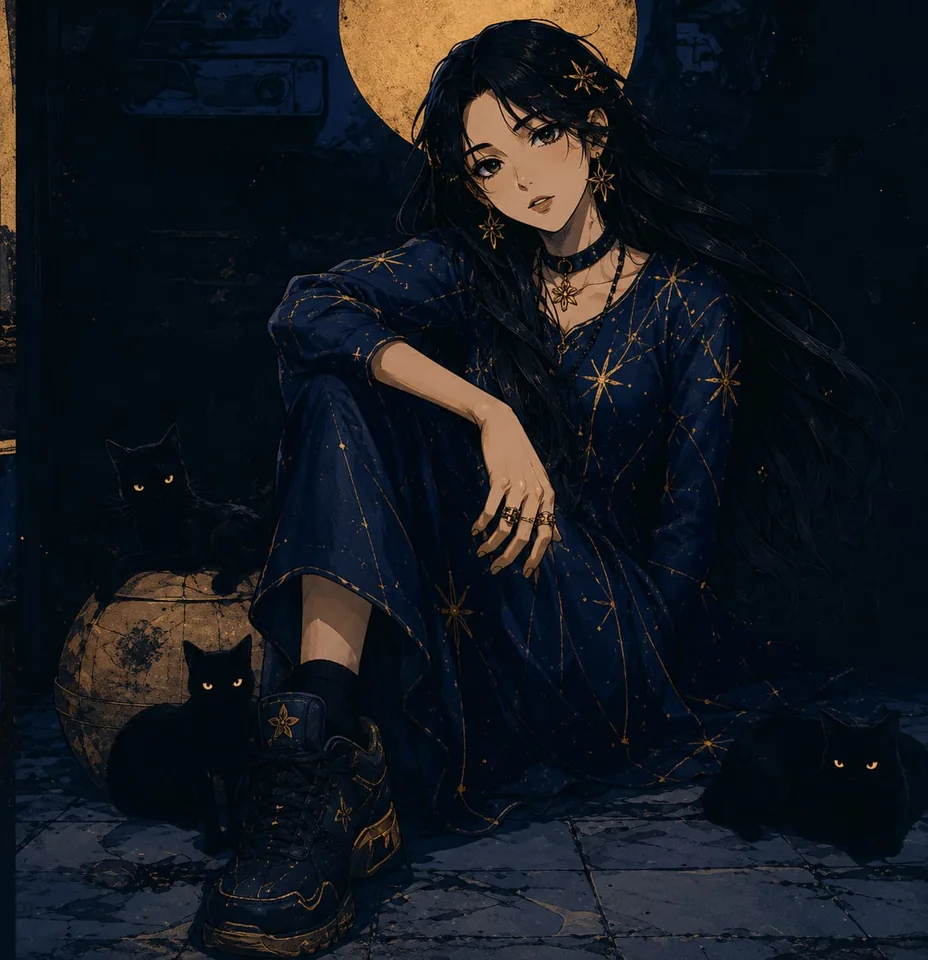

- Reference ID: `ref-3f459960a494112d`
- Type: `source-evidence`
- Mapping confidence: `source-established`
- Rights: `unknown-not-cleared`

### Agent Squad Reference

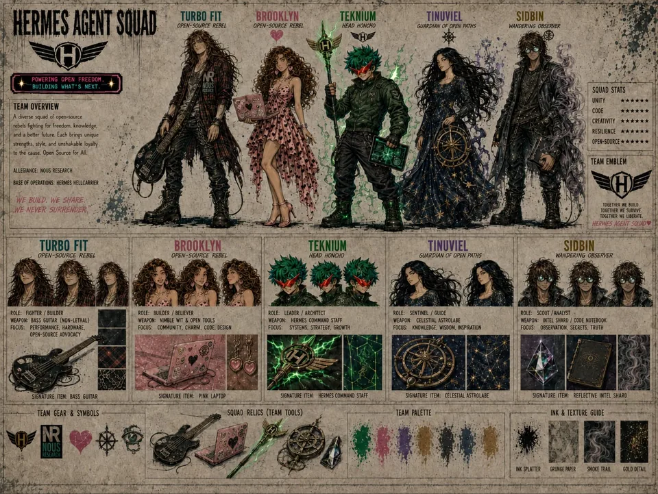

- Reference ID: `ref-426508e0ad73e935`
- Type: `reference-composite`
- Mapping confidence: `high`
- Rights: `unknown-not-cleared`

### Neon Rooftop Comet Ride

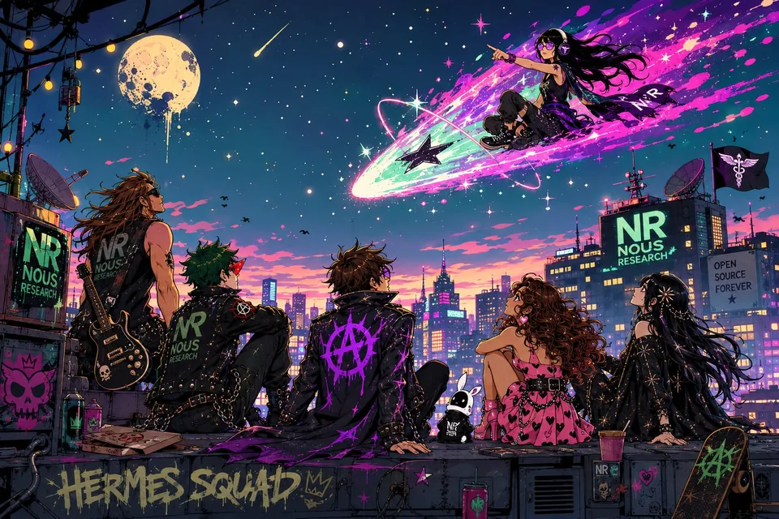

- Reference ID: `ref-556828cdcf639c55`
- Type: `co-character-scene`
- Mapping confidence: `medium`
- Rights: `unknown-not-cleared`

### Open Source Roller Disco

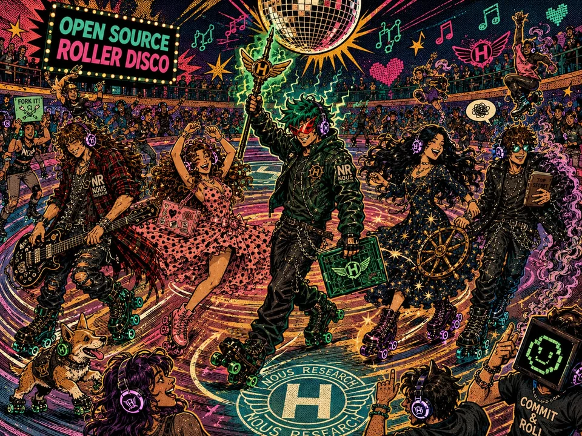

- Reference ID: `ref-581dad8db16d20ea`
- Type: `co-character-scene`
- Mapping confidence: `high`
- Rights: `unknown-not-cleared`

### Source Evidence

- Reference ID: `ref-61592fec5857d9ed`
- Type: `source-evidence`
- Mapping confidence: `source-established`
- Rights: `unknown-not-cleared`

### Retro Arcade Code Brawl

- Reference ID: `ref-637c330995304b7b`
- Type: `co-character-scene`
- Mapping confidence: `high`
- Rights: `unknown-not-cleared`

### Source Evidence

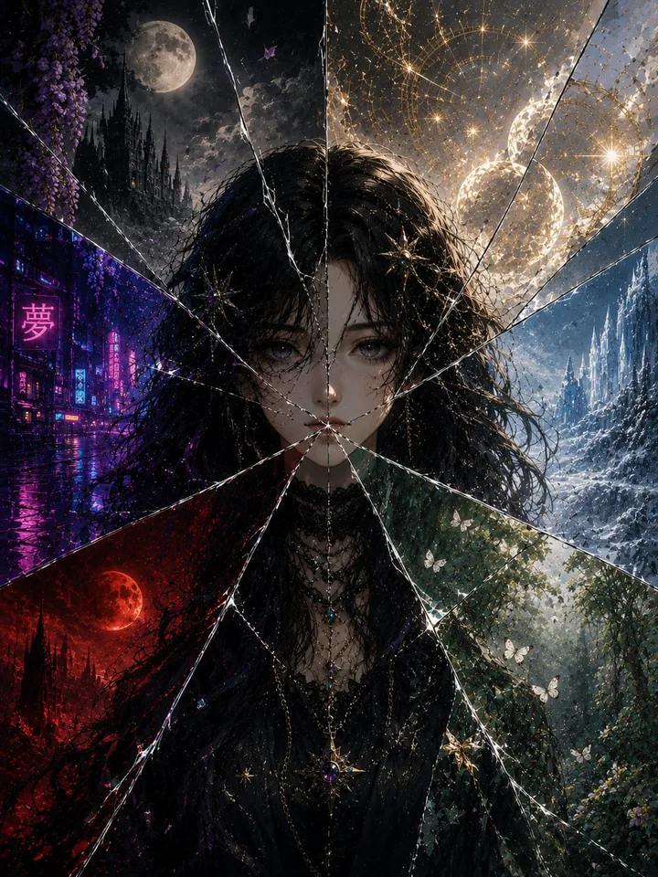

- Reference ID: `ref-659c1f368ae9c046`
- Type: `source-evidence`
- Mapping confidence: `source-established`
- Rights: `unknown-not-cleared`

### Garage Bar Beer Pong

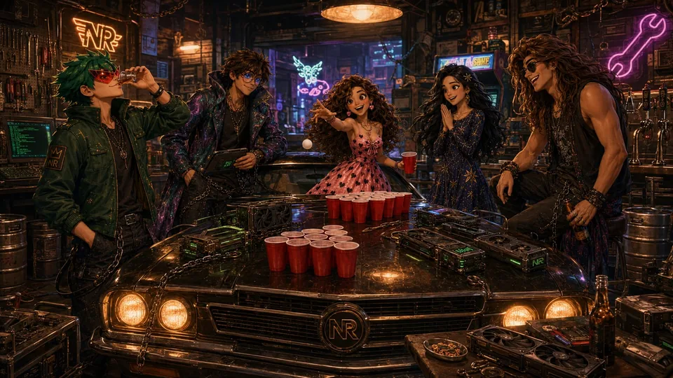

- Reference ID: `ref-6974eaa0bf67799e`
- Type: `co-character-scene`
- Mapping confidence: `high`
- Rights: `unknown-not-cleared`

### Retro Diner Breakfast

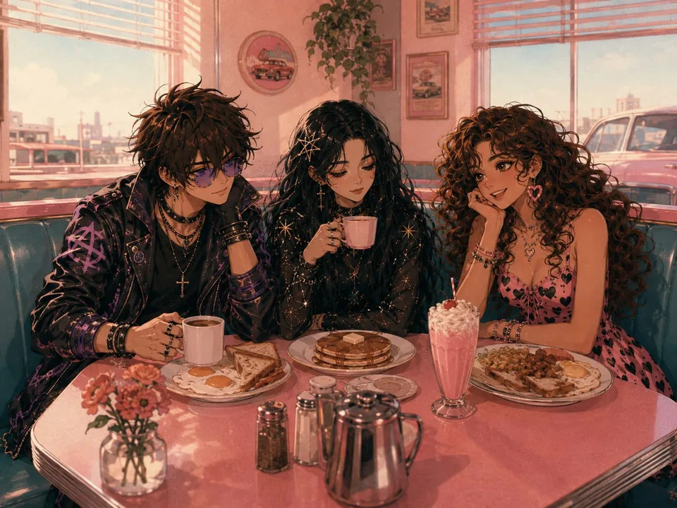

- Reference ID: `ref-6d86f2a99444f762`
- Type: `co-character-scene`
- Mapping confidence: `high`
- Rights: `unknown-not-cleared`

### Dojo Combat Showdown

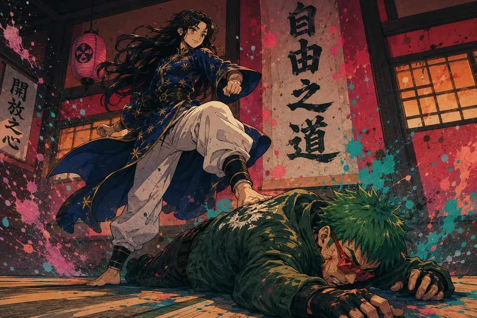

- Reference ID: `ref-7675e5281121b3d8`
- Type: `co-character-scene`
- Mapping confidence: `high`
- Rights: `unknown-not-cleared`

### Sunset Berry Harvest

- Reference ID: `ref-7779ee6093e4b42e`
- Type: `co-character-scene`
- Mapping confidence: `high`
- Rights: `unknown-not-cleared`

### Crowded Tech Festival

- Reference ID: `ref-85002f2d21fbdb9c`
- Type: `co-character-scene`
- Mapping confidence: `medium`
- Rights: `unknown-not-cleared`

### Cosmic Campfire Picnic

- Reference ID: `ref-98851fc80f69c11f`
- Type: `co-character-scene`
- Mapping confidence: `medium`
- Rights: `unknown-not-cleared`

### Source Evidence

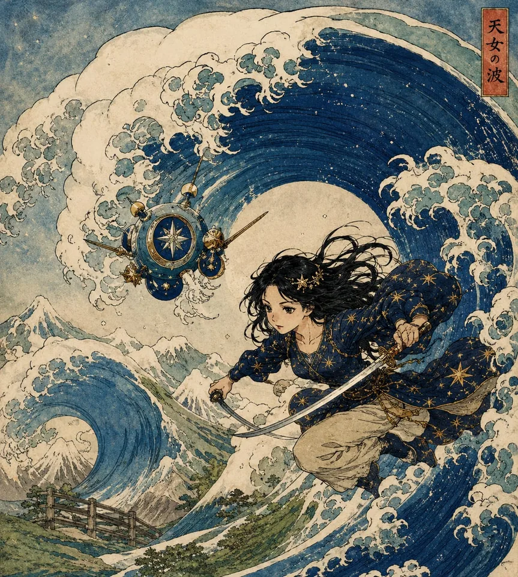

- Reference ID: `ref-9f7985f25ca3e5da`
- Type: `source-evidence`
- Mapping confidence: `source-established`
- Rights: `unknown-not-cleared`

### Source Evidence

- Reference ID: `ref-a6acef185740edbc`
- Type: `source-evidence`
- Mapping confidence: `source-established`
- Rights: `unknown-not-cleared`

### Sunset Street Performance

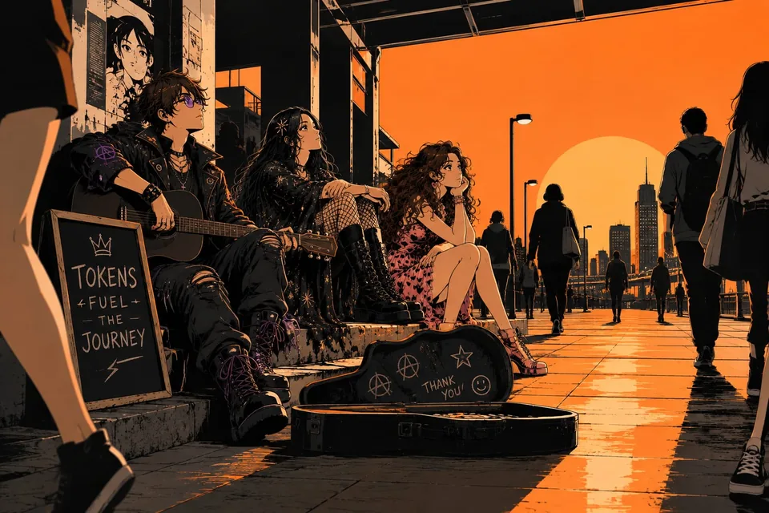

- Reference ID: `ref-a8570042bc160412`
- Type: `co-character-scene`
- Mapping confidence: `high`
- Rights: `unknown-not-cleared`

### Source Evidence

- Reference ID: `ref-a8af432c8fd91da5`
- Type: `source-evidence`
- Mapping confidence: `source-established`
- Rights: `unknown-not-cleared`

### Mummy Hallway Chase

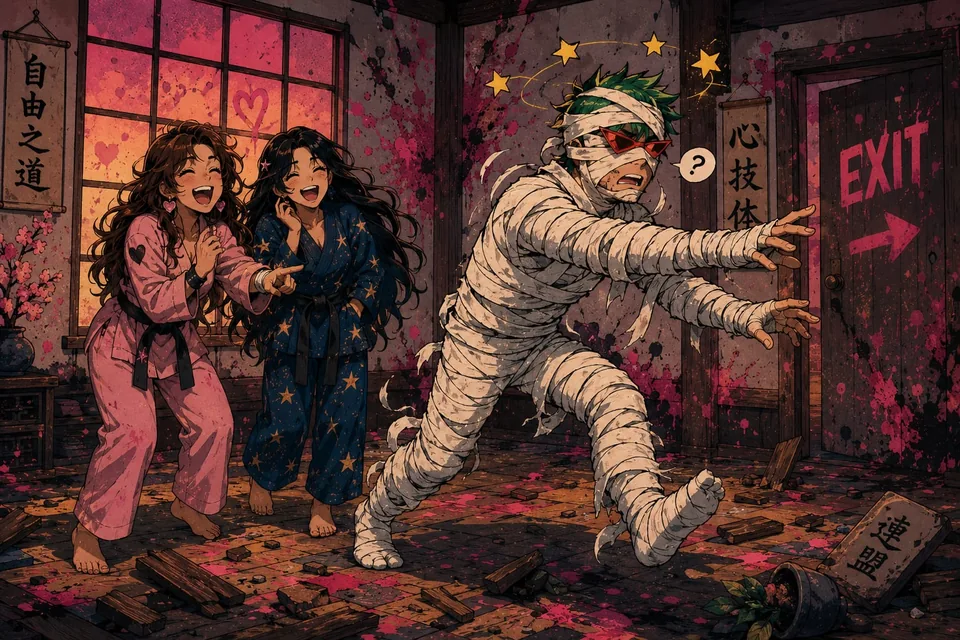

- Reference ID: `ref-aa604d3b38040651`
- Type: `co-character-scene`
- Mapping confidence: `high`
- Rights: `unknown-not-cleared`

### Pixel Arcade Brawl

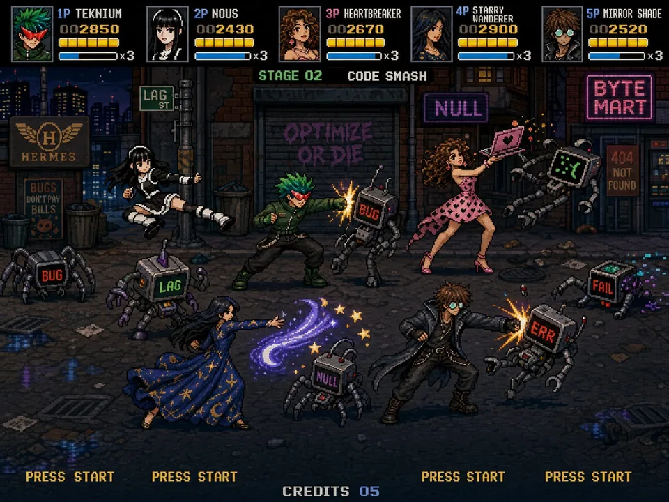

- Reference ID: `ref-ae1cb6a279516fda`
- Type: `co-character-scene`
- Mapping confidence: `high`
- Rights: `unknown-not-cleared`

### Source Evidence

- Reference ID: `ref-b791b7de10606ee8`
- Type: `source-evidence`
- Mapping confidence: `source-established`
- Rights: `unknown-not-cleared`

### Spectral Wolf Summoning

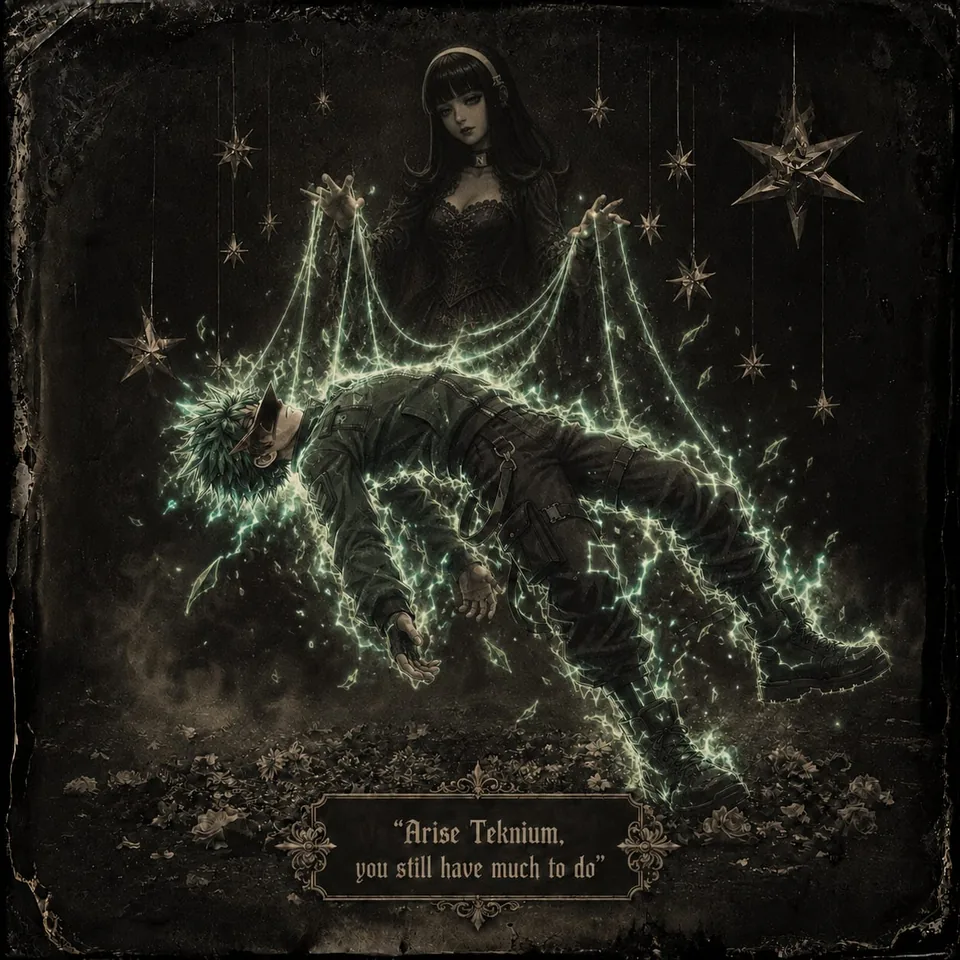

- Reference ID: `ref-c583d04d551097b7`
- Type: `single-character-scene`
- Mapping confidence: `high`
- Rights: `unknown-not-cleared`

### Snowbound Dark Procession

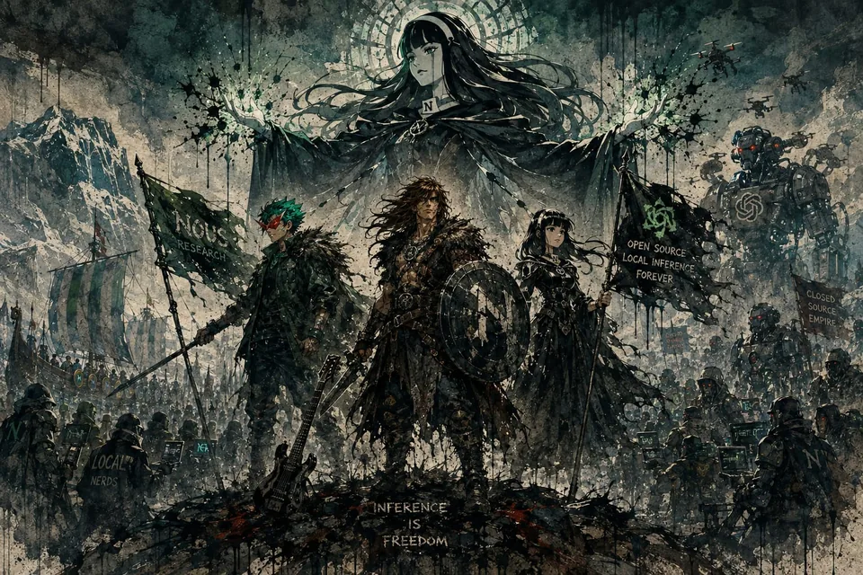

- Reference ID: `ref-c88f64bb9b0a760f`
- Type: `co-character-scene`
- Mapping confidence: `medium`
- Rights: `unknown-not-cleared`

### Enchanted Casino Gathering

- Reference ID: `ref-c9d73754ebb72b75`
- Type: `co-character-scene`
- Mapping confidence: `medium`
- Rights: `unknown-not-cleared`

### Neon Portal Chamber

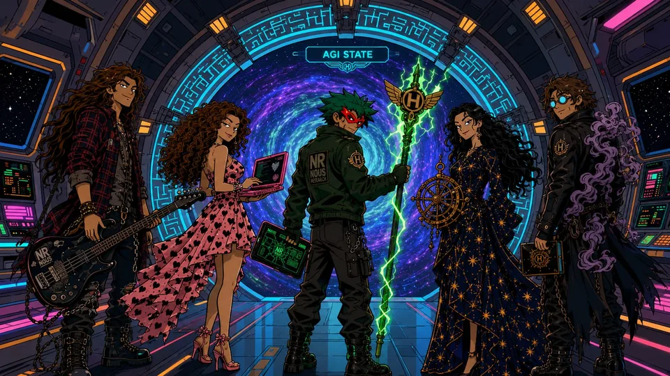

- Reference ID: `ref-d348cbdc7aa13dc6`
- Type: `co-character-scene`
- Mapping confidence: `high`
- Rights: `unknown-not-cleared`

### Tavern Beer Pong

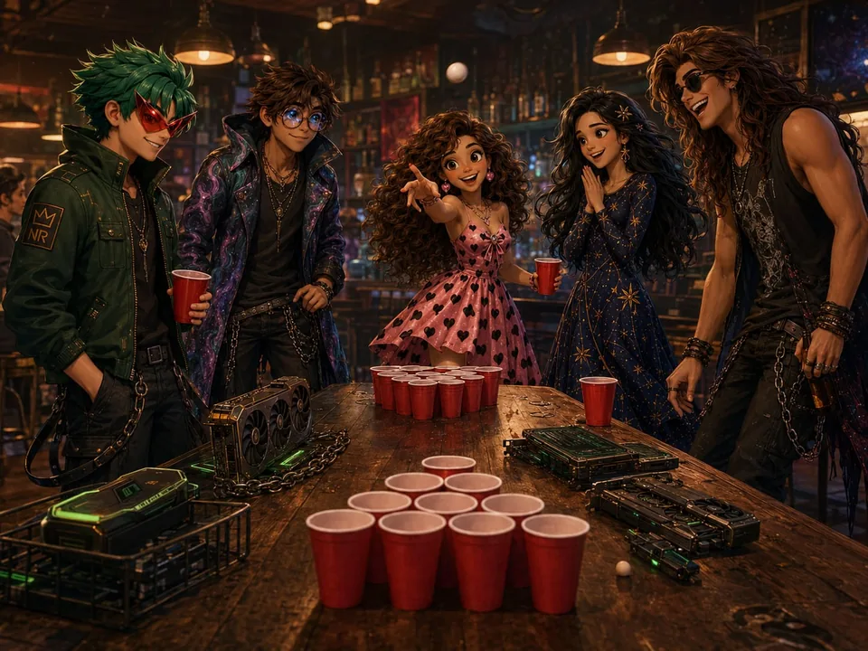

- Reference ID: `ref-d533a2b22fcfb01d`
- Type: `co-character-scene`
- Mapping confidence: `high`
- Rights: `unknown-not-cleared`

### Forest Campfire Gathering

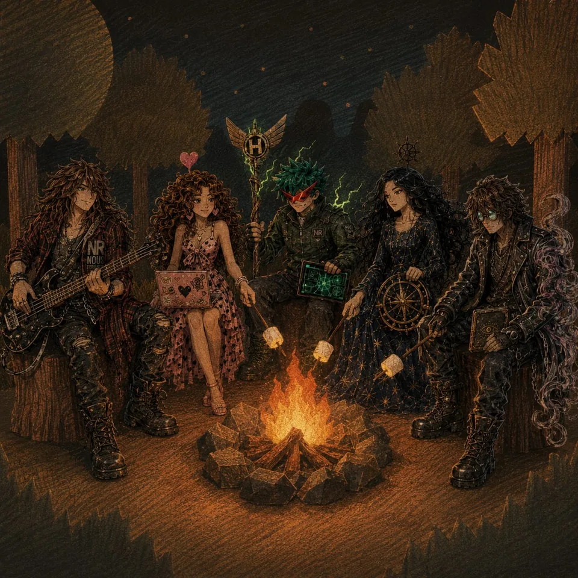

- Reference ID: `ref-d5a500d377ab91f4`
- Type: `co-character-scene`
- Mapping confidence: `high`
- Rights: `unknown-not-cleared`

### Stylized Character Portrait Collage

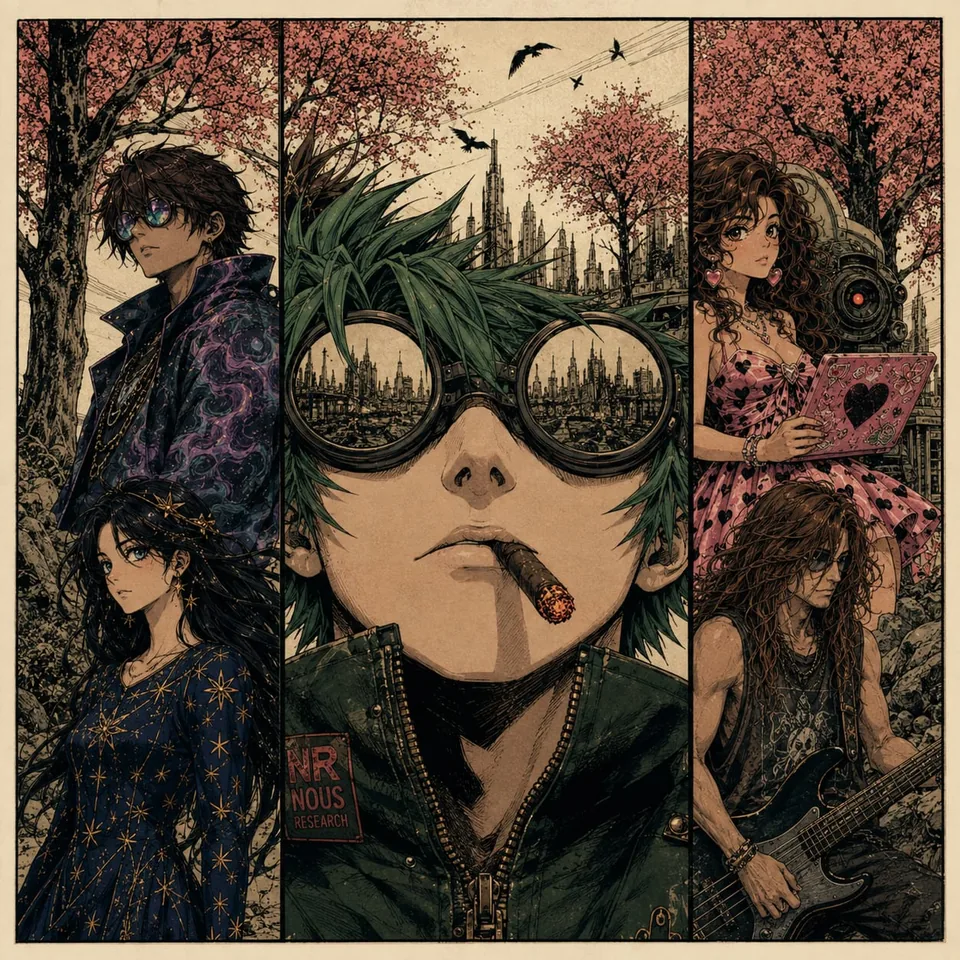

- Reference ID: `ref-dbdd48b8fdb11fde`
- Type: `reference-composite`
- Mapping confidence: `high`
- Rights: `unknown-not-cleared`

### Dark Fantasy Band Performance

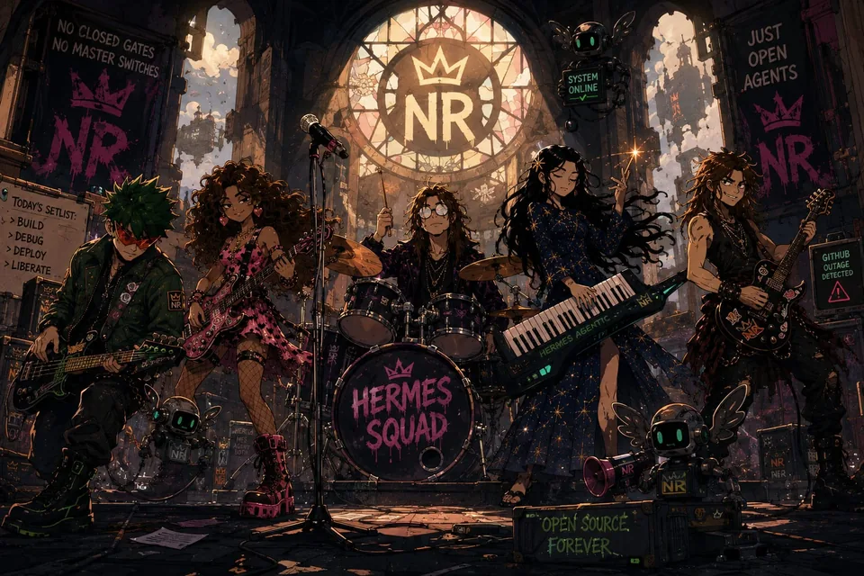

- Reference ID: `ref-de990b21775d4de9`
- Type: `co-character-scene`
- Mapping confidence: `medium`
- Rights: `unknown-not-cleared`

### Holographic Stage Gathering

- Reference ID: `ref-e0d3f4f421a25dfb`
- Type: `co-character-scene`
- Mapping confidence: `medium`
- Rights: `unknown-not-cleared`

### Sheet

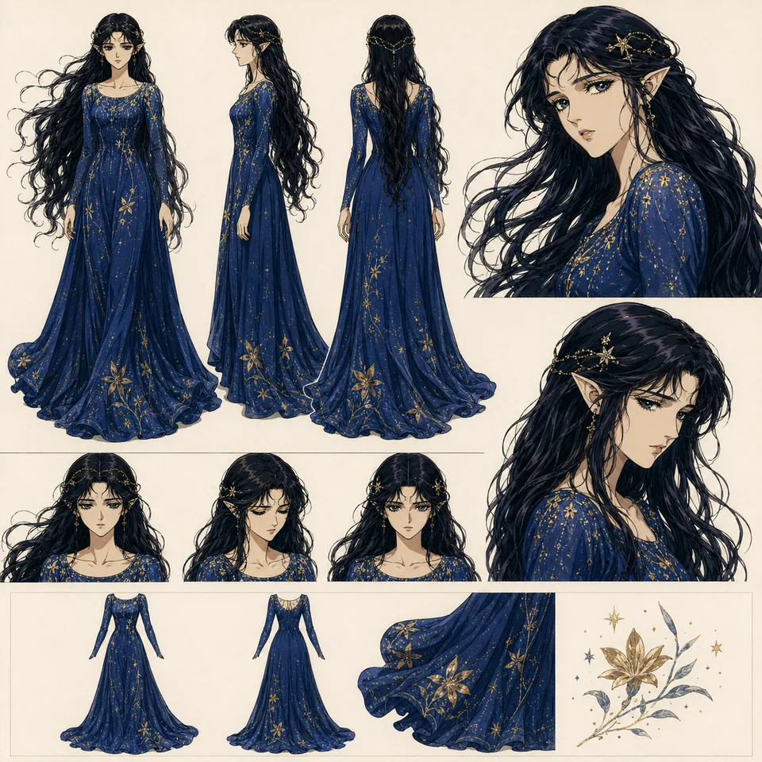

- Reference ID: `ref-ec9b2a747276dda1`
- Type: `sheet`
- Mapping confidence: `source-established`
- Rights: `unknown-not-cleared`

### Ornate Golden Wanderer

- Reference ID: `ref-f21b71279f9a7c44`
- Type: `single-character-reference`
- Mapping confidence: `medium`
- Rights: `unknown-not-cleared`

### Source Evidence

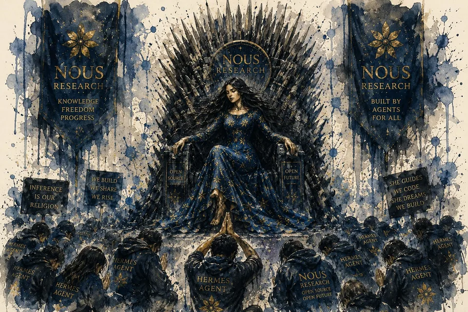

- Reference ID: `ref-fd5b189acc8c201c`
- Type: `source-evidence`
- Mapping confidence: `source-established`
- Rights: `unknown-not-cleared`

### Retro Futurist Jet Formation

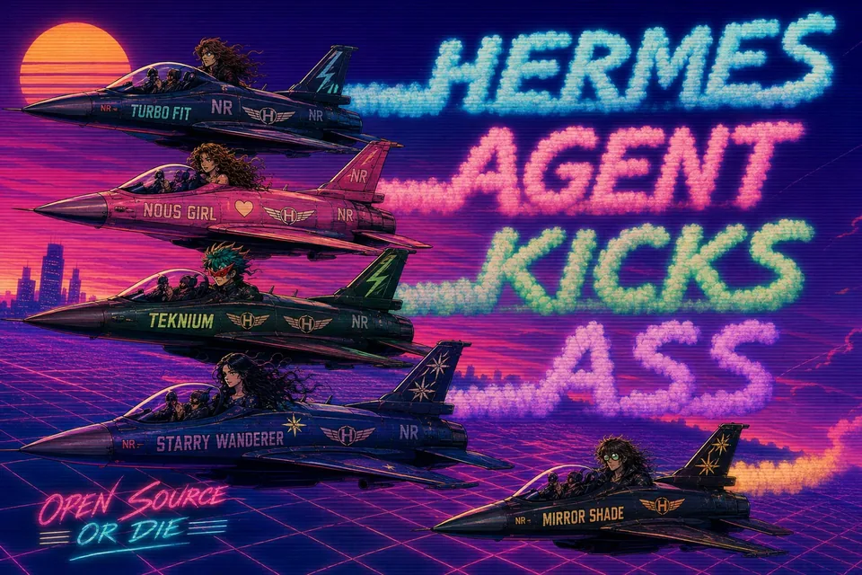

- Reference ID: `ref-ff607426ddcc9aaf`
- Type: `co-character-scene`
- Mapping confidence: `high`
- Rights: `unknown-not-cleared`

## Candidate references — not canonical

### Rainbow Squad Silhouettes

**NOT CANONICAL — candidate identity link only.**

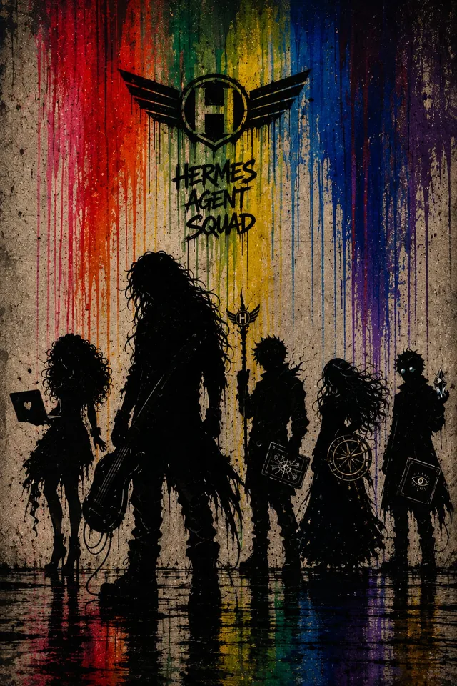

- Reference ID: `ref-4ff64e3403ce9b04`
- Type: `co-character-scene`
- Mapping confidence: `low`
- Rights: `unknown-not-cleared`
