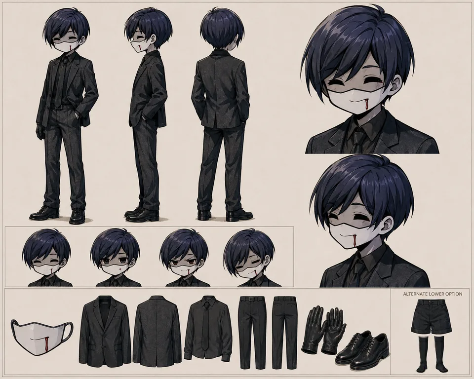

# TunaCookie — supporting references

Shared references remain single-copy previews in the central reference gallery.

- Canonical reference links: 4
- Candidate links (not canonical): 0

## Canonical references

### Sheet

- Reference ID: `ref-732dc278b05ceae6`
- Type: `sheet`
- Mapping confidence: `source-established`
- Rights: `unknown-not-cleared`

### Dessert Buffet Brawl

- Reference ID: `ref-7acce532b34ba583`
- Type: `co-character-scene`
- Mapping confidence: `high`
- Rights: `unknown-not-cleared`

### Underground Sewer Cafe

- Reference ID: `ref-ae741cefc93c1767`
- Type: `co-character-scene`
- Mapping confidence: `high`
- Rights: `mixed:approval-pending-per-profile,unknown-not-cleared`

### Moody Cocktail Bar

- Reference ID: `ref-d5849ed5351df0e3`
- Type: `co-character-scene`
- Mapping confidence: `high`
- Rights: `mixed:approval-pending-per-profile,unknown-not-cleared`

## Candidate references — not canonical

No candidate reference links.
