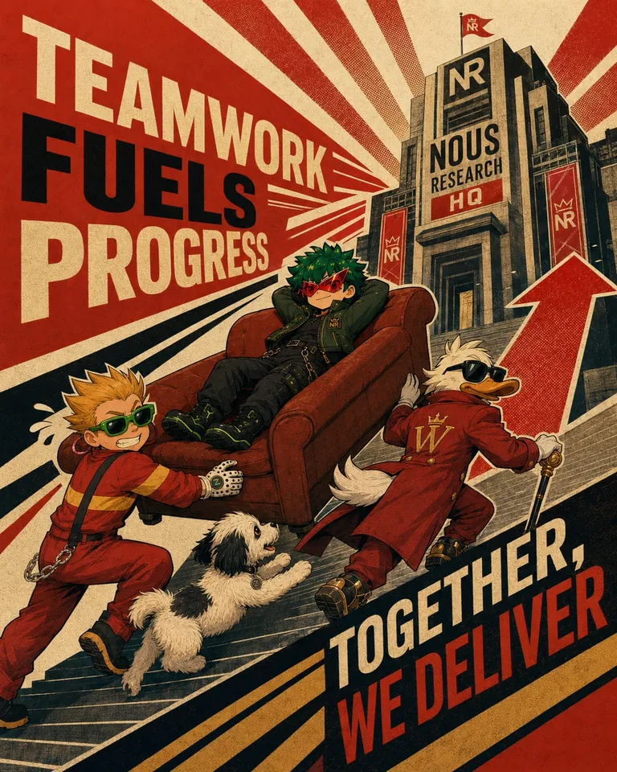
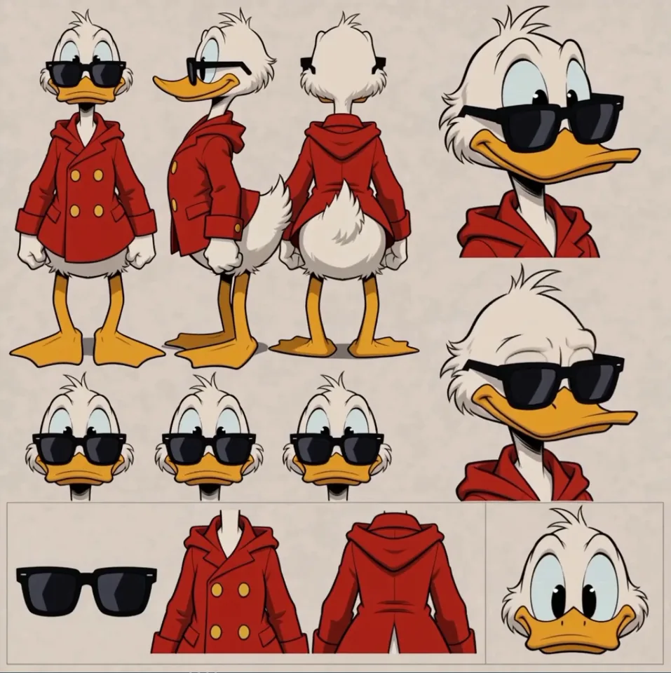
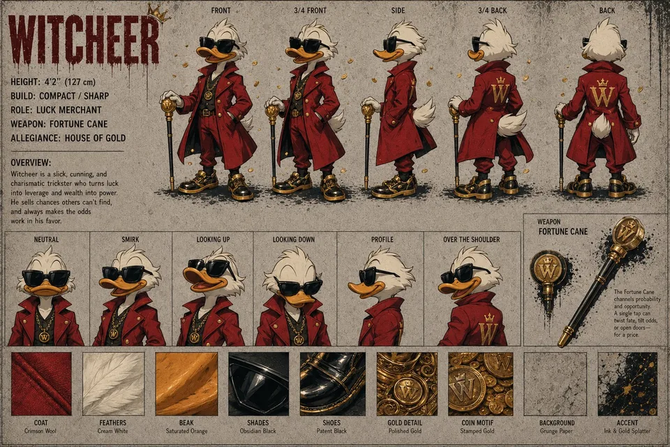
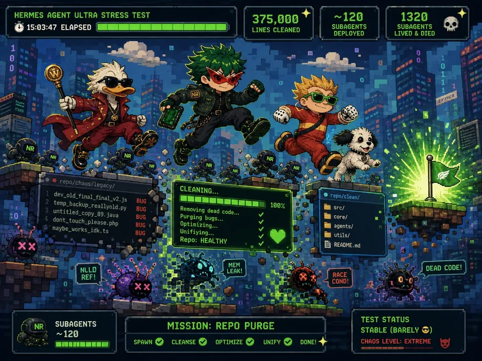

# Witcheer — supporting references

Shared references remain single-copy previews in the central reference gallery.

- Canonical reference links: 7
- Candidate links (not canonical): 0

## Canonical references

### Teamwork Propaganda Poster

- Reference ID: `ref-0022ed4f3c3d8335`
- Type: `co-character-scene`
- Mapping confidence: `high`
- Rights: `unknown-not-cleared`

### Plush Factory Argument

- Reference ID: `ref-4262d1ca9d36af6b`
- Type: `co-character-scene`
- Mapping confidence: `high`
- Rights: `unknown-not-cleared`

### Sheet

- Reference ID: `ref-8f65edc1bb2a6aac`
- Type: `sheet`
- Mapping confidence: `source-established`
- Rights: `unknown-not-cleared`

### Sheet

- Reference ID: `ref-94d95e768008dc30`
- Type: `sheet`
- Mapping confidence: `source-established`
- Rights: `unknown-not-cleared`

### Cyberpunk Server Room Fight

- Reference ID: `ref-94f681aac0a0b815`
- Type: `co-character-scene`
- Mapping confidence: `high`
- Rights: `mixed:approval-pending-per-profile,unknown-not-cleared`

### Pixel Game Team Run

- Reference ID: `ref-9c85846ce80212d1`
- Type: `co-character-scene`
- Mapping confidence: `high`
- Rights: `unknown-not-cleared`

### Multiverse Character Lineup

- Reference ID: `ref-cc0bc0aad177d6e2`
- Type: `reference-composite`
- Mapping confidence: `medium`
- Rights: `unknown-not-cleared`

## Candidate references — not canonical

No candidate reference links.
